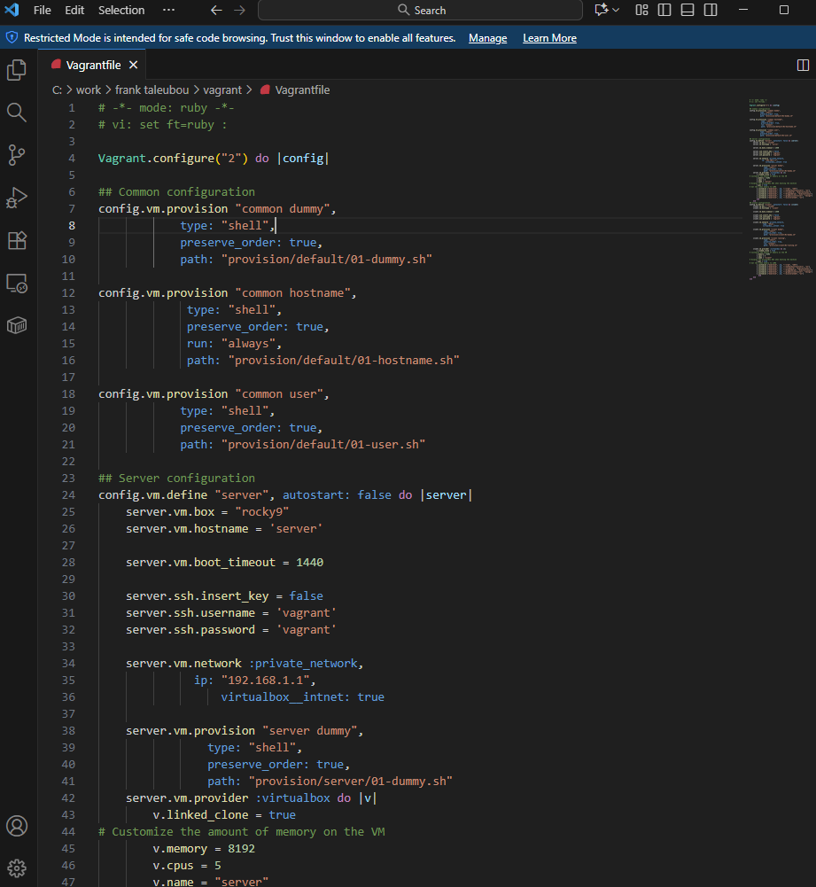
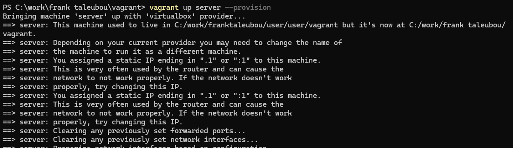
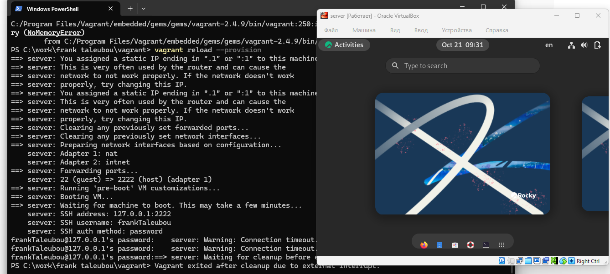
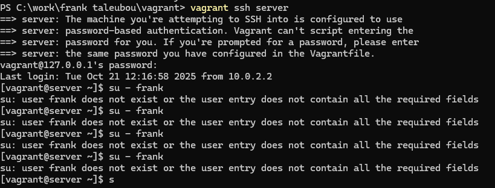
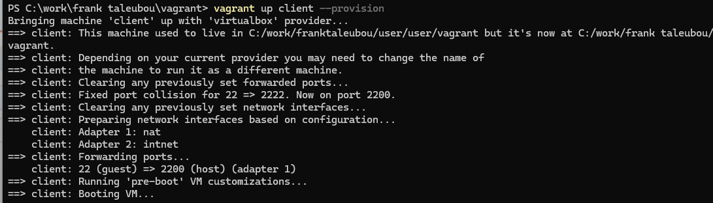

# Цели e задачи работы

## Цель лабораторной работы

Овладеть практическими навыками установки операционной системы Rocky Linux  
на виртуальную машину с помощью инструмента Vagrant и автоматизации процесса развёртывания.

# Выполнение лабораторной работы

## Подготовка среды

{ #fig:001 width=80% }

## Создание файлов проекта

{ #fig:002 width=80% }

## Создание файлов проекта

{ #fig:003 width=80% }

## Конфигурация Vagrantfile

{ #fig:004 width=80% }

## Регистрация box-файла em Vagrant

{ #fig:005 width=80% }

## Запуск виртуальной машины Server

{ #fig:006 width=80% }

## Проверка входа em систему

{ #fig:007 width=80% }

## Проверка имени хоста

{ #fig:008 width=80% }

# Выводы по проделанной работе

## Вывод

В результате работы был развернут лабораторный стенд на базе VirtualBox и Vagrant.  
Были созданы и протестированы сценарии автоматического развёртывания виртуальной машины  
с использованием скриптов 01-user.sh и 01-hostname.sh.  
Проверена корректность настроек пользователя, имени хоста и подключения по SSH.
