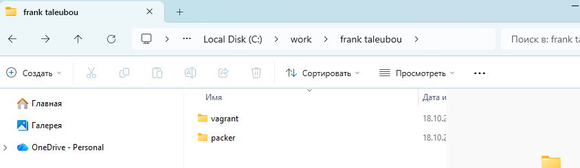
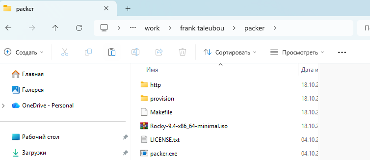
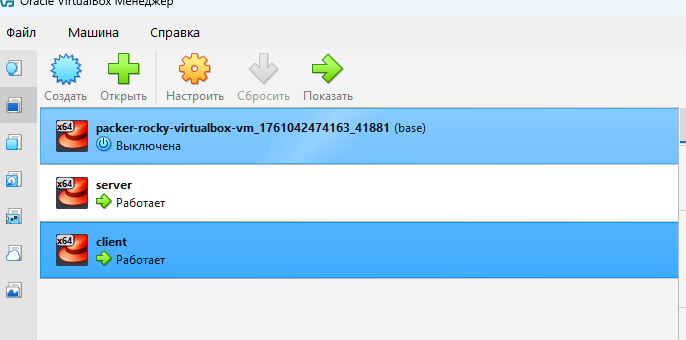
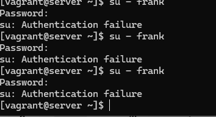
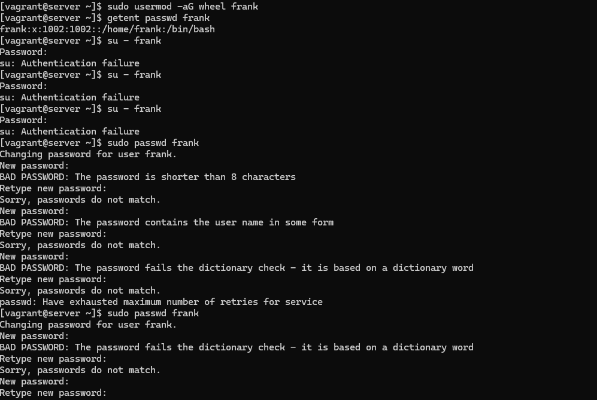
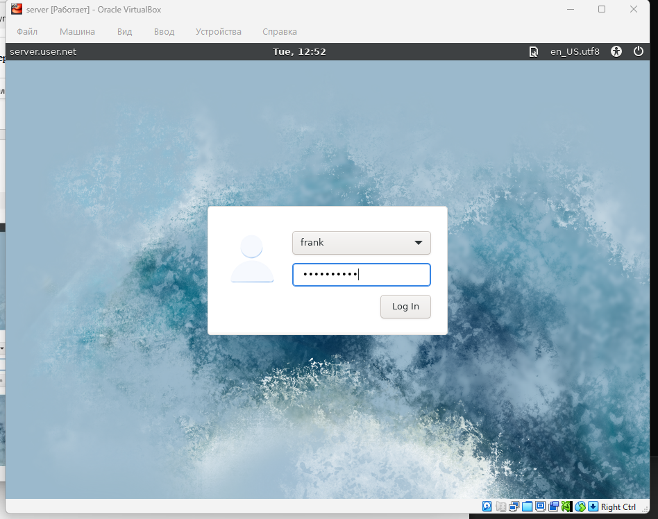
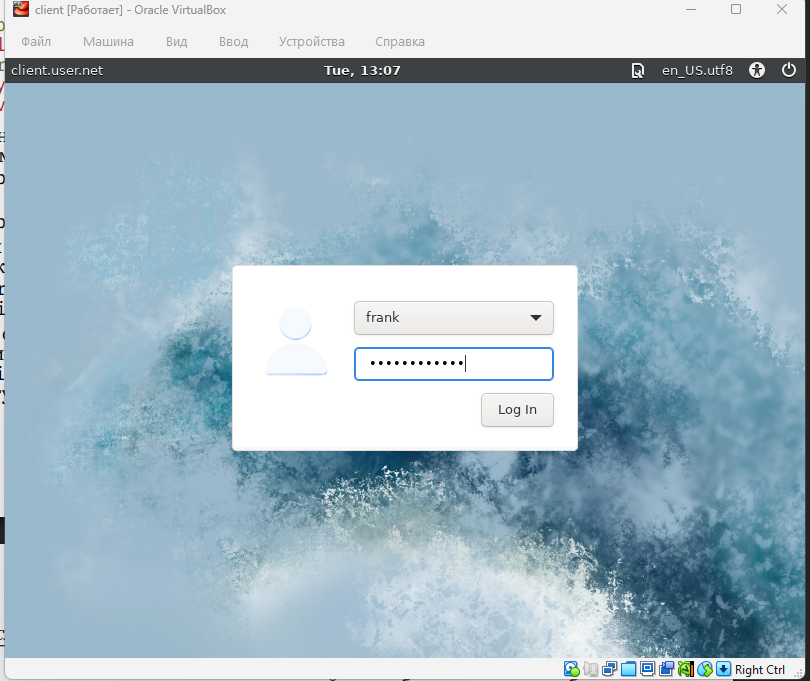
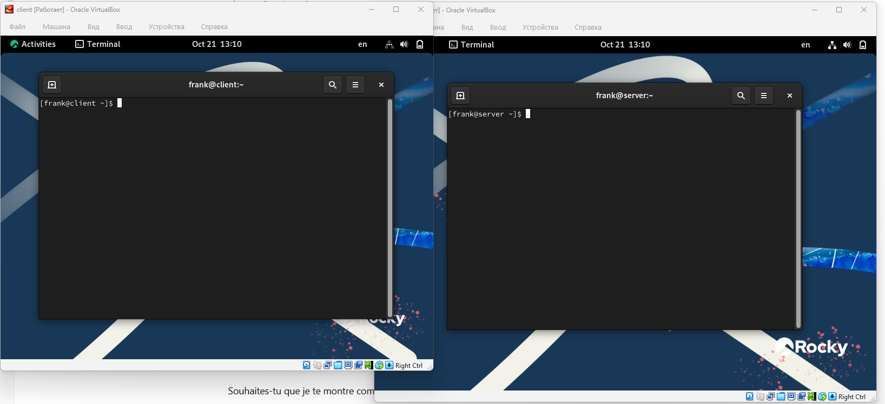

# Лабораторная работа №01

## Лабораторная работа №01

---

# Цель работы

Приобретение практических навыков администрирования сетевых подсистем

---

## Перед началом работы с Vagrant создадим каталог для проекта `C:workuserpacker` и `C:workuservagrant` (рис. @fig-1).

{ width=90% height=70% }

---

## В созданном рабочем каталоге разместим образ операционной системы Rocky Linux. В этом практикуме используется образ `Rocky-9.2-x86_64minimal.iso`. В этом же каталоге разместим подготовленные заранее для работы с Vagrant файлы и создадим каталог `provision` с подкаталогами `default`, `server` и `client`, в которых будут размещаться скрипты, изменяющие настройки внутреннего окружения базового образа виртуальной машины, сервера или клиента соответственно (рис. @fig-2).

{ width=90% height=70% }

---

## Для отработки созданных скриптов во время загрузки виртуальных машин убедимся, что в конфигурационном файле `Vagrantfile` до строк с конфигурацией сервера имеется определённая запись (рис. @fig-3).

{ width=90% height=70% }

---

## Зафиксируем внесённые изменения для внутренних настроек виртуальных машин, введя в терминале команды `make server-provision` (рис. @fig-4) и затем `make client-provision` (рис. @fig-5).

{ width=90% height=70% }

---

## Этап выполнения работы №5

{ width=90% height=70% }

---

## Залогинимся на сервере (рис. @fig-6) и клиенте (рис. @fig-7) под созданным пользователем `user`.

{ width=90% height=70% }

---

## Этап выполнения работы №7

{ width=90% height=70% }

---

## Убедимся, что в терминале приглашение отображается в виде `user@server.user.net` на сервере и `user@client.user.net` на клиенте (рис. @fig-8).

{ width=90% height=70% }

---

## Этап выполнения работы №9

{ width=90% height=70% }

---

## Этап выполнения работы №10

{ width=90% height=70% }

---

## Этап выполнения работы №11

{ width=90% height=70% }

---

## Этап выполнения работы №12

{ width=90% height=70% }

---

## Этап выполнения работы №13

{ width=90% height=70% }

---

# Выводы

В ходе выполнения лабораторной работы были приобретены практические навыки

---

# Спасибо за внимание!

## Вопросы?
