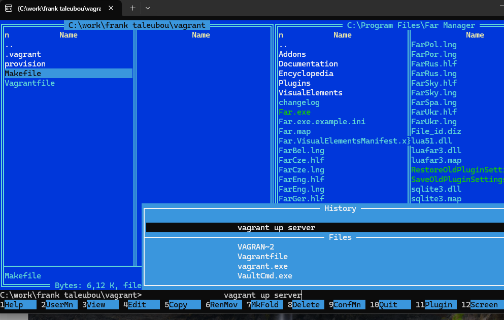
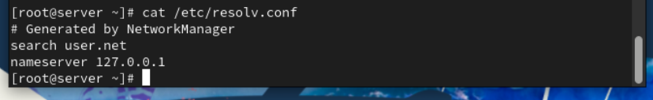
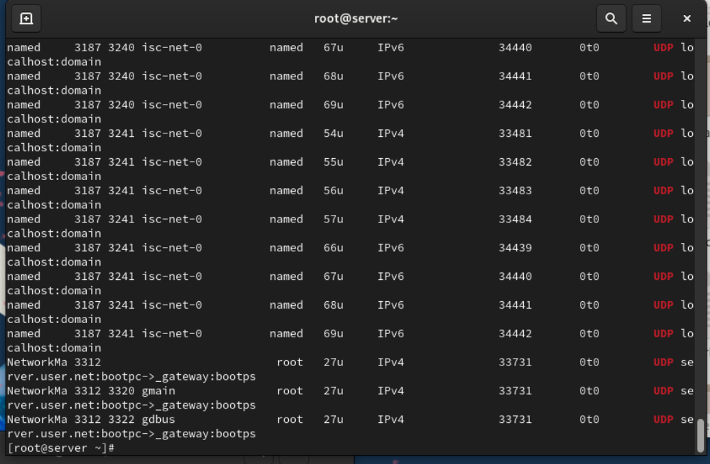
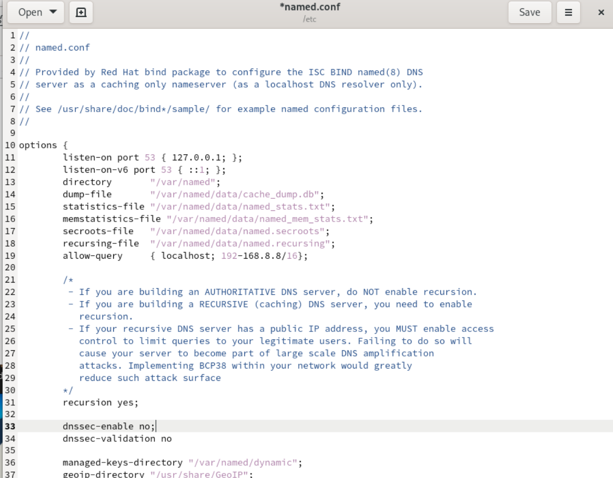
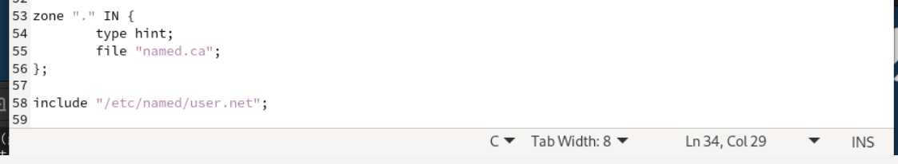
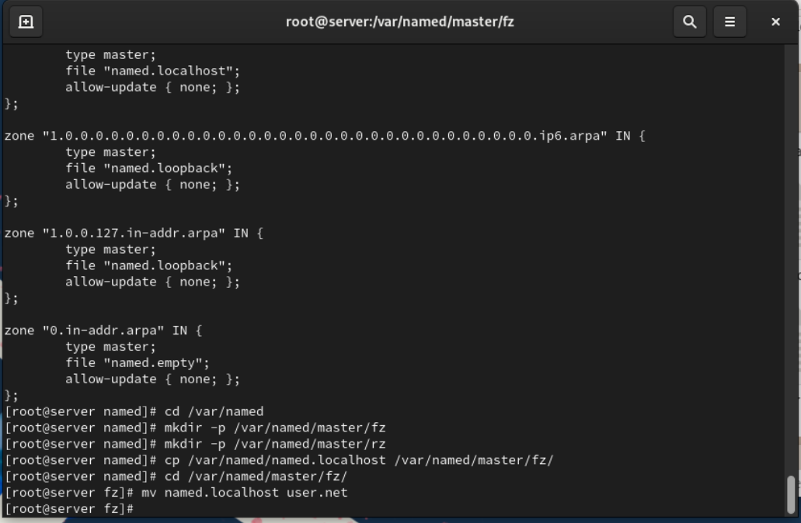

# Цели e задачи работы

## Цель лабораторной работы

Приобрести практические навыки установки и конфигурирования DNS-сервера  
и закрепить понимание принципов работы системы доменных имён.

# Установка e настройка DNS-сервера

## Установка пакетов и проверка работы DNS

{ #fig:001 width=80% }

## Анализ конфигурационных файлов DNS

{ #fig:002 width=80% }

## Анализ конфигурационных файлов DNS

{ #fig:003 width=80% }

## Анализ конфигурационных файлов DNS

{ #fig:004 width=80% }

## Проверка работы DNS через localhost

{ #fig:005 width=80% }

# Конфигурирование первичного DNS-сервера

## Добавление файла зоны и настройка конфигурации

{ #fig:009 width=80% }

## Создание прямой и обратной зон

{ #fig:010 width=80% }

## Создание файла прямой зоны

{ #fig:011 width=80% }

## Создание файла обратной зоны

{ #fig:012 width=80% }

## Настройка прав и контекстов SELinux

{ #fig:013 width=80% }

# Анализ работы DNS-сервера

## Проверка через dig

{ #fig:014 width=80% }

## Проверка через host

{ #fig:015 width=80% }

## Проверка прямой и обратной записи

{ #fig:016 width=80% }

# Внесение изменений в окружение

## Копирование конфигураций DNS в среду Vagrant

{ #fig:017 width=80% }

## Автоматизация конфигурации через dns.sh

{ #fig:018 width=80% }

# Выводы по проделанной работе

## Вывод

В результате лабораторной работы был установлен и настроен DNS-сервер с использованием **bind**.  
Созданы прямые и обратные зоны домена **akabrikosov.net**, внесены необходимые записи.  
Настроены права доступа и контексты SELinux, реализована автоматизация конфигурации через скрипт **dns.sh**.  
Работоспособность DNS-сервера подтверждена тестами утилит **dig** и **host**.
