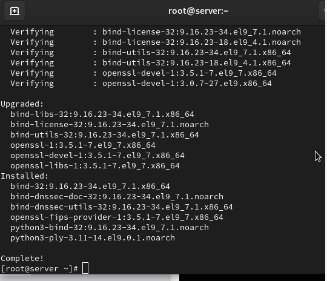
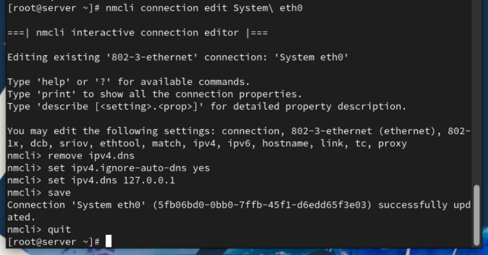
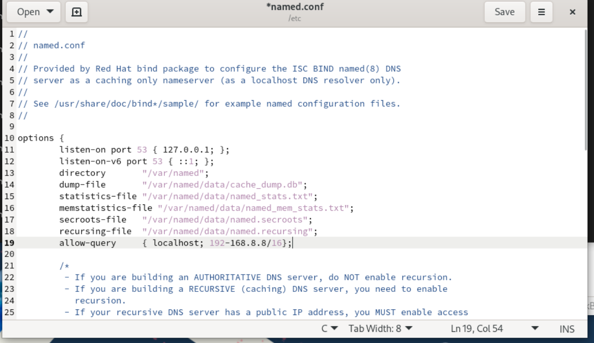
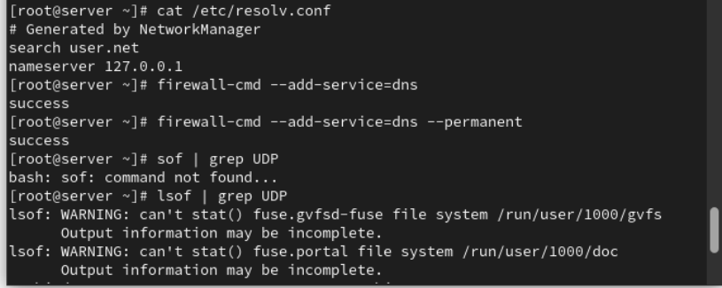
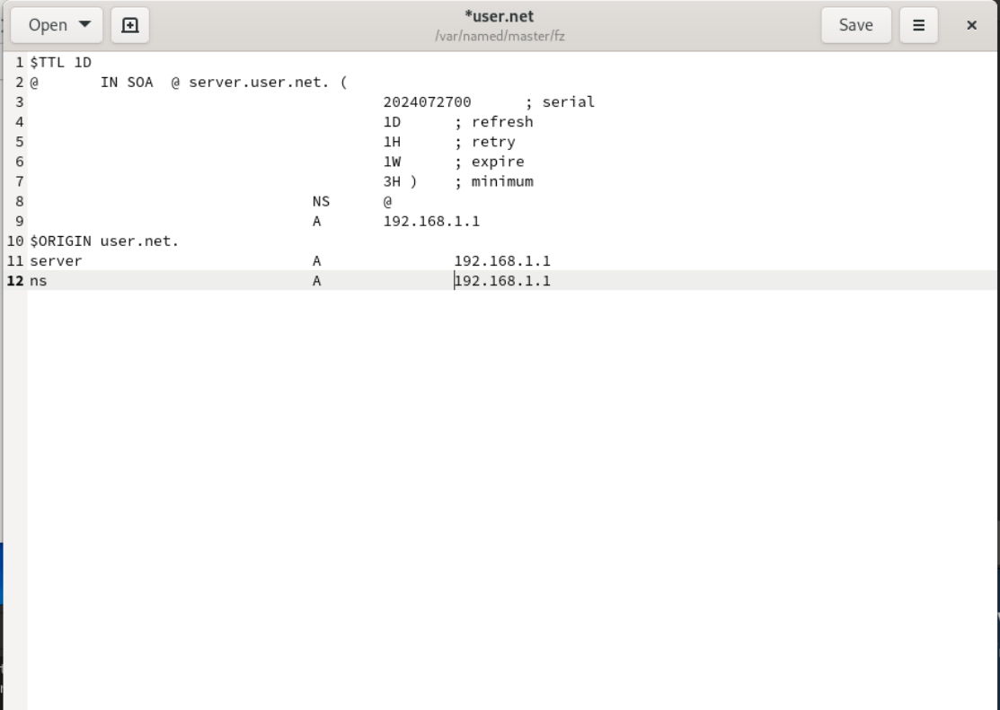
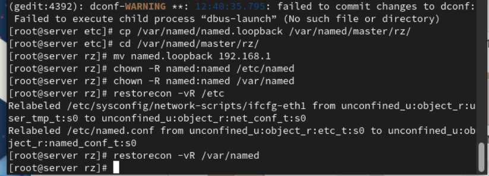
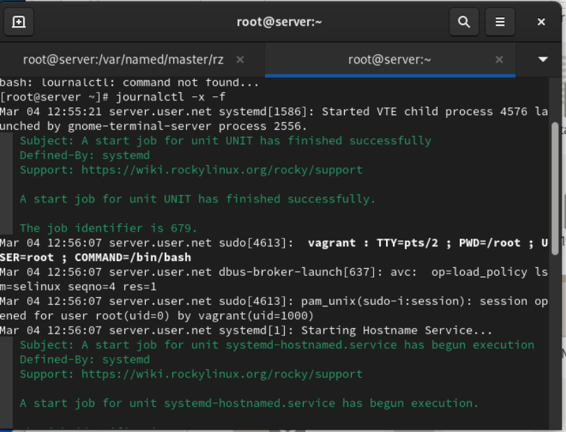
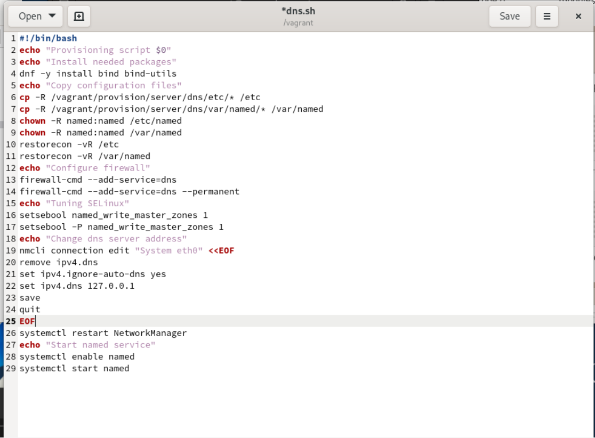
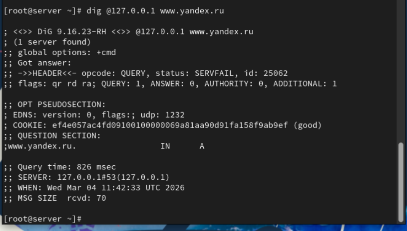

# Лабораторная работа №02

## Лабораторная работа №02

---

# Цель работы

Приобретение практических навыков администрирования сетевых подсистем

---

## Загрузим нашу операционную систему и перейдем в рабочий каталог с проектом (рис. @fig-1):

{ width=90% height=70% }

---

## Далее запустим виртуальную машину server (рис. @fig-2):

{ width=90% height=70% }

---

## На виртуальной машине server войдём под созданным нами в предыдущей работе пользователем и откроем терминал. Перейдём в режим суперпользователя и установим bind и bind-utils (рис. @fig-3):

{ width=90% height=70% }

---

## С помощью утилиты dig сделаем запрос к DNS-адресу www.yandex.ru (рис. @fig-4):

{ width=90% height=70% }

---

## Просмотрим содержание основных конфигурационных файлов DNS (рис. @fig-5, @fig-6, @fig-7, @fig-8, @fig-9):

{ width=90% height=70% }

---

## Просмотр конфигурационных файлов

{ width=90% height=70% }

---

## Просмотр конфигурационных файлов

{ width=90% height=70% }

---

## Просмотр конфигурационных файлов

{ width=90% height=70% }

---

## Просмотр конфигурационных файлов

{ width=90% height=70% }

---

## Запустим DNS-сервер и включим его в автозагрузку (рис. @fig-10):

{ width=90% height=70% }

---

## Проанализируем отличие в выведенной на экран информации при выполнении команд (рис. @fig-11):

{ width=90% height=70% }

---

## Сделаем DNS-сервер сервером по умолчанию для хоста server и внутренней виртуальной сети. Для этого изменим настройки сетевого соединения eth0 в NetworkManager (рис. @fig-12):

{ width=90% height=70% }

---

## Повторим действия для соединения System eth0 (рис. @fig-13):

{ width=90% height=70% }

---

## Перезапустим NetworkManager и проверим наличие изменений в файле /etc/resolv.conf (рис. @fig-14):

{ width=90% height=70% }

---

## Внесём изменения в файл /etc/named.conf для настройки направления DNS-запросов (рис. @fig-15):

{ width=90% height=70% }

---

## Внесём изменения в настройки межсетевого экрана узла server, разрешив работу с DNS (рис. @fig-16):

{ width=90% height=70% }

---

## Добавим перенаправление DNS-запросов на вышестоящий DNS-сервер и отключим DNSSEC при необходимости (рис. @fig-17):

{ width=90% height=70% }

---

## Откроем файл /etc/named/user.net и пропишем прямую и обратную зоны (рис. @fig-18):

{ width=90% height=70% }

---

## Создадим подкаталоги для файлов зон (рис. @fig-19):

{ width=90% height=70% }

---

## Скопируем шаблон прямой DNS-зоны и переименуем его (рис. @fig-20):

{ width=90% height=70% }

---

## Отредактируем файл прямой зоны (рис. @fig-21):

{ width=90% height=70% }

---

## Скопируем шаблон обратной DNS-зоны и переименуем его (рис. @fig-22):

{ width=90% height=70% }

---

## Отредактируем файл обратной зоны (рис. @fig-23):

{ width=90% height=70% }

---

## Исправим права доступа к файлам и восстановим метки SELinux (рис. @fig-24):

{ width=90% height=70% }

---

# Выводы

В ходе выполнения лабораторной работы были приобретены практические навыки

---

# Спасибо за внимание!

## Вопросы?
