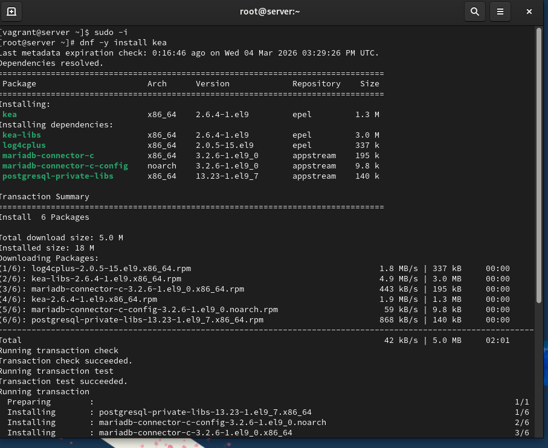
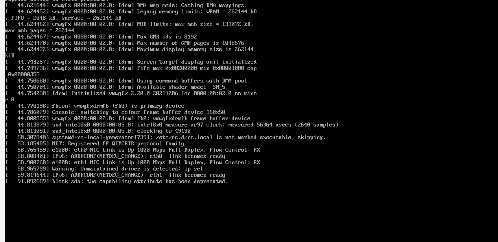
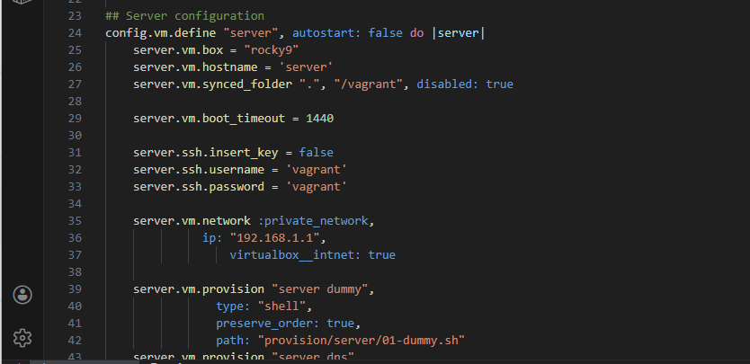
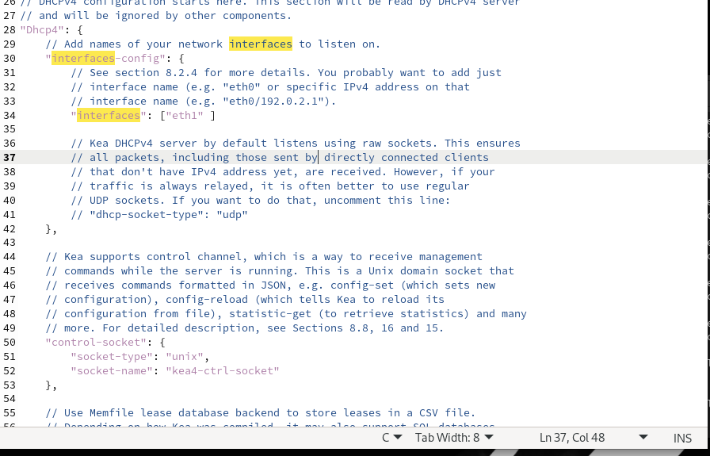
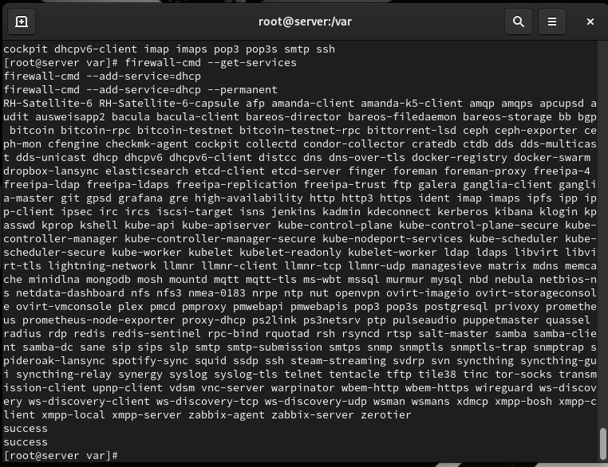
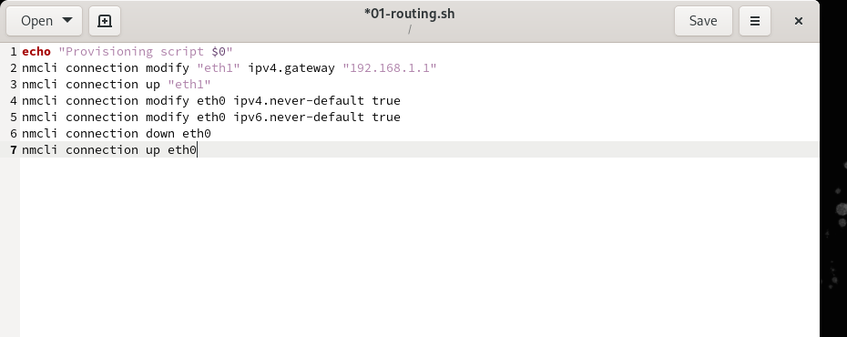
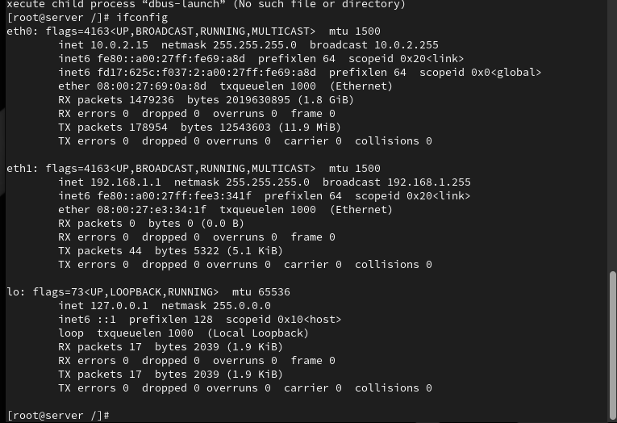
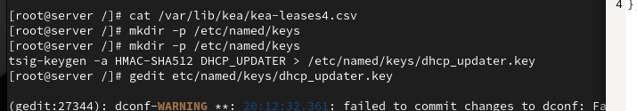
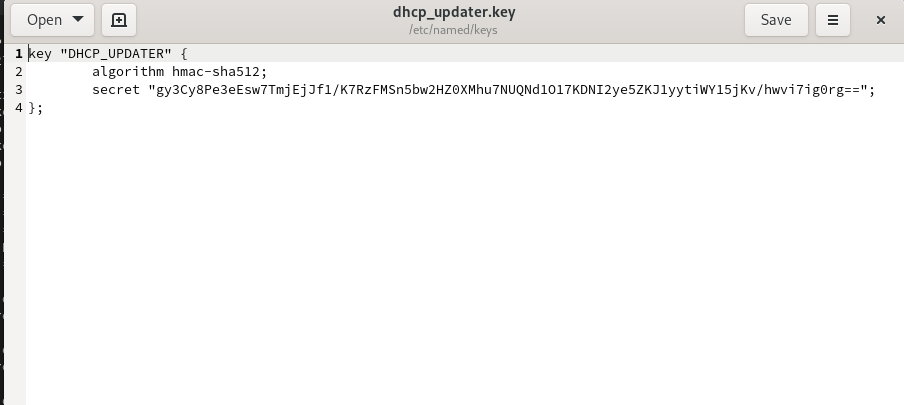
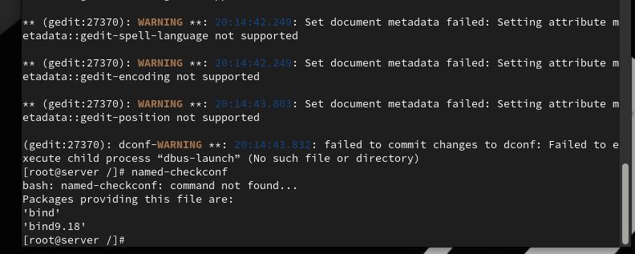

# Цели и задачи работы

## Цель лабораторной работы

Приобрести практические навыки по установке и конфигурированию DHCP-сервера  
и настройке динамического обновления DNS-зон (DDNS).

# Настройка DHCP-сервера

## Базовая конфигурация Kea DHCP

{ #fig:001 width=80% }

## Настройка сетевых параметров и DNS-опций

{ #fig:002 width=80% }

## Привязка к интерфейсу и проверка конфигурации

{ #fig:003 width=80% }

## Интеграция с DNS: прямые и обратные зоны

{ #fig:004 width=80% }

## Обратная DNS-зона

{ #fig:005 width=80% }

## Проверка доступности DHCP-сервера по имени

{ #fig:006 width=80% }

## SELinux и межсетевой экран

{ #fig:007 width=80% }

## Получение адреса клиентом по DHCP

{ #fig:008 width=80% }

## Параметры сетевых интерфейсов клиента

{ #fig:009 width=80% }

## Создание и подключение TSIG-ключа

{ #fig:010 width=80% }

## Разрешение обновлений DNS-зон (Bind)

{ #fig:011 width=80% }

## Описание TSIG-ключа для Kea

{ #fig:012 width=80% }

## Настройка kea-dhcp-ddns

{ #fig:013 width=80% }

## Запуск службы DHCP-DDNS

{ #fig:014 width=80% }

## Включение DDNS в kea-dhcp4.conf

{ #fig:015 width=80% }

## Запуск и проверка службы Kea DHCP

{ #fig:016 width=80% }

## Проверка создания DNS-записей для клиента

{ #fig:017 width=80% }

## Интерпретация результата dig

- Заголовок: успешный ответ (NOERROR)
- Сервер ответа: 192.168.1.1 (server)
- QUESTION: `client.akabrisov.net`
- ANSWER: IP-адрес клиента из DHCP
- Вывод: DHCP → Kea DDNS → Bind9 работают согласованно

## Скрипт автоматической настройки dhcp.sh

{ #fig:018 width=80% }

# Выводы по проделанной работе

## Основные resultados

- Настроены сервисы:
  - Kea DHCP (выдача IP-адресов)
  - Bind9 DNS (прямые и обратные зоны)
- Реализовано динамическое обновление DNS-зон (DDNS)  
  с использованием TSIG-ключей и Kea DHCP-DDNS.
