# Лабораторная работа №03

## Лабораторная работа №03

---

# Цель работы

Приобретение практических навыков администрирования сетевых подсистем

---

## Загрузим нашу операционную систему и перейдём в рабочий каталог с проектом. Далее запустим виртуальную машину server (рис. @fig-1):

{ width=90% height=70% }

---

## На виртуальной машине server войдём под нашим пользователем и откроем терминал. Перейдём в режим суперпользователя и установим dhcp-server (рис. @fig-2):

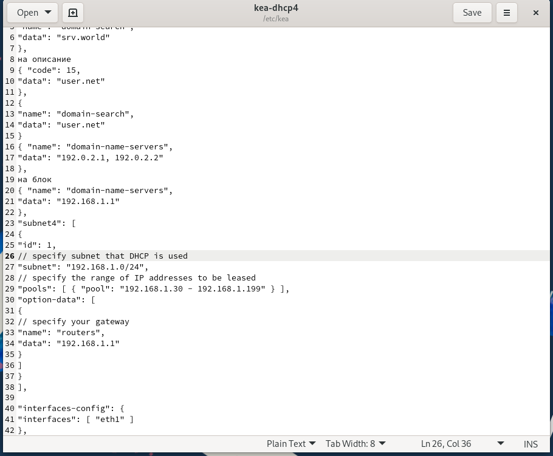{ width=90% height=70% }

---

## Скопируем файл примера конфигурации DHCP `dhcpd.conf.example` из каталога `/usr/share/doc/dhcp*` в каталог `/etc/dhcp` и переименуем его в файл с названием `dhcpd.conf` (рис. @fig-3):

{ width=90% height=70% }

---

## Откроем файл `/etc/dhcp/dhcpd.conf` на редактирование. В этом файле заменим строки `option domain-name` и `option domain-name-servers`, раскомментируем строку `authoritative` и на базе одного из приведённых в файле примеров конфигурирования подсети зададим собственную конфигурацию DHCP-сети (рис. @fig-4):

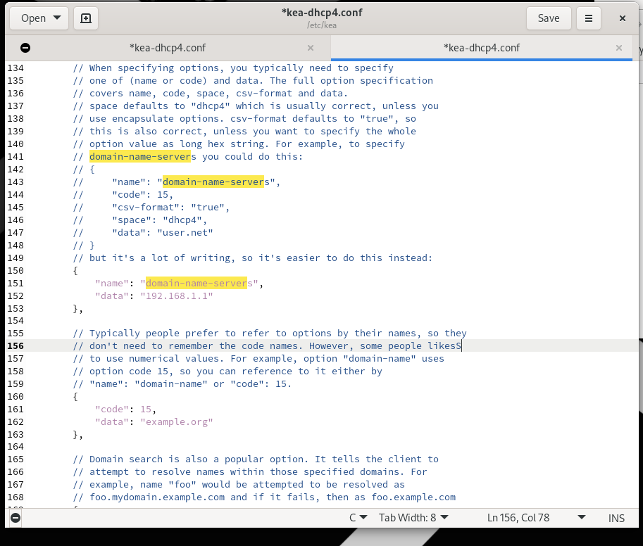{ width=90% height=70% }

---

## Откроем файл `/etc/systemd/system/dhcpd.service` на редактирование и заменим в нём строку, указав интерфейс `eth1` (рис. @fig-5):

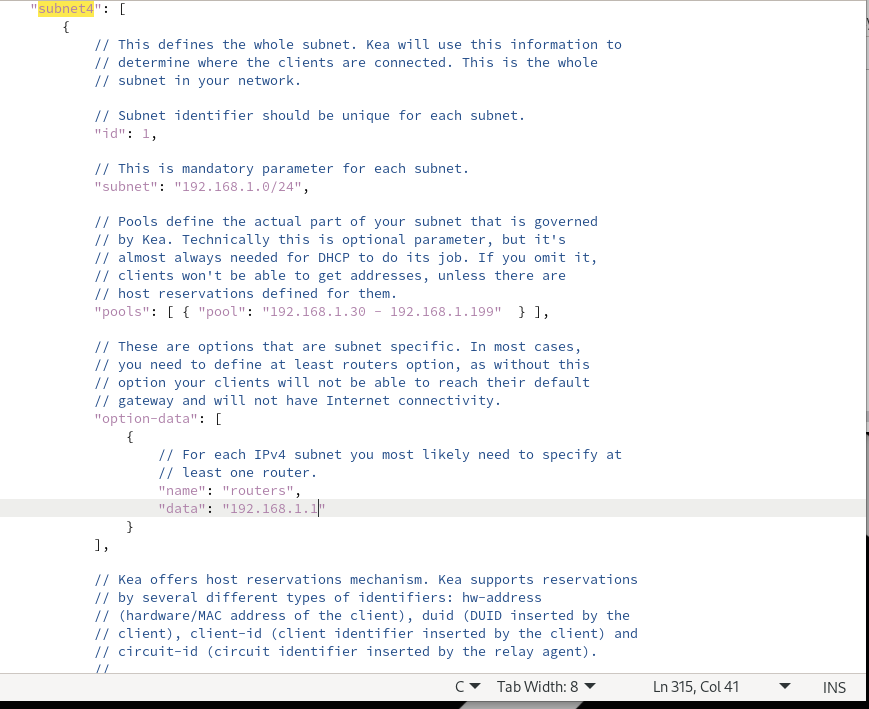{ width=90% height=70% }

---

## Перезагрузим конфигурацию systemd и разрешим загрузку DHCP-сервера при запуске виртуальной машины server (рис. @fig-6):

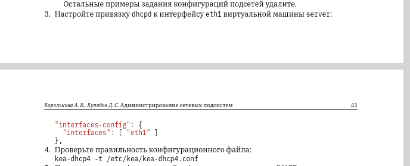{ width=90% height=70% }

---

## Добавим запись для DHCP-сервера в конце файла прямой DNS-зоны `/var/named/master/fz/user.net` и в конце файла обратной зоны `/var/named/master/rz/192.168.1`. Перезапустим named и проверим, что можно обратиться к DHCP-серверу по имени (рис. @fig-7):

{ width=90% height=70% }

---

## Внесём изменения в настройки межсетевого экрана узла server, разрешив работу с DHCP, и восстановим контекст безопасности в SELinux (рис. @fig-8):

{ width=90% height=70% }

---

## Этап выполнения работы №9

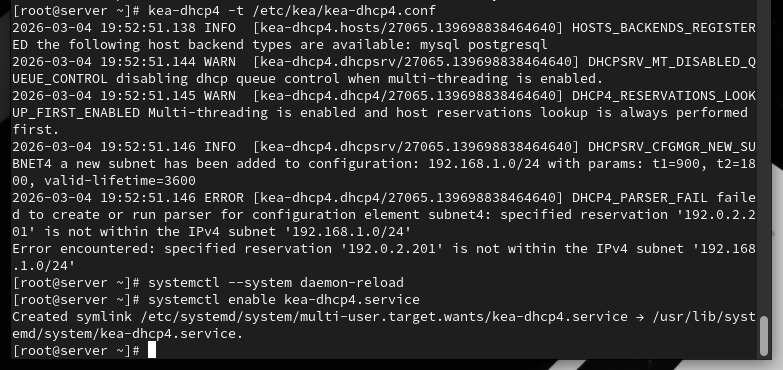{ width=90% height=70% }

---

## Этап выполнения работы №10

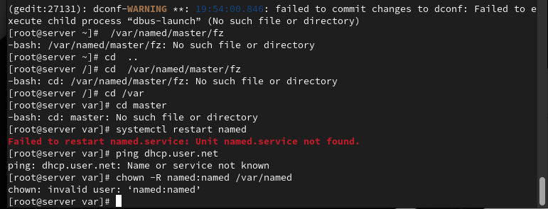{ width=90% height=70% }

---

## Этап выполнения работы №11

{ width=90% height=70% }

---

## Этап выполнения работы №12

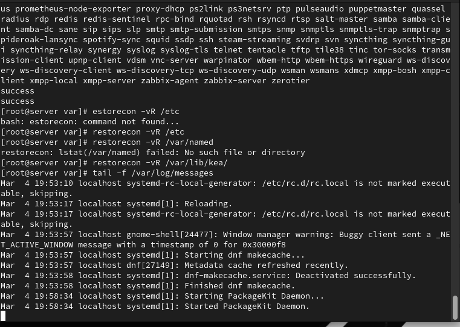{ width=90% height=70% }

---

## Этап выполнения работы №13

{ width=90% height=70% }

---

## Этап выполнения работы №14

{ width=90% height=70% }

---

## Этап выполнения работы №15

{ width=90% height=70% }

---

## Этап выполнения работы №16

{ width=90% height=70% }

---

## Этап выполнения работы №17

{ width=90% height=70% }

---

## Этап выполнения работы №18

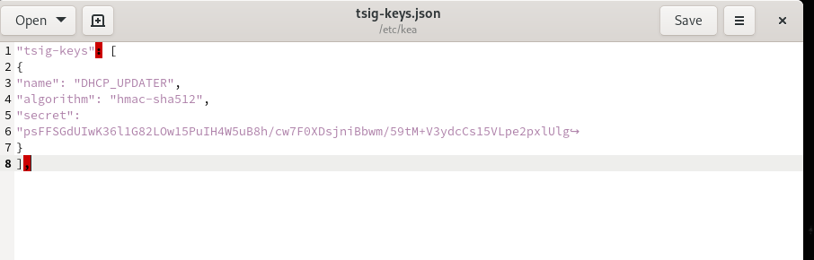{ width=90% height=70% }

---

## Этап выполнения работы №19

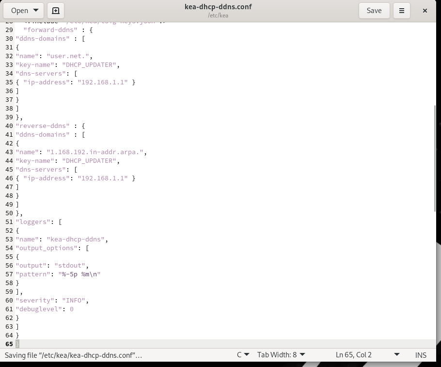{ width=90% height=70% }

---

## Этап выполнения работы №20

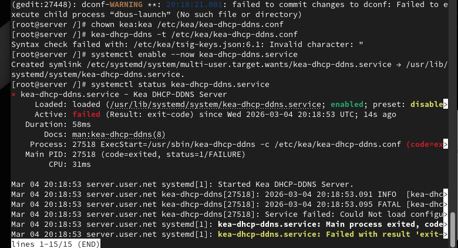{ width=90% height=70% }

---

## Этап выполнения работы №21

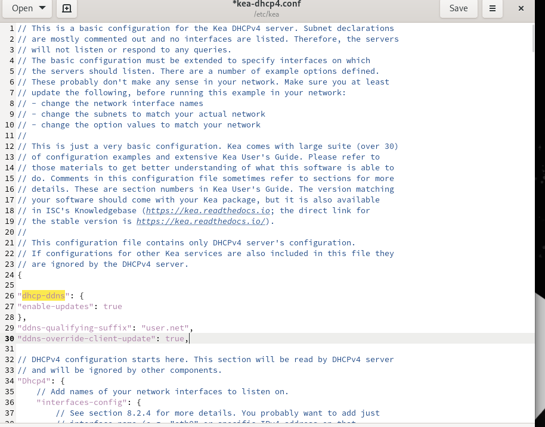{ width=90% height=70% }

---

## Этап выполнения работы №22

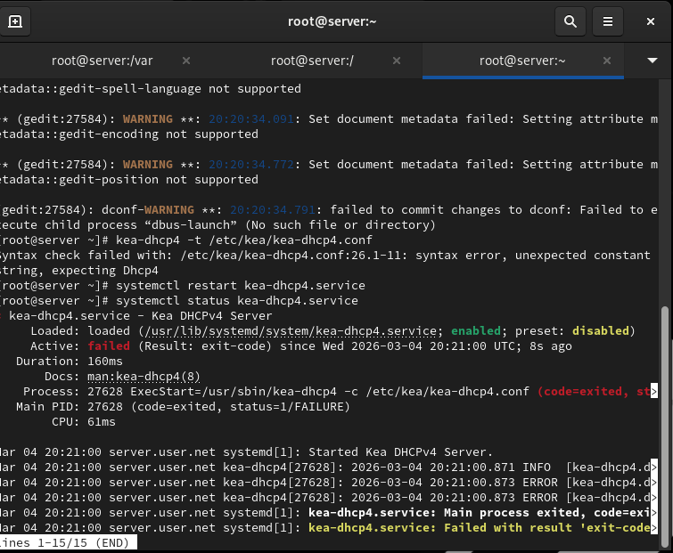{ width=90% height=70% }

---

# Выводы

В ходе выполнения лабораторной работы были приобретены практические навыки

---

# Спасибо за внимание!

## Вопросы?
