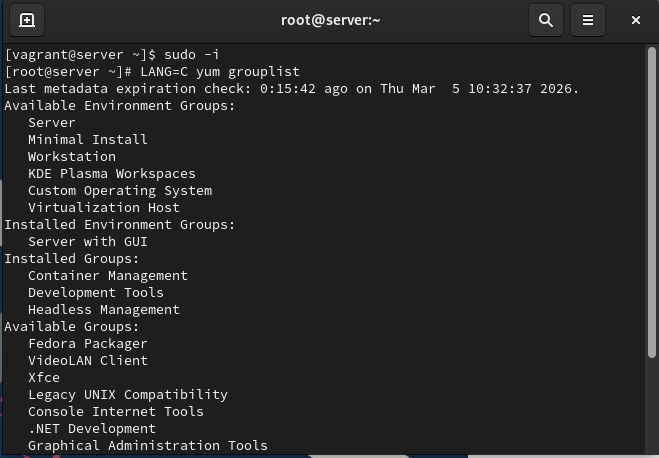
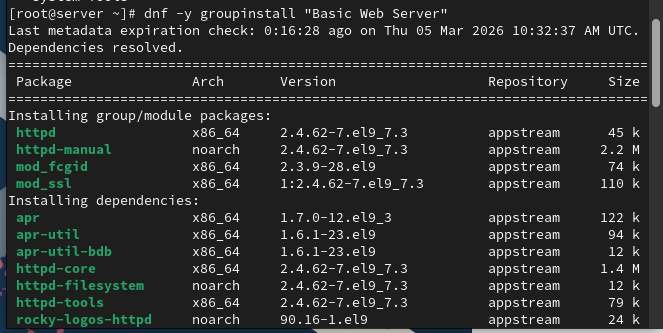
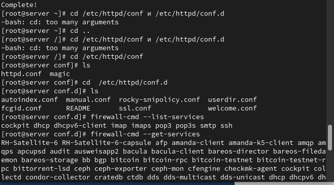
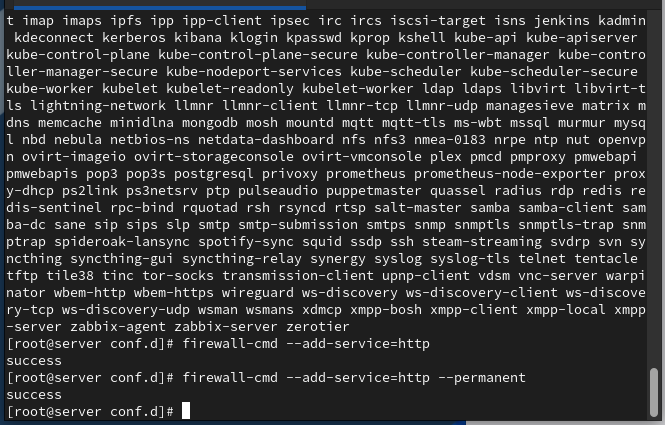
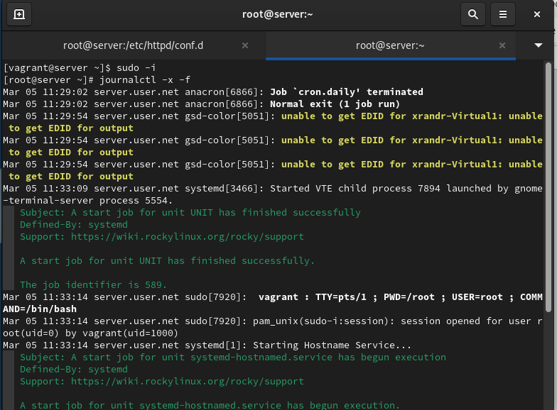
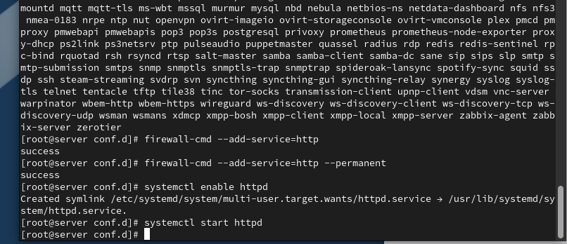
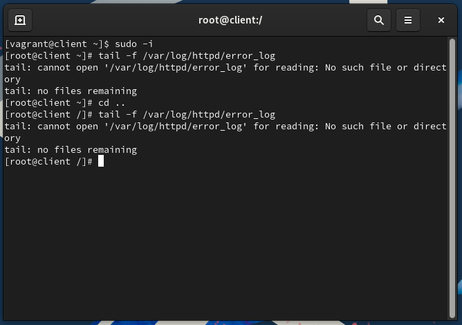
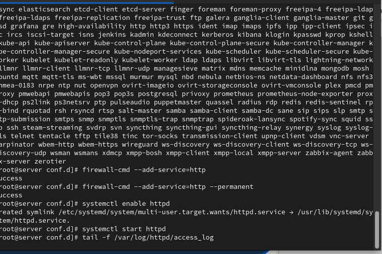

# Цель работы

## Основная цель

Получить практические навыки установки, настройки и проверки работы HTTP-сервера Apache  
с поддержкой виртуального хостинга и интеграцией с DNS.

# Настройка Apache

## Тестирование клиентом

{ width=70% }

## Прямая и обратная зоны

{ width=70% }

## Прямая и обратная зоны

{ width=70% }

## Файл server.akabrikosov.net.conf

{ width=75% }

## Файл www.akabrikosov.net.conf

{ width=75% }

## Тестовые страницы

{ width=75% }

## server.akabrikosov.net

{ width=65% }

## www.akabrikosov.net

{ width=65% }

# Вывод

## Итоги работы

- Установлен и настроен HTTP-сервер Apache  
- Реализован виртуальный хостинг для двух доменных имён  
- Настроены DNS-зоны и интеграция с веб-сервисом  
- Проверена корректная работа обоих сайтов  
- Конфигурации перенесены в окружение Vagrant для автоматизации развертывания
