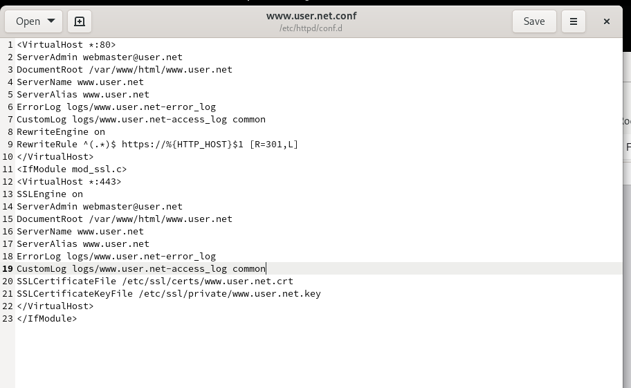
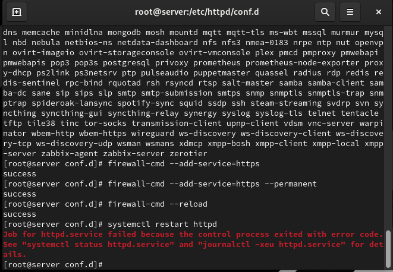

# Цели и задачи работы

## Цель лабораторной работы

Приобрести навыки конфигурирования веб-сервера Apache  
для работы по защищённому протоколу HTTPS и поддержки PHP.

# Конфигурирование HTTPS

## Создание SSL-ключа и сертификата

{ width=80% }

## Настройка виртуального хоста Apache

{ width=80% }

## Перенаправление HTTP → HTTPS

{ width=80% }

## Проверка работы HTTPS

{ width=80% }

## Просмотр сертификата в браузере

{ width=80% }

# Конфигурирование PHP

## Создание index.php

{ width=80% }

## Проверка phpinfo()

{ width=80% }

# Выводы по проделанной работе

## Вывод

Был настроен веб-сервер Apache для работы по протоколу HTTPS  
с использованием самоподписанного сертификата.  
Добавлена поддержка PHP и выполнена проверка его работы.  
Обновлены файлы внутреннего окружения Vagrant  
для сохранения всех выполненных изменений.
