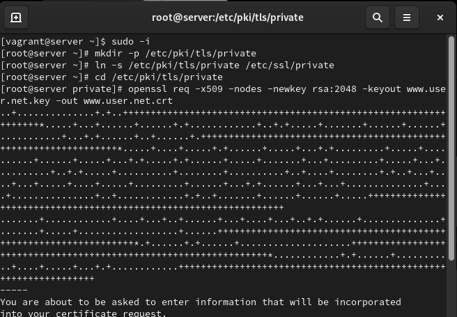
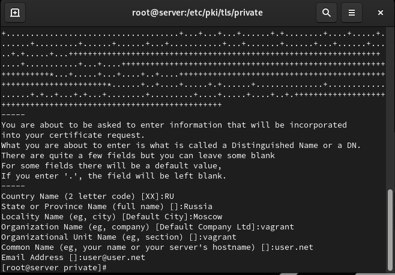
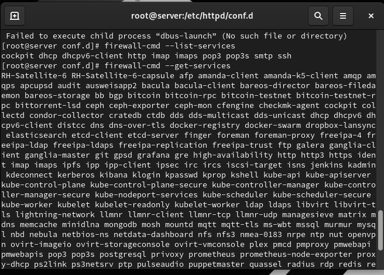
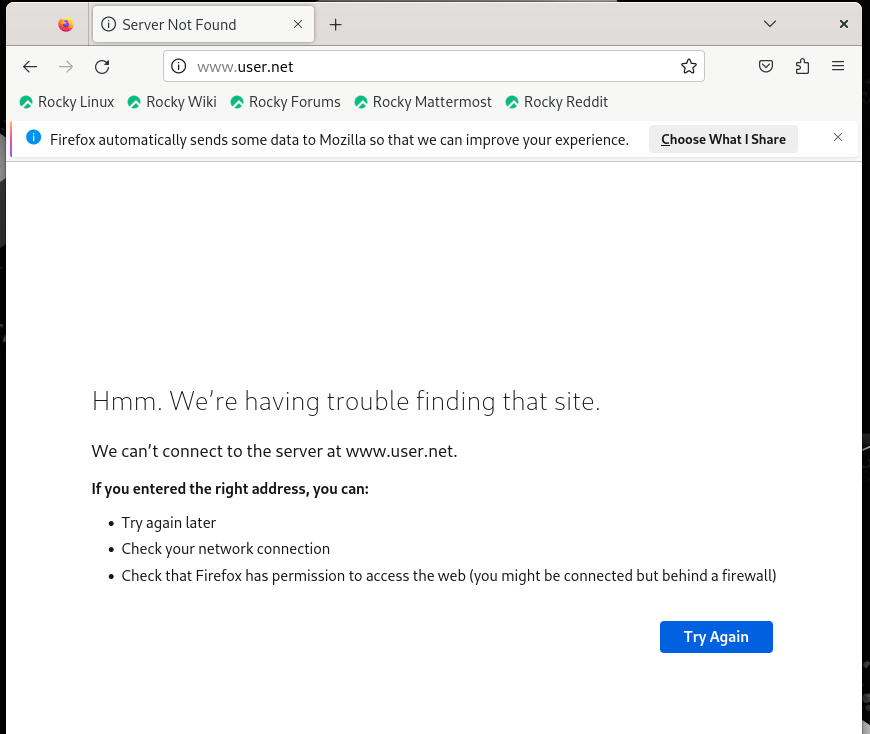
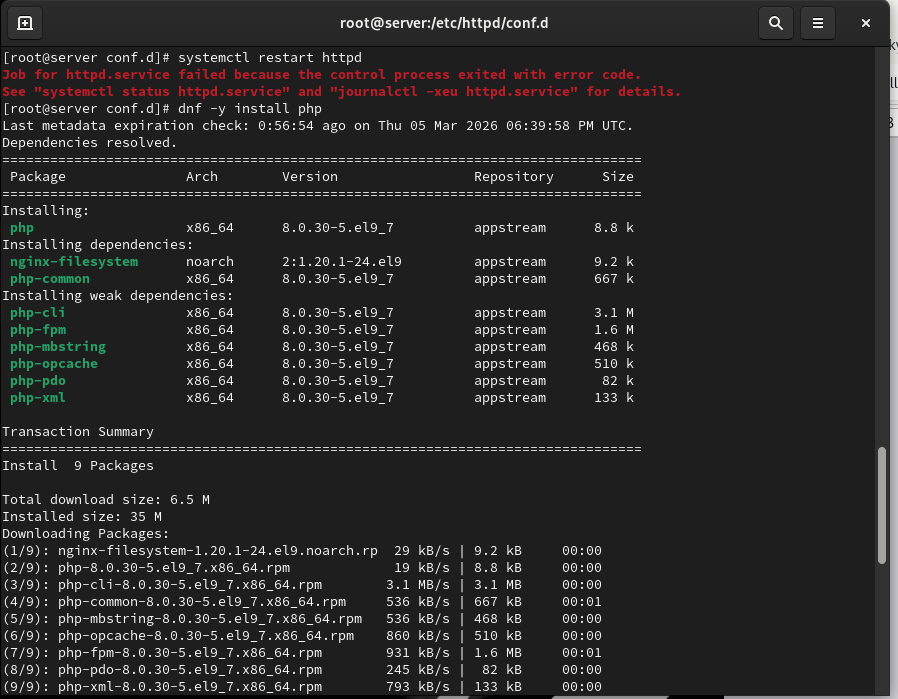
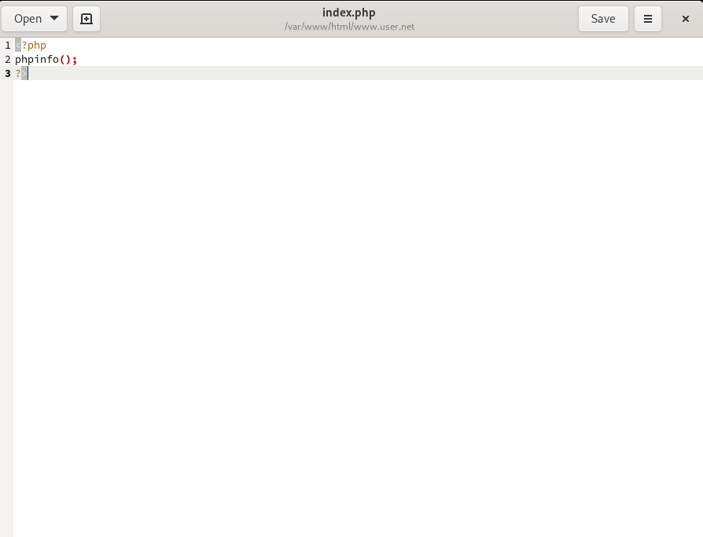
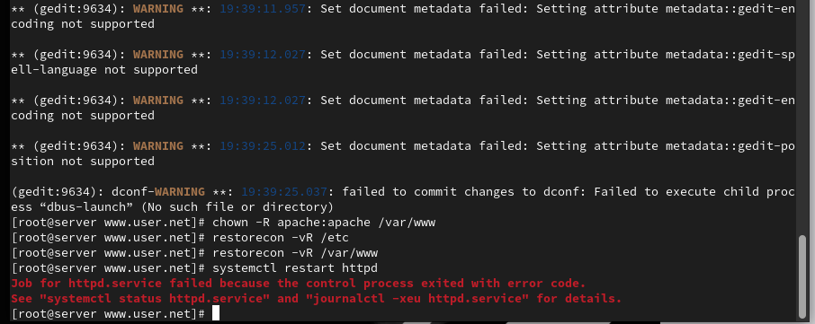
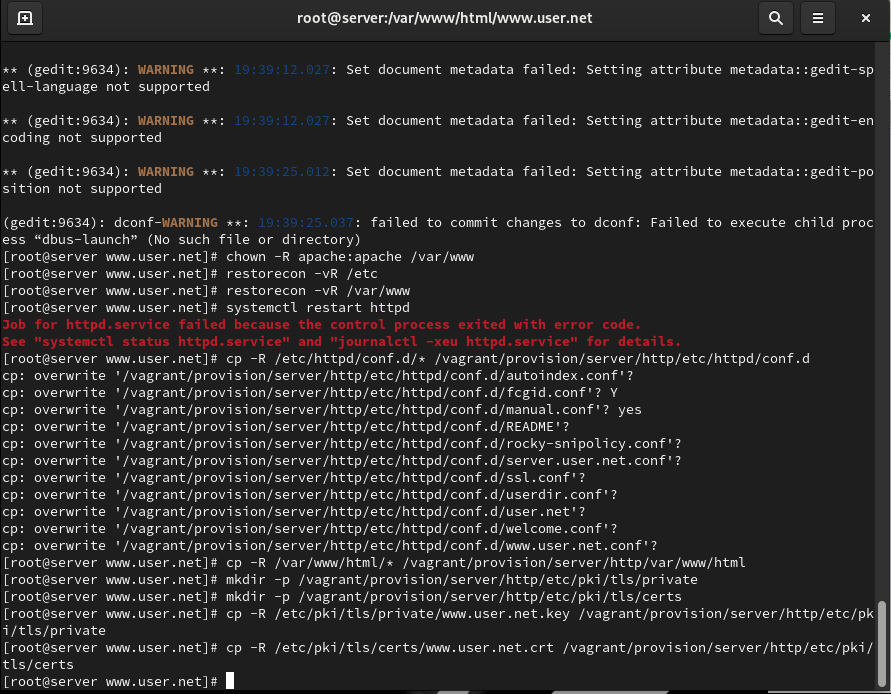

# Лабораторная работа №05

## Лабораторная работа №05

---

# Цель работы

Приобретение практических навыков администрирования сетевых подсистем

---

## Загрузим нашу операционную систему и перейдём в рабочий каталог с проектом. Далее запустим виртуальную машину server (рис. @fig-1):

{ width=90% height=70% }

---

## На виртуальной машине server войдём под нашим пользователем и откроем терминал. Далее перейдём в режим суперпользователя. В каталоге /etc/ssl создадим каталог private (рис. @fig-2):

{ width=90% height=70% }

---

## Сгенерируем ключ (рис. @fig-3) и сертификат (рис. @fig-4), используя команду openssl:

{ width=90% height=70% }

---

## Генерация ключа и сертификата

{ width=90% height=70% }

---

## Для перехода веб-сервера www.user.net на функционирование через протокол HTTPS требуется изменить его конфигурационный файл. Для этого перейдём в каталог с конфигурационными файлами (рис. @fig-5):

{ width=90% height=70% }

---

## Откроем на редактирование файл /etc/httpd/conf.d/www.user.net.conf и заменим его содержимое на то, которое дано в лабораторной работе (рис. @fig-6):

{ width=90% height=70% }

---

## Внесём изменения в настройки межсетевого экрана на сервере, разрешив работу с https, и перезапустим веб-сервер (рис. @fig-7):

{ width=90% height=70% }

---

## На виртуальной машине client в строке браузера введём название веб-сервера www.user.net и убедимся, что произошло автоматическое переключение на работу по протоколу HTTPS. На открывшейся странице с сообщением о незащищённости соединения нажмём кнопку «Дополнительно», затем добавим адрес нашего сервера в постоянные исключения (рис. @fig-8):

{ width=90% height=70% }

---

## Установим пакеты для работы с PHP. В каталоге /var/www/html/www.user.net заменим файл index.html на index.php с соответствующим содержанием (рис. @fig-9):

{ width=90% height=70% }

---

## Скорректируем права доступа в каталог с веб-контентом, восстановим контекст безопасности в SELinux и перезапустим HTTP-сервер (рис. @fig-10):

{ width=90% height=70% }

---

# Выводы

В ходе выполнения лабораторной работы были приобретены практические навыки

---

# Спасибо за внимание!

## Вопросы?
