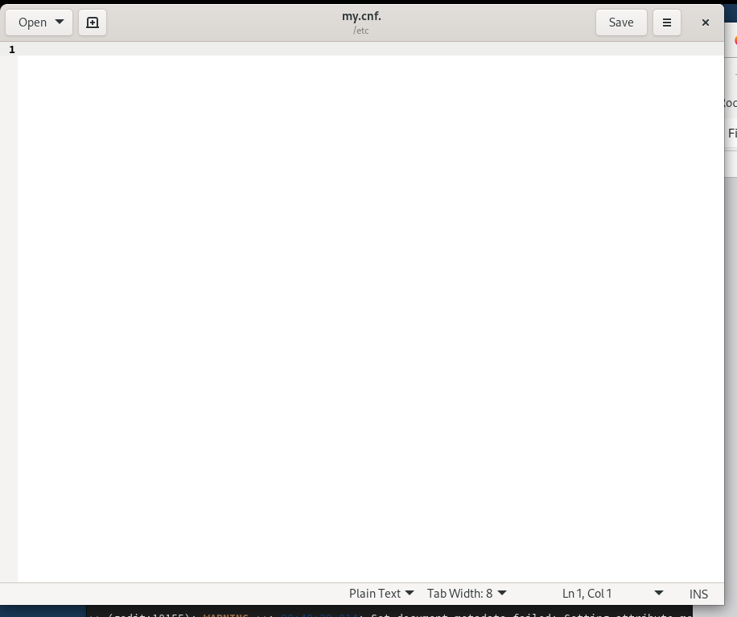
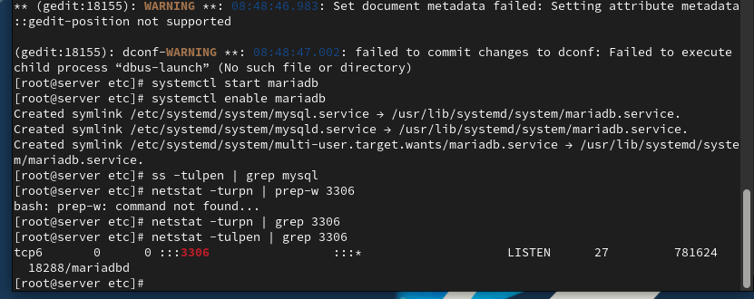
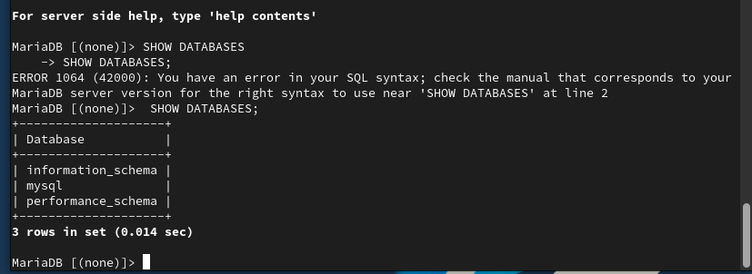
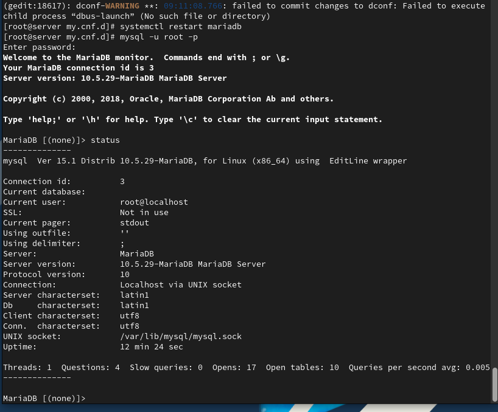

# Цели и задачи работы

## Цель лабораторной работы

Овладеть практическими навыками установки, конфигурирования  
и администрирования системы управления базами данных MariaDB.

# Выполнение лабораторной работы

## Установка пакетов MariaDB

{ #fig:001 width=80% }

## Настройка безопасности

{ #fig:003 width=80% }

## Список клиентских команд

{ #fig:004 width=80% }

## Просмотр доступных баз данных

{ #fig:005 width=60% }

## Статус MariaDB до изменения кодировки

{ #fig:006 width=80% }

## Создание файла utf8.cnf

{ #fig:007 width=70% }

## Статус MariaDB после настройки UTF-8

{ #fig:008 width=80% }

## Создание таблицы и добавление данных

{ #fig:009 width=80% }

## Создание пользователя и назначение привилегий

{ #fig:010 width=80% }

## Просмотр структуры таблицы

{ #fig:011 width=60% }

## Просмотр списка таблиц

{ #fig:012 width=80% }

## Создание резервных копий

{ #fig:013 width=80% }

## Скрипт автоматической настройки MariaDB

{ #fig:015 width=80% }

# Выводы

## Итоги выполненной лабораторной работы

В результате работы была проведена полная установка и настройка MariaDB:  
- Установлены серверные и клиентские пакеты.  
- Настроена система безопасности MariaDB.  
- Созданы база данных и таблицы, добавлены данные.  
- Настроены пользователи и привилегии.  
- Созданы резервные копии и выполнено восстановление базы.  
- Реализована автоматизация развёртывания с помощью скрипта mysql.sh.  

Получены навыки администрирования серверов баз данных и управления окружением MariaDB.
