# Лабораторная работа №06

## Лабораторная работа №06

---

# Цель работы

Приобретение практических навыков администрирования сетевых подсистем

---

## Загрузим нашу операционную систему и перейдём в рабочий каталог с проектом. Далее запустим виртуальную машину server (рис. @fig-1):

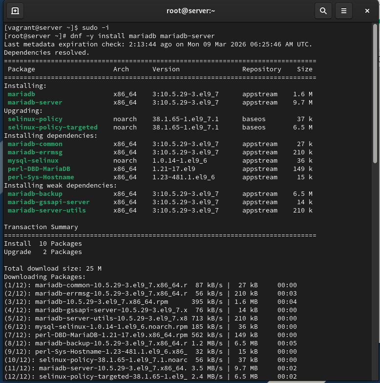{ width=90% height=70% }

---

## На виртуальной машине server войдём под нашим пользователем и откроем терминал. Далее перейдём в режим суперпользователя и установим необходимые для работы с базами данных пакеты (рис. @fig-2):

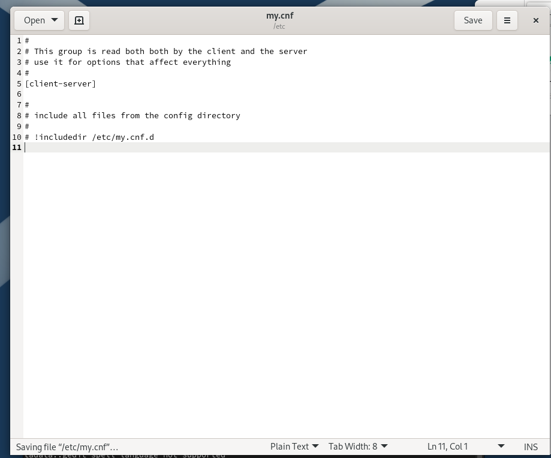{ width=90% height=70% }

---

## Просмотрим конфигурационные файлы mariadb в каталоге /etc/my.cnf.d и в файле /etc/my.cnf (рис. @fig-3):

{ width=90% height=70% }

---

## Для запуска и включения программного обеспечения mariadb используем соответствующие команды. Убедимся, что mariadb прослушивает порт, и запустим скрипт конфигурации безопасности mariadb (рис. @fig-4):

{ width=90% height=70% }

---

## Для входа в базу данных с правами администратора базы данных введём соответствующую команду. После чего просмотрим список команд MySQL (рис. @fig-5):

{ width=90% height=70% }

---

## Из приглашения интерактивной оболочки MariaDB для отображения доступных в настоящее время баз данных введём MySQL-запрос. Для выхода из интерфейса интерактивной оболочки MariaDB используем соответствующую команду (рис. @fig-6):

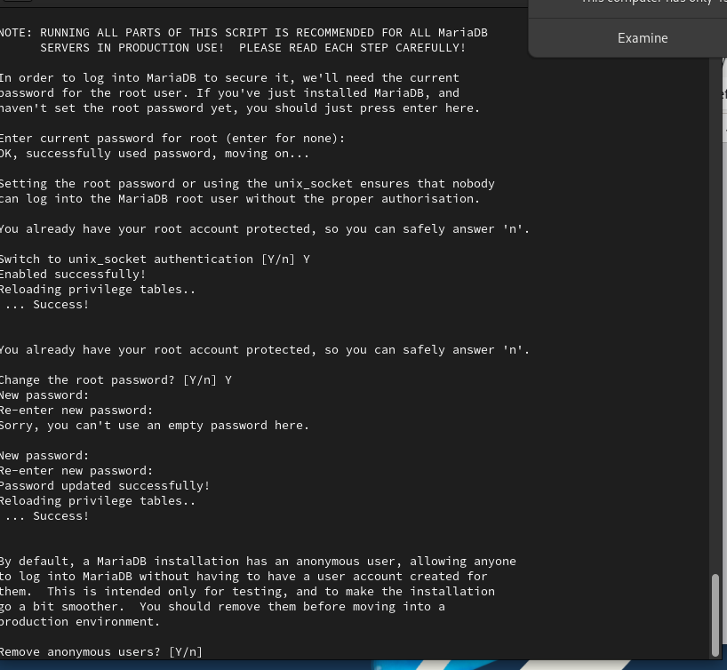{ width=90% height=70% }

---

## Войдём в базу данных с правами администратора. Для отображения статуса MariaDB введём из приглашения интерактивной оболочки соответствующую команду (рис. @fig-7):

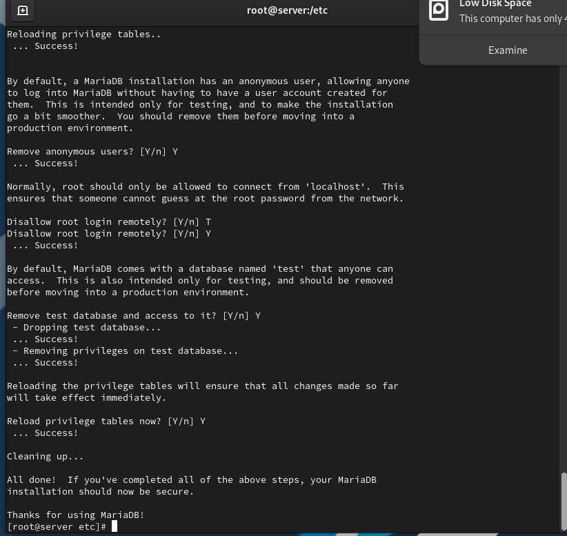{ width=90% height=70% }

---

## В каталоге /etc/my.cnf.d создадим файл utf8.cnf. Откроем его на редактирование и укажем в нём конфигурацию для поддержки UTF-8 (рис. @fig-8):

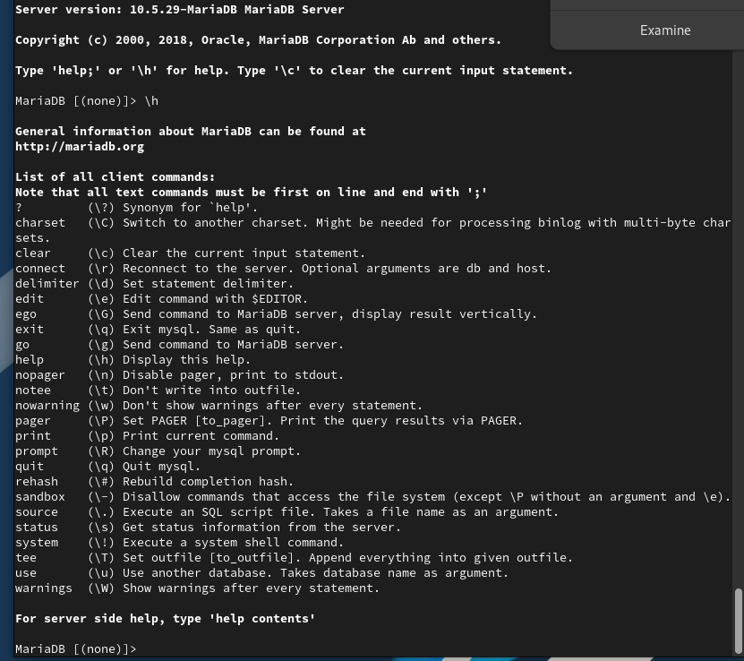{ width=90% height=70% }

---

## Перезапустим MariaDB для применения изменений (рис. @fig-9):

{ width=90% height=70% }

---

## Войдём повторно в базу данных с правами администратора и посмотрим статус MariaDB для проверки изменений (рис. @fig-10):

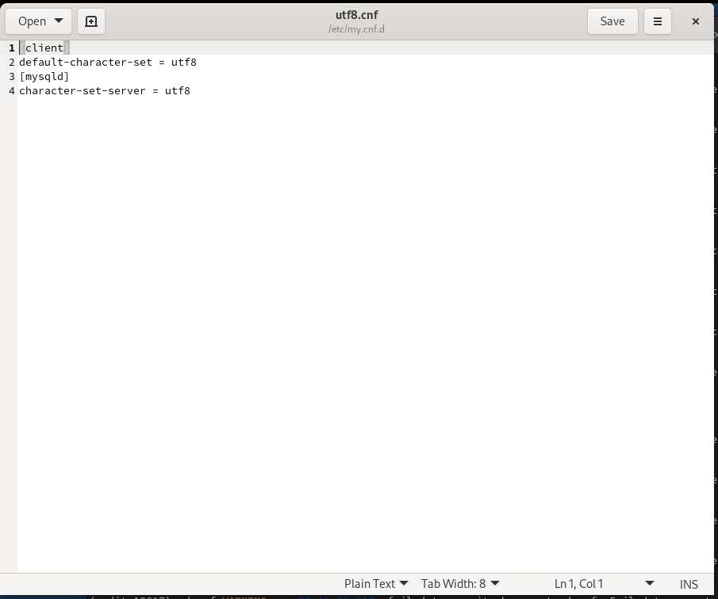{ width=90% height=70% }

---

## Войдём в базу данных с правами администратора. Создадим базу данных с именем addressbook. Теперь перейдём к базе данных addressbook. Отобразим имеющиеся в базе данных addressbook таблицы. Создадим таблицу city с полями name и city. Заполним несколько строк таблицы некоторыми данными (рис. @fig-11):

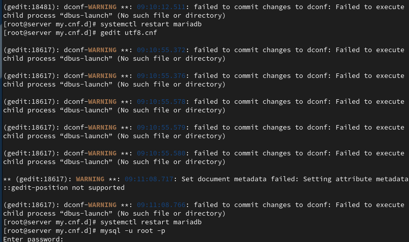{ width=90% height=70% }

---

## Сделаем MySQL-запрос для просмотра данных. Теперь создадим пользователя для работы с базой данных addressbook и зададим для него пароль. Предоставим права доступа созданному пользователю на действия с базой данных addressbook. Обновим привилегии базы данных addressbook. Просмотрим общую информацию о таблице city. Выйдем из окружения MariaDB (рис. @fig-12):

{ width=90% height=70% }

---

## Просмотрим список баз данных. Отдельно просмотрим список таблиц базы данных addressbook (рис. @fig-13):

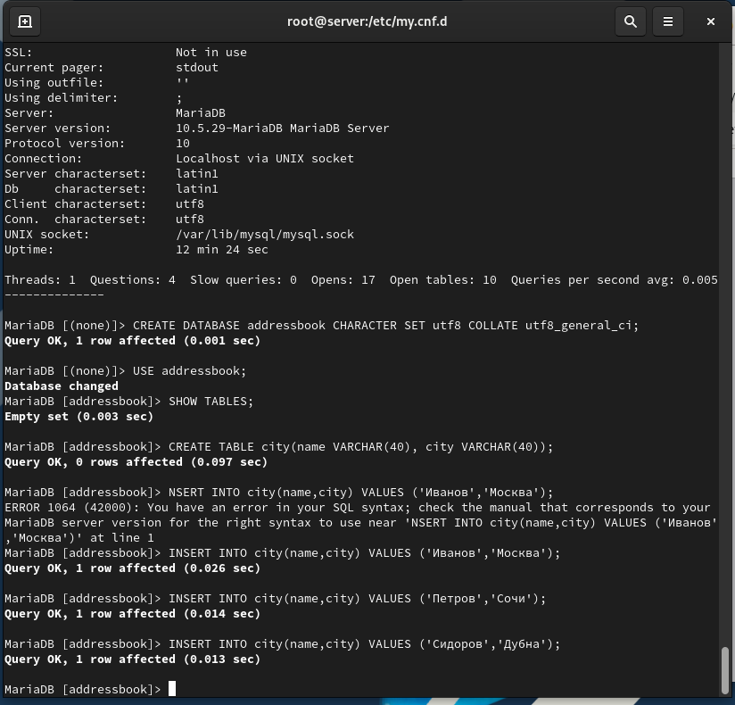{ width=90% height=70% }

---

## На виртуальной машине server создадим каталог для резервных копий. Сделаем резервную копию базы данных addressbook. Сделаем сжатую резервную копию базы данных addressbook. Сделаем сжатую резервную копию базы данных addressbook с указанием даты создания копии. Восстановим базу данных addressbook из резервной копии. Восстановим базу данных addressbook из сжатой резервной копии (рис. @fig-14):

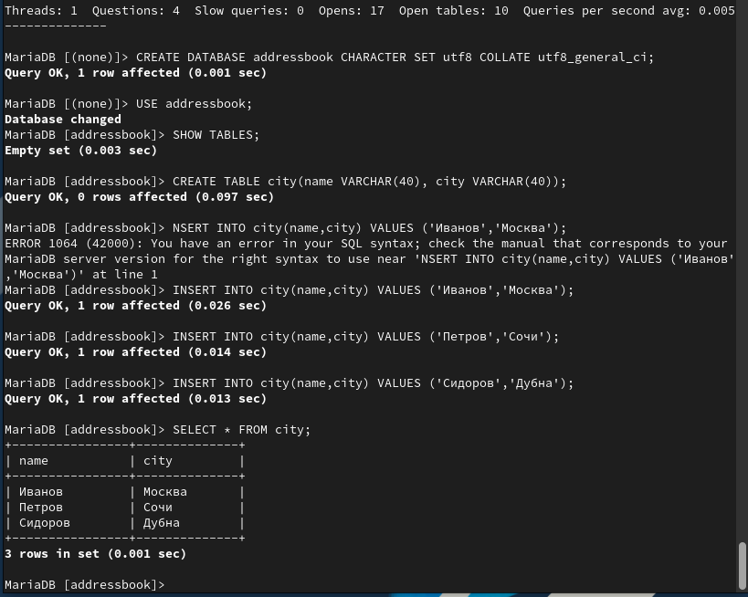{ width=90% height=70% }

---

## На виртуальной машине server перейдём в каталог для внесения изменений в настройки внутреннего окружения, создадим в нём каталог mysql, в который поместим в соответствующие подкаталоги конфигурационные файлы MariaDB и резервную копию базы данных addressbook. В каталоге создадим исполняемый файл mysql.sh. Откроем его на редактирование и пропишем скрипт. Для отработки созданного скрипта во время загрузки виртуальных машин в конфигурационном файле Vagrantfile добавим соответствующую запись (рис. @fig-15):

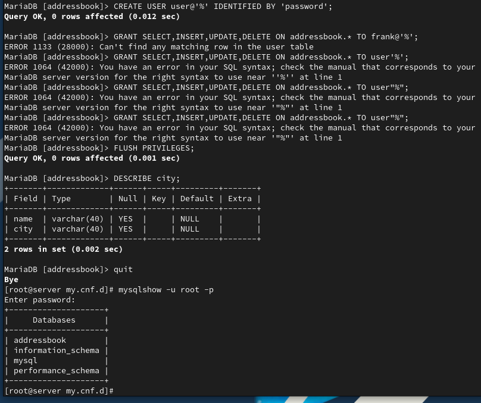{ width=90% height=70% }

---

## Этап выполнения работы №16

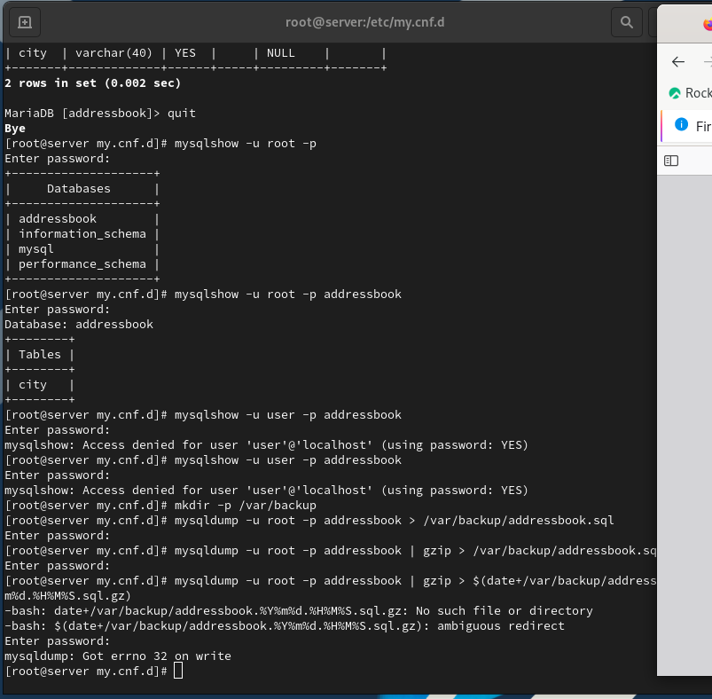{ width=90% height=70% }

---

## Этап выполнения работы №17

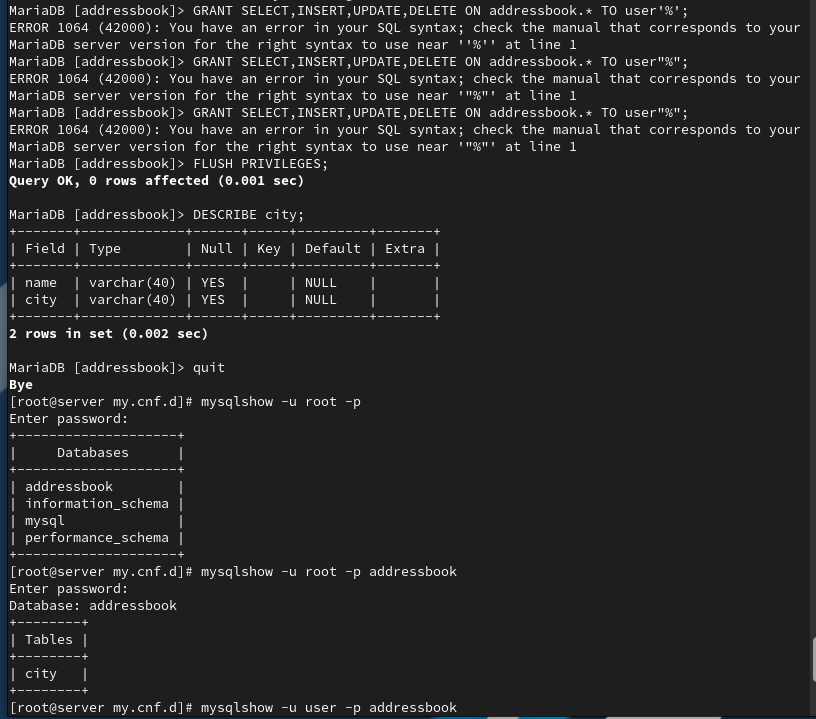{ width=90% height=70% }

---

## Этап выполнения работы №18

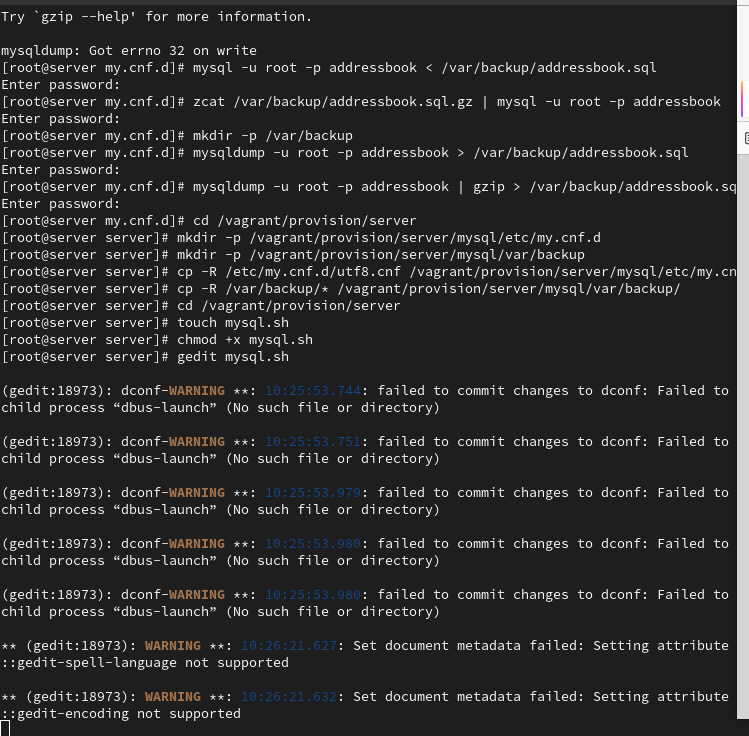{ width=90% height=70% }

---

# Выводы

В ходе выполнения лабораторной работы были приобретены практические навыки

---

# Спасибо за внимание!

## Вопросы?
