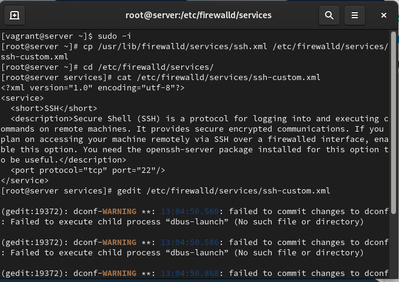
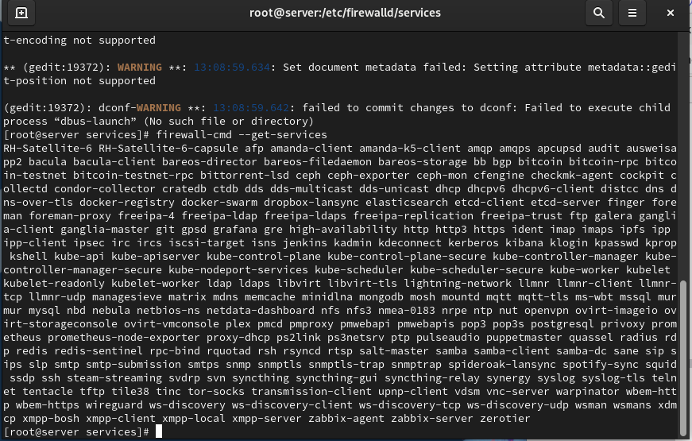
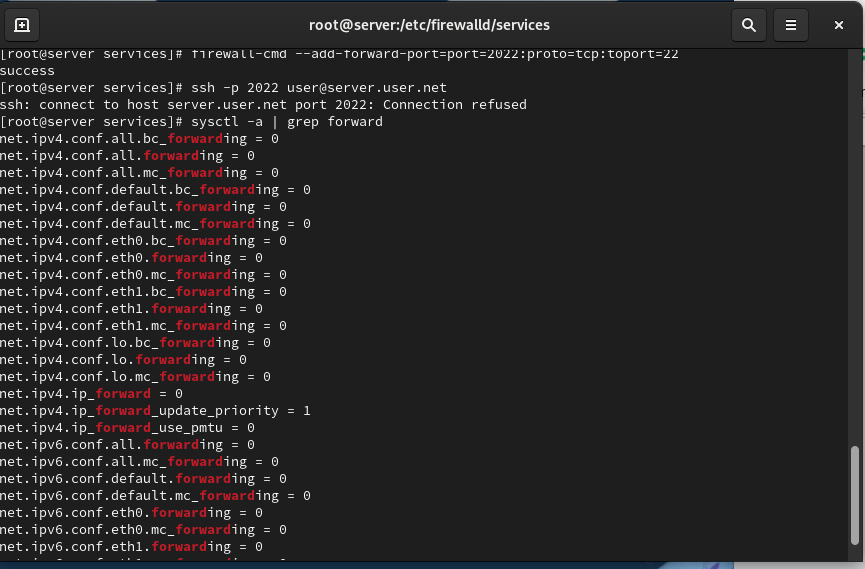

# Цели и задачи работы

## Цель лабораторной работы

Получить практические навыки настройки межсетевого экрана firewalld  
в части создания служб, перенаправления портов и активации Masquerading.

# Выполнение работы

## Копирование и просмотр стандартной службы SSH

{ #fig:001 width=80% }

## Внесение изменений в файл службы

{ #fig:002 width=80% }

## Проверка списка служб и добавление новой

{ #fig:003 width=80% }

## Port Forwarding 2022 → 22

{ #fig:004 width=80% }

## Port Forwarding 2022 → 22

{ #fig:005 width=80% }

## Проверка параметров ядра

{ #fig:006 width=80% }

## Включение forwarding и masquerading

{ #fig:007 width=80% }

## Проверка доступа в Интернет с клиента

{ #fig:008 width=80% }

## Создание provisioning-скрипта firewall.sh

{ #fig:009 width=80% }

# Выводы по работе

## Вывод

- Создана пользовательская служба firewalld на базе SSH.  
- Настроено перенаправление порта 2022 → 22.  
- Включены IPv4 forwarding и masquerading.  
- Проверен доступ клиента во внешнюю сеть.  
- Подготовлены provisioning-файлы для автоматизации конфигурации Firewalld.
