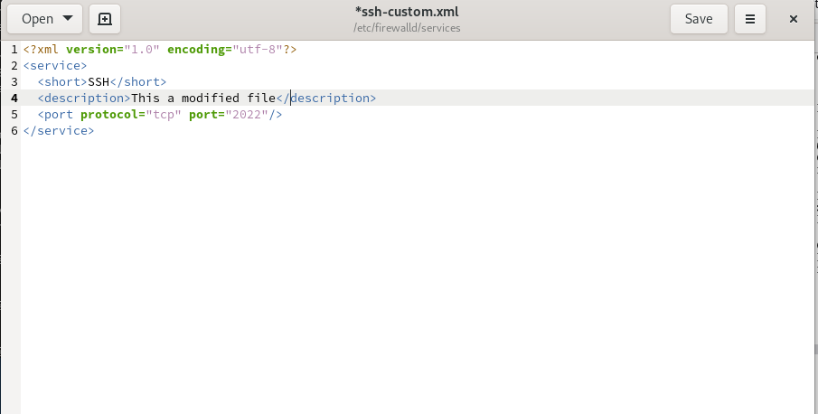
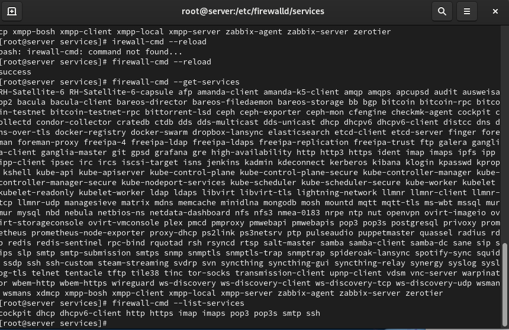
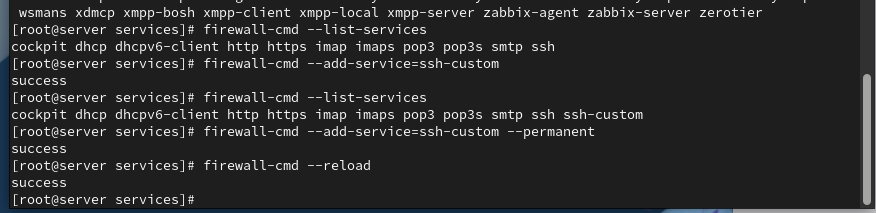
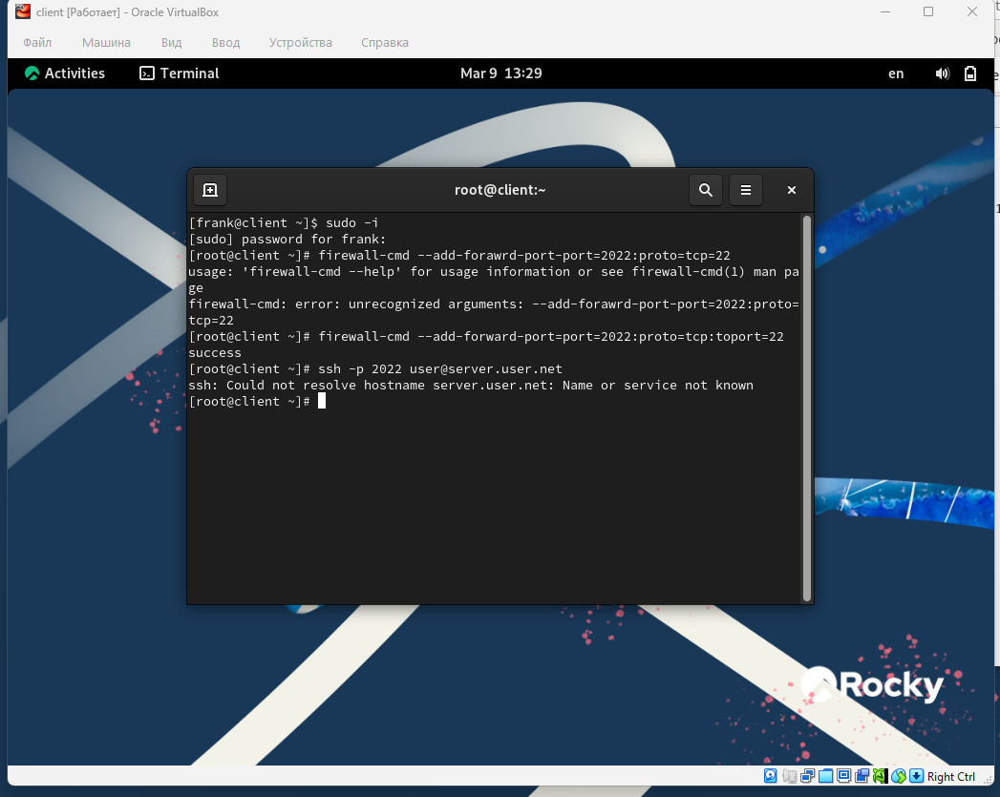
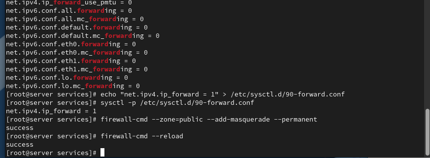
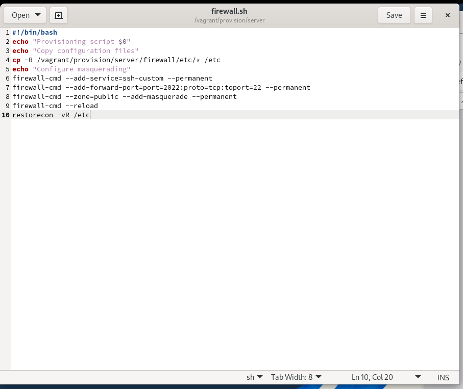
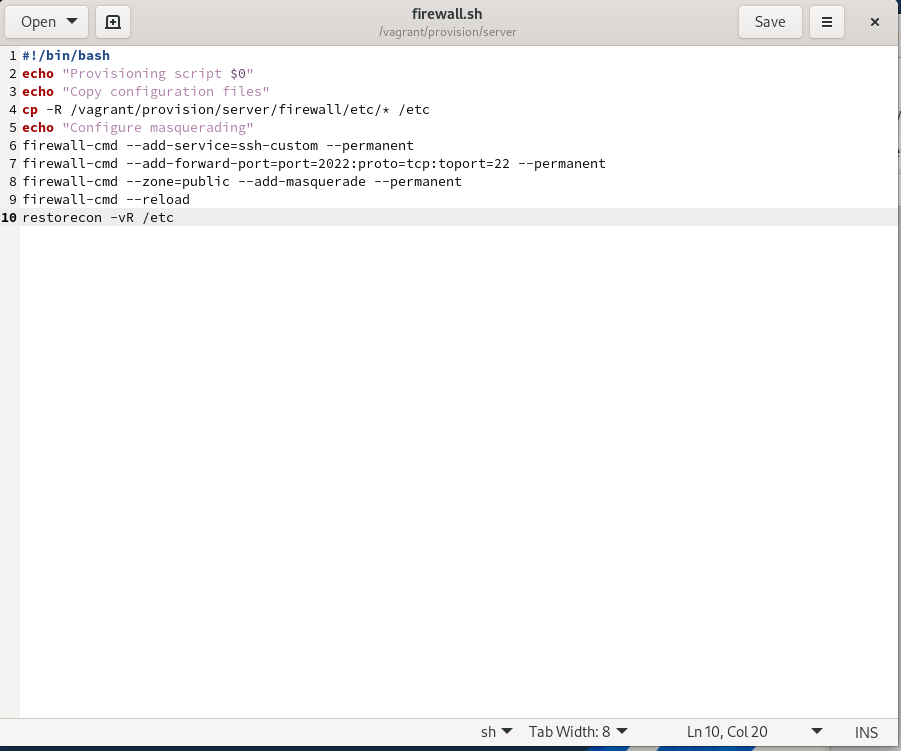

# Лабораторная работа №07

## Лабораторная работа №07

---

# Цель работы

Приобретение практических навыков администрирования сетевых подсистем

---

## На основе существующего файла описания службы ssh создадим файл с собственным описанием. Перейдём в каталог служб и посмотрим содержимое созданного файла (рис. @fig-1):

{ width=90% height=70% }

---

## Откроем файл описания службы на редактирование и заменим порт 22 на новый порт (2022). В этом же файле скорректируем описание службы для демонстрации, что это модифицированный файл службы (рис. @fig-2):

{ width=90% height=70% }

---

## Просмотрим список доступных FirewallD служб, чтобы убедиться, что наша новая служба ещё не отображается (рис. @fig-3):

{ width=90% height=70% }

---

## Перегрузим правила межсетевого экрана с сохранением информации о состоянии и вновь выведем на экран список служб, а также список активных служб. Убедимся, что созданная нами служба отображается в списке доступных для FirewallD служб, но не активирована (рис. @fig-4):

{ width=90% height=70% }

---

## Добавим новую службу в FirewallD и выведем на экран список активных служб, чтобы убедиться в её активации (рис. @fig-5):

{ width=90% height=70% }

---

## Организуем на сервере переадресацию с порта 2022 на порт 22 (рис. @fig-6):

{ width=90% height=70% }

---

## На клиенте попробуем получить доступ по SSH к серверу через порт 2022 (рис. @fig-7):

{ width=90% height=70% }

---

## На сервере посмотрим, активирована ли в ядре системы возможность перенаправления IPv4-пакетов (рис. @fig-8):

{ width=90% height=70% }

---

## Включим перенаправление IPv4-пакетов на сервере и затем включим маскарадинг (рис. @fig-9):

{ width=90% height=70% }

---

## На клиенте проверим доступность выхода в Интернет после настройки маскарадинга (рис. @fig-10):

{ width=90% height=70% }

---

## На виртуальной машине server перейдём в каталог для внесения изменений в настройки внутреннего окружения, создадим в нём каталог firewall, в который поместим в соответствующие подкаталоги конфигурационные файлы FirewallD. В каталоге создадим файл firewall.sh (рис. @fig-11):

{ width=90% height=70% }

---

# Выводы

В ходе выполнения лабораторной работы были приобретены практические навыки

---

# Спасибо за внимание!

## Вопросы?
