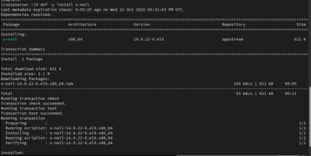
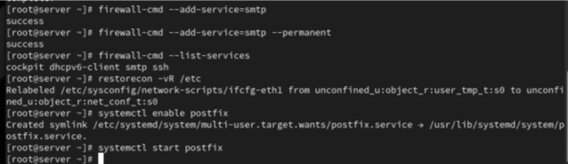
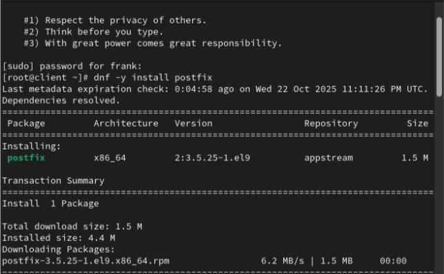
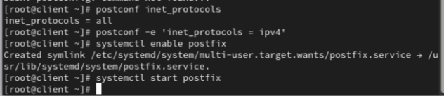
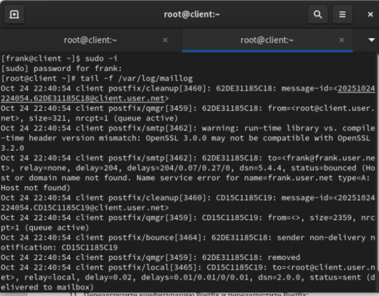

# Цели и задачи работы

## Цель лабораторной работы

Приобрести практические навыки установки и конфигурирования SMTP-сервера  
на базе Postfix в виртуальной среде, а также проверить доставку локальной и доменной почты.

## Задачи

- Установить и запустить Postfix на server и client  
- Выполнить настройку параметров Postfix через postconf  
- Проверить доставку локальной почты и пересылку между узлами  
- Настроить доставку на доменные адреса с использованием DNS (A/MX/PTR)  
- Подготовить provisioning-скрипты для автоматизации развёртывания

# Выполнение лабораторной работы

## Установка Postfix на сервере

{ #fig:001 width=80% }

## Настройка параметров myorigin e mydomain

{ #fig:002 width=80% }

## Отключение IPv6 в Postfix

{ #fig:003 width=80% }

## Проверка локальной доставки письма

{ #fig:004 width=80% }

## Анализ журнала maillog

{ #fig:005 width=80% }

## Настройка Postfix на клиенте

{ #fig:006 width=80% }

## Разрешение пересылки между узлами

{ #fig:007 width=80% }

## Подтверждение доставки по логам

{ #fig:008 width=80% }

## Ошибка при отправке на доменный адрес

{ #fig:009 width=80% }

## Проверка очереди сообщений на клиенте

{ #fig:010 width=80% }

## Настройка прямой DNS-зоны

{ #fig:011 width=80% }

## Настройка обратной DNS-зоны

{ #fig:012 width=80% }

## Добавление домена в mydestination

{ #fig:013 width=80% }

## Успешная доставка доменной почты

{ #fig:014 width=80% }

## Подтверждение письма в почтовом ящике

{ #fig:015 width=80% }

# Выводы по проделанной работе

## Вывод

- Установлен и настроен Postfix на виртуальных машинах server и client  
- Выполнена настройка параметров Postfix через postconf и проверка конфигурации  
- Подтверждена доставка локальной почты и пересылка между узлами сети  
- Реализована доставка на доменные адреса через настройку DNS-зон и mydestination  
- Подготовлены provisioning-скрипты mail.sh для автоматизации развёртывания
