# Лабораторная работа №08

## Лабораторная работа №08

---

# Цель работы

Приобретение практических навыков администрирования сетевых подсистем

---

## На виртуальной машине server войдём под нашим пользователем и откроем терминал. Перейдём в режим суперпользователя и установим необходимые для работы пакеты (рис. @fig-1, @fig-2):

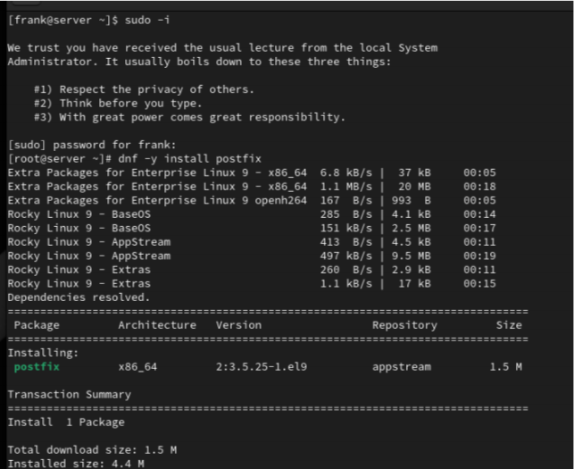{ width=90% height=70% }

---

## Установка Postfix на сервере

{ width=90% height=70% }

---

## Сконфигурируем межсетевой экран, разрешив работать службе протокола SMTP. Восстановим контекст безопасности в SELinux и запустим Postfix (рис. @fig-3):

{ width=90% height=70% }

---

## Просмотрим и изменим параметры Postfix, заменив значение параметра myorigin на значение параметра mydomain (рис. @fig-4):

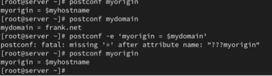{ width=90% height=70% }

---

## Проверим корректность конфигурационного файла и перезагрузим Postfix (рис. @fig-5):

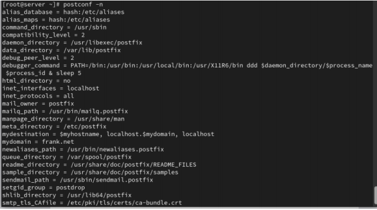{ width=90% height=70% }

---

## На сервере под учётной записью пользователя отправим себе письмо, используя утилиту mail (рис. @fig-6):

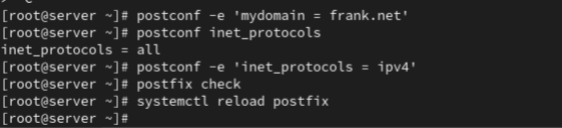{ width=90% height=70% }

---

## Запустим мониторинг работы почтовой службы и посмотрим, что произошло с нашим сообщением (рис. @fig-7):

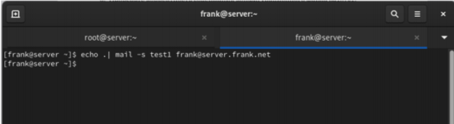{ width=90% height=70% }

---

## На виртуальной машине client установим необходимые для работы пакеты (рис. @fig-8, @fig-9):

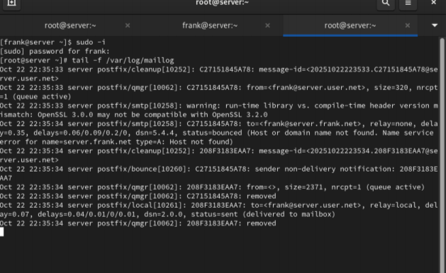{ width=90% height=70% }

---

## Установка Postfix на клиенте

{ width=90% height=70% }

---

## Настроим Postfix на клиенте и отправим тестовое письмо (рис. @fig-10):

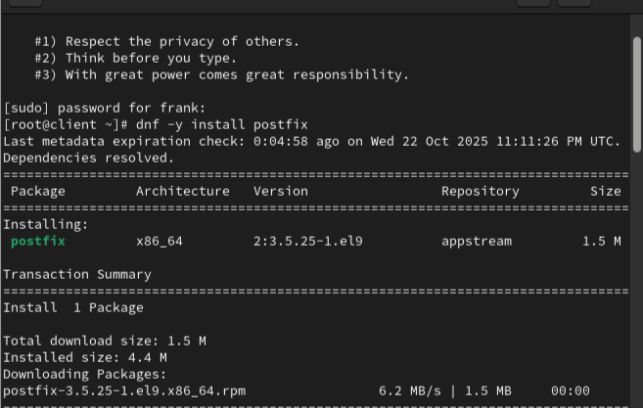{ width=90% height=70% }

---

## На сервере настроим параметры сетевых интерфейсов и перезапустим Postfix (рис. @fig-11):

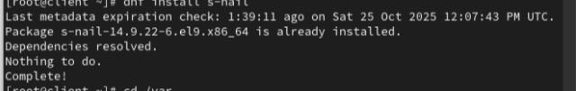{ width=90% height=70% }

---

## С клиента отправим письмо на свой доменный адрес и просмотрим очередь сообщений (рис. @fig-12):

{ width=90% height=70% }

---

## Пропишем MX-запись в файлах прямой и обратной DNS-зон (рис. @fig-13):

{ width=90% height=70% }

---

## Восстановим контекст безопасности, перезапустим DNS и отправим сообщения из очереди (рис. @fig-14):

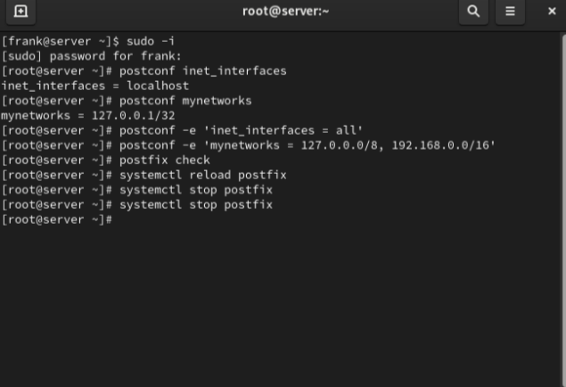{ width=90% height=70% }

---

## Настроим скрипты для автоматического развёртывания и добавим записи в Vagrantfile (рис. @fig-15):

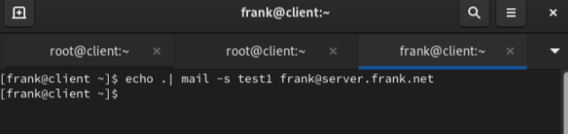{ width=90% height=70% }

---

## Этап выполнения работы №16

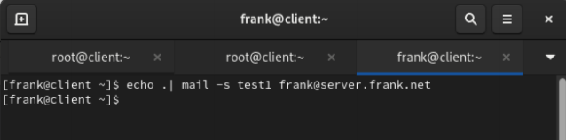{ width=90% height=70% }

---

## Этап выполнения работы №17

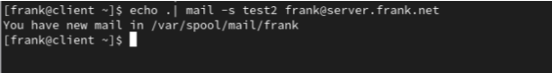{ width=90% height=70% }

---

## Этап выполнения работы №18

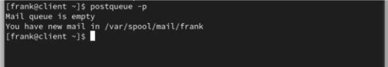{ width=90% height=70% }

---

## Этап выполнения работы №19

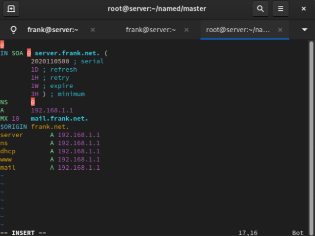{ width=90% height=70% }

---

## Этап выполнения работы №20

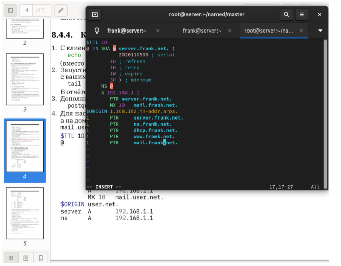{ width=90% height=70% }

---

## Этап выполнения работы №21

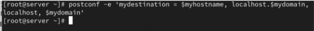{ width=90% height=70% }

---

## Этап выполнения работы №22

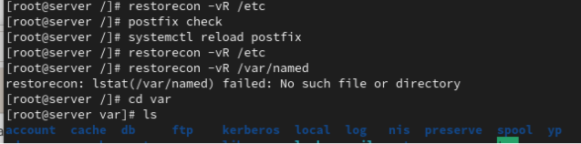{ width=90% height=70% }

---

## Этап выполнения работы №23

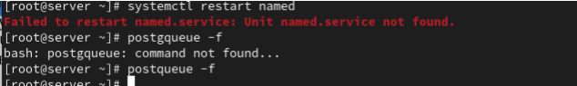{ width=90% height=70% }

---

## Этап выполнения работы №24

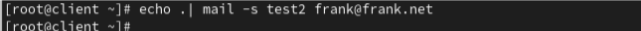{ width=90% height=70% }

---

## Этап выполнения работы №25

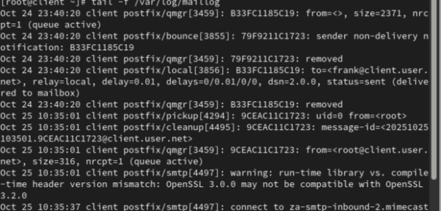{ width=90% height=70% }

---

## Этап выполнения работы №26

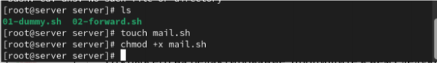{ width=90% height=70% }

---

## Этап выполнения работы №27

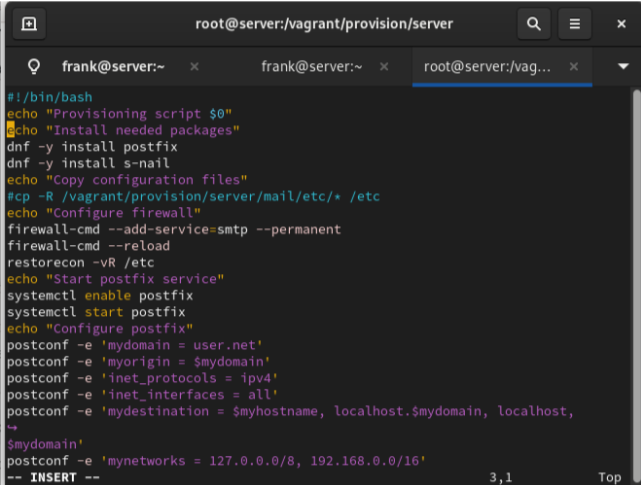{ width=90% height=70% }

---

## Этап выполнения работы №28

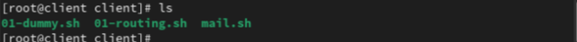{ width=90% height=70% }

---

## Этап выполнения работы №29

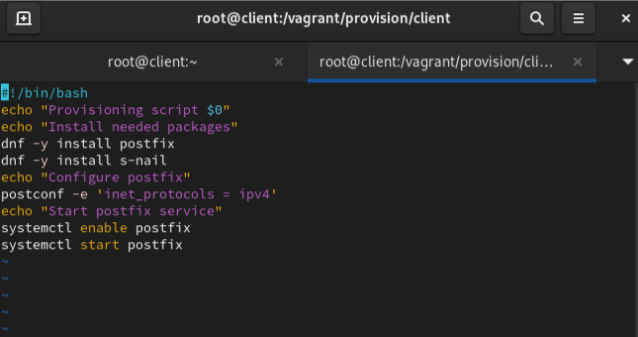{ width=90% height=70% }

---

## Этап выполнения работы №30

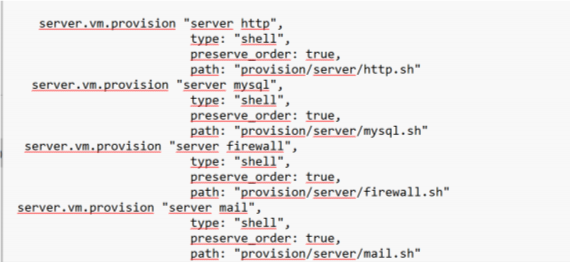{ width=90% height=70% }

---

## Этап выполнения работы №31

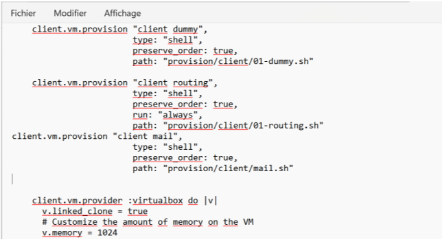{ width=90% height=70% }

---

# Выводы

В ходе выполнения лабораторной работы были приобретены практические навыки

---

# Спасибо за внимание!

## Вопросы?
