# Лабораторная работа №09

## Лабораторная работа №09

---

# Цель работы

Приобретение практических навыков администрирования сетевых подсистем

---

## На виртуальной машине server войдём под нашим пользователем и откроем терминал. Перейдём в режим суперпользователя и установим необходимые для работы пакеты (рис. @fig-1):

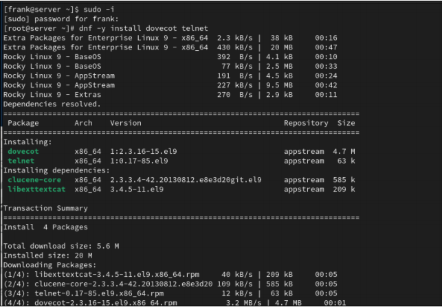{ width=90% height=70% }

---

## В Postfix зададим каталог для доставки почты. Сконфигурируем межсетевой экран, разрешив работать службам протоколов POP3 и IMAP (рис. @fig-2):

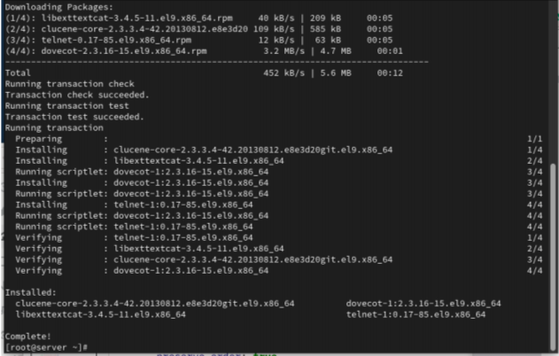{ width=90% height=70% }

---

## Восстановим контекст безопасности в SELinux. Перезапустим Postfix и запустим Dovecot (рис. @fig-3):

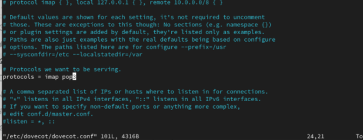{ width=90% height=70% }

---

## На терминале сервера просмотрим имеющуюся почту и mailbox пользователя (рис. @fig-4):

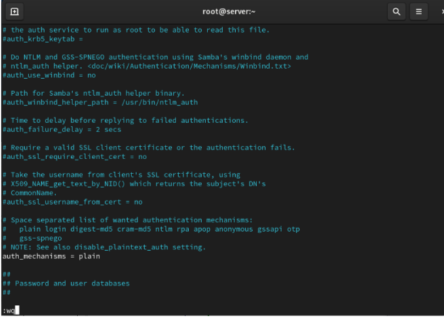{ width=90% height=70% }

---

## На виртуальной машине client установим почтовый клиент Evolution, запустим и настроим его для работы с нашим почтовым сервером (рис. @fig-5):

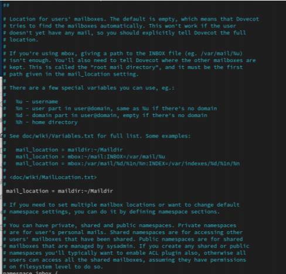{ width=90% height=70% }

---

## Из почтового клиента отправим себе несколько тестовых писем и убедимся, что они доставлены. Параллельно посмотрим сообщения при мониторинге почтовой службы на сервере (рис. @fig-6):

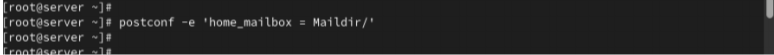{ width=90% height=70% }

---

## Проверим работу почтовой службы, используя на сервере протокол Telnet: подключимся к почтовому серверу по протоколу POP3, получим список писем, прочитаем первое письмо и удалим второе (рис. @fig-7):

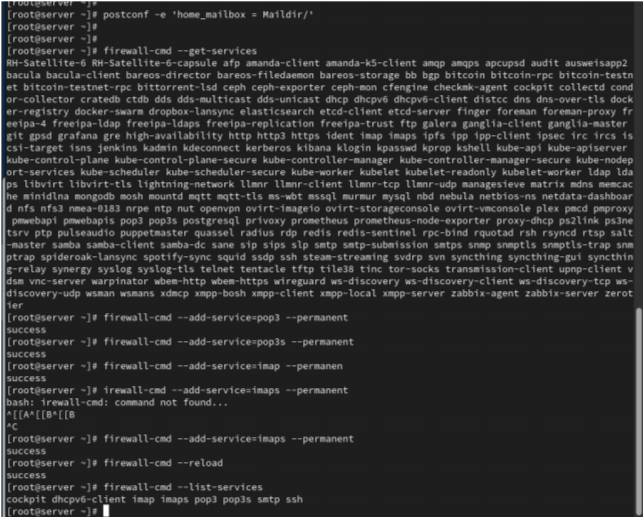{ width=90% height=70% }

---

## На виртуальной машине server перейдём в каталог для внесения изменений в настройки внутреннего окружения, поместим конфигурационные файлы Dovecot и заменим конфигурационный файл Postfix. Внесём изменения в файл mail.sh на сервере и клиенте (рис. @fig-8):

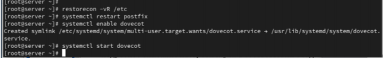{ width=90% height=70% }

---

## Этап выполнения работы №9

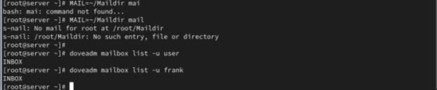{ width=90% height=70% }

---

## Этап выполнения работы №10

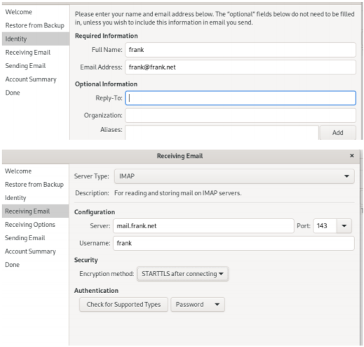{ width=90% height=70% }

---

## Этап выполнения работы №11

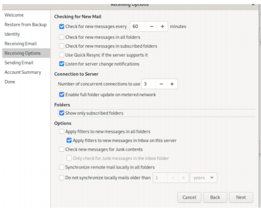{ width=90% height=70% }

---

## Этап выполнения работы №12

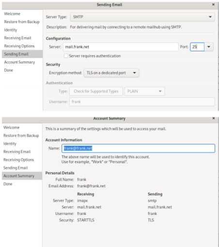{ width=90% height=70% }

---

## Этап выполнения работы №13

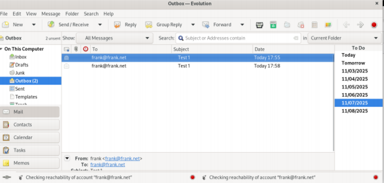{ width=90% height=70% }

---

## Этап выполнения работы №14

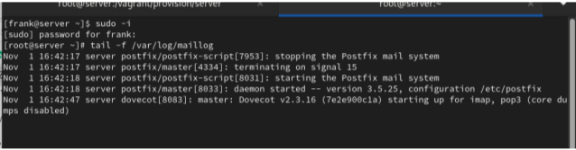{ width=90% height=70% }

---

## Этап выполнения работы №15

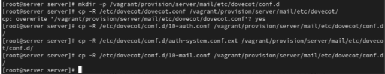{ width=90% height=70% }

---

## Этап выполнения работы №16

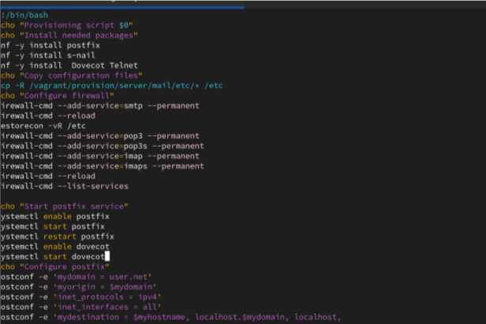{ width=90% height=70% }

---

## Этап выполнения работы №17

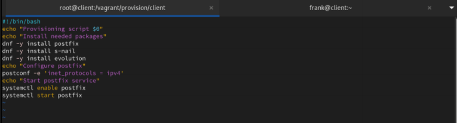{ width=90% height=70% }

---

# Выводы

В ходе выполнения лабораторной работы были приобретены практические навыки

---

# Спасибо за внимание!

## Вопросы?
