# Цели и задачи работы

## Цель лабораторной работы

Приобрести практические навыки конфигурирования SMTP-сервера  
в части настройки аутентификации и защищённой передачи данных.

## Задачи

- Настроить доставку почты через LMTP (Postfix → Dovecot)
- Включить SMTP-аутентификацию (SASL через Dovecot)
- Настроить SMTP over TLS (STARTTLS) и порт submission 587
- Проверить работу через консольные тесты и почтовый клиент
- Зафиксировать изменения в provisioning-окружении Vagrant

# Выполнение лабораторной работы

## Добавление LMTP в список протоколов

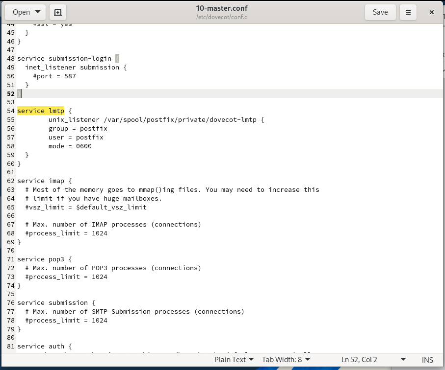{ width=80% }

## Настройка сервиса LMTP и unix-сокета

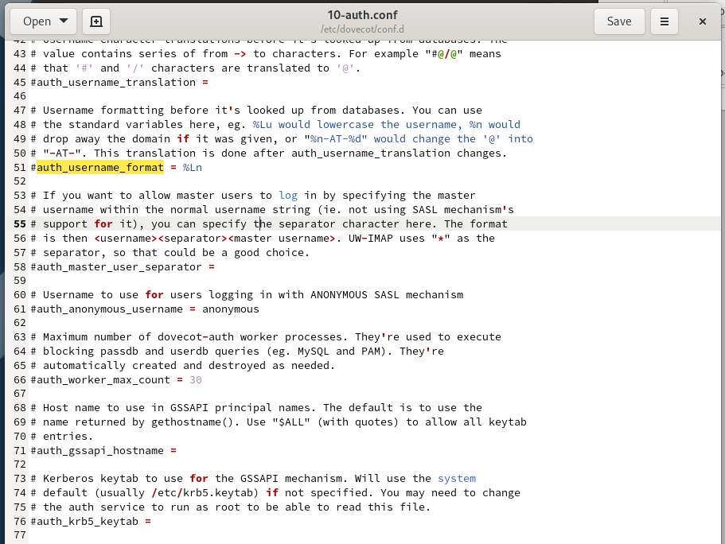{ width=80% }

## Формат имени пользователя для аутентификации

{ width=80% }

## Доставка сообщения: анализ логов

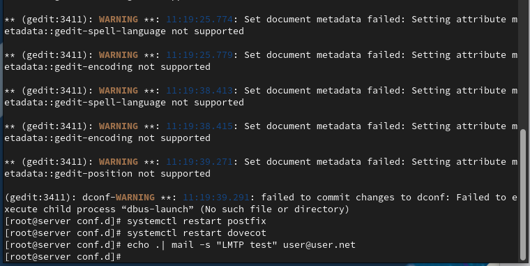{ width=80% }

## Проверка почтового ящика Maildir

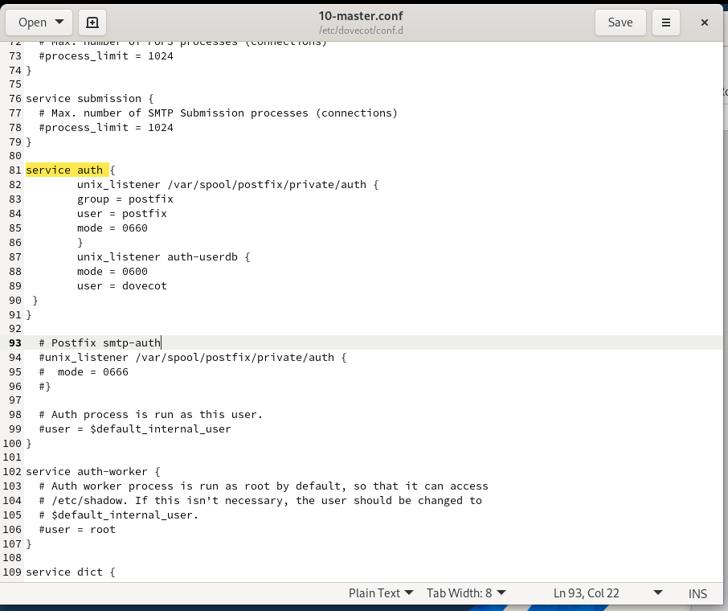{ width=80% }

## Служба auth в Dovecot

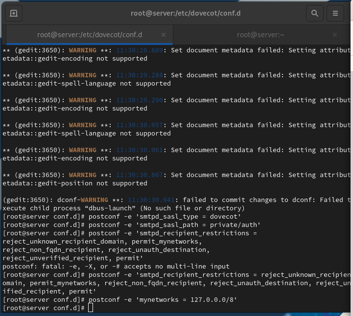{ width=80% }

## Настройка SASL в Postfix

{ width=80% }

## Временная конфигурация для теста SMTP AUTH

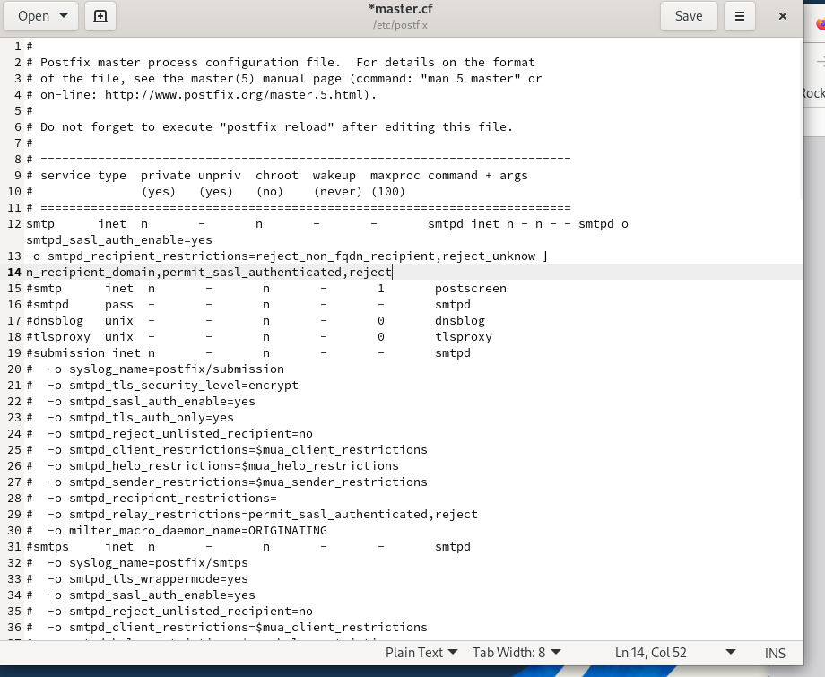{ width=80% }

## Проверка SMTP AUTH

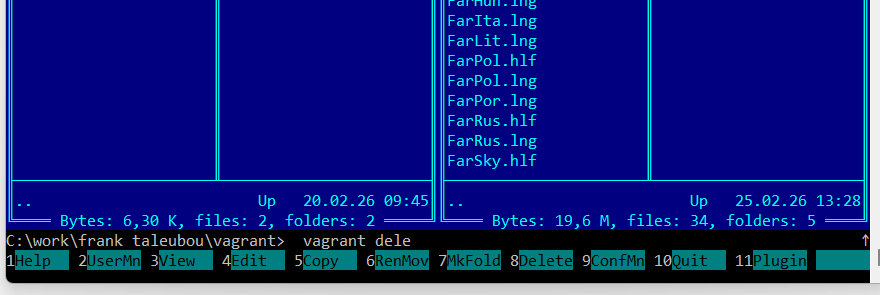{ width=80% }

## Подключение TLS (сертификат Dovecot)

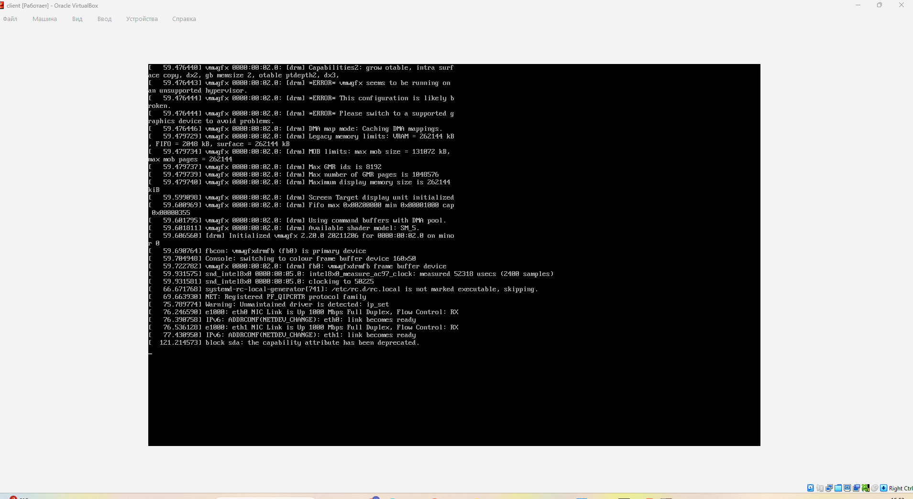{ width=80% }

## Порт submission (587) и обязательный TLS

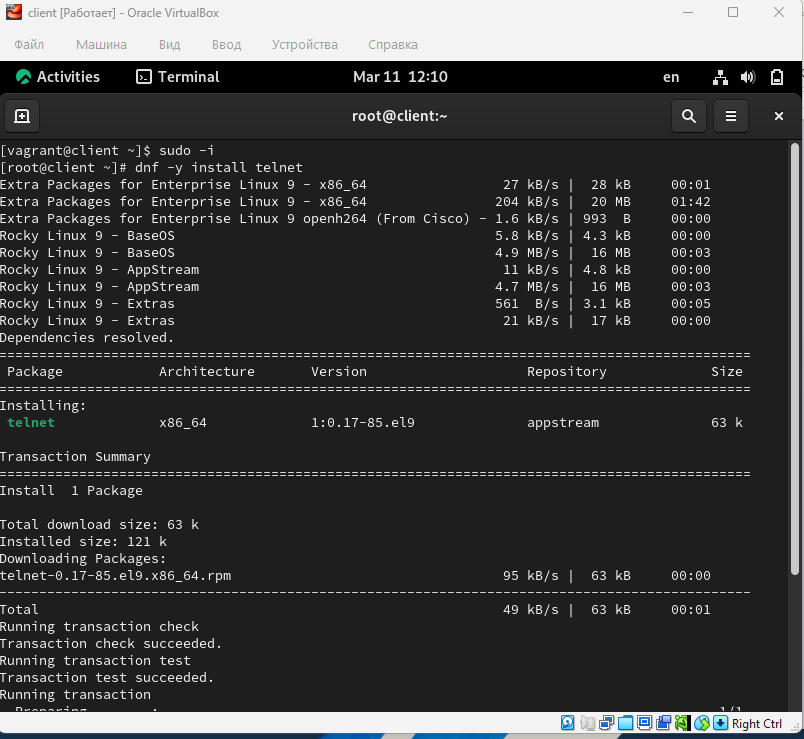{ width=80% }

## Проверка STARTTLS и аутентификации на 587

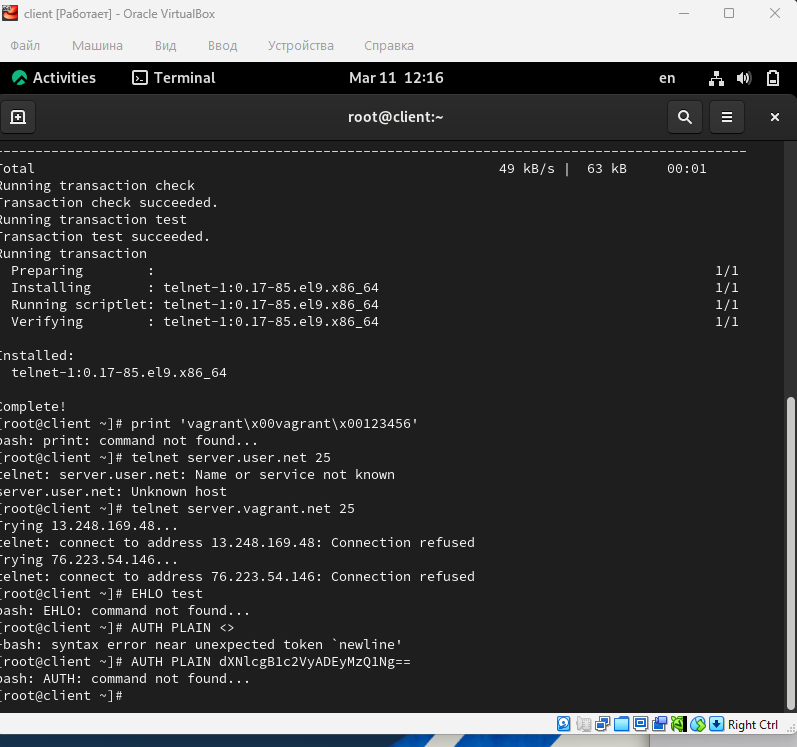{ width=80% }

## Настройка Evolution

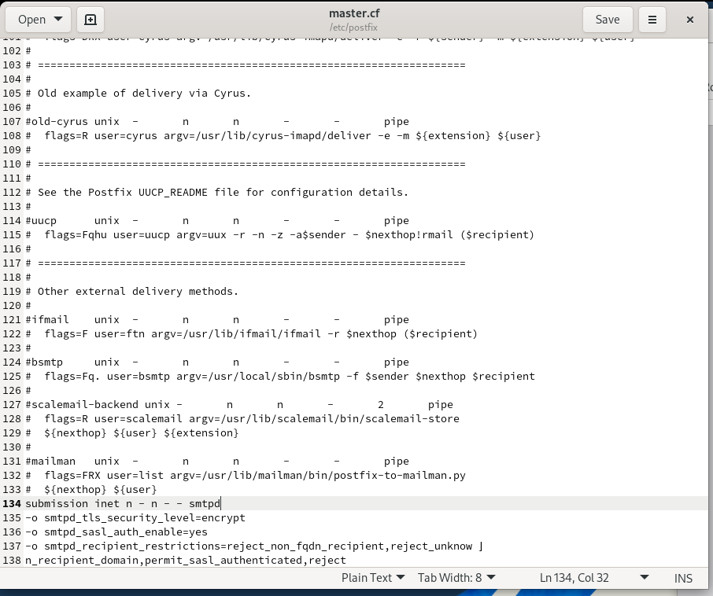{ width=80% }

## Результат проверки

{ width=80% }

## Логи сервера при работе TLS и AUTH

{ width=80% }

# Итоги работы

## Вывод

- Настроена доставка почты через LMTP (Postfix → Dovecot)
- Реализована SMTP-аутентификация пользователей (SASL через Dovecot)
- Включён SMTP over TLS и настроен submission 587 с обязательным шифрованием
- Выполнено тестирование через консоль и Evolution
- Конфигурация перенесена в provisioning, обеспечено воспроизводимое развёртывание
