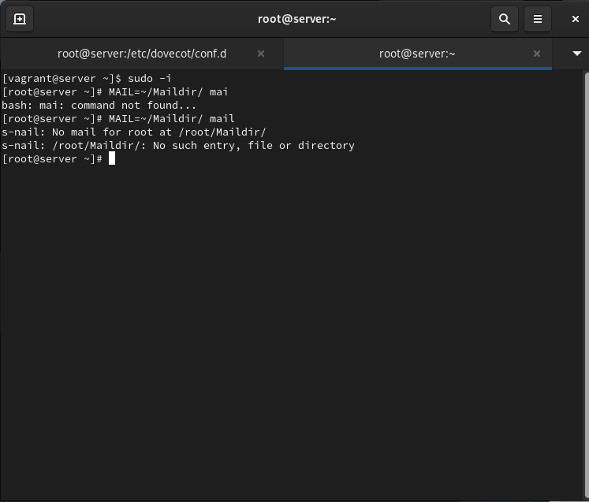
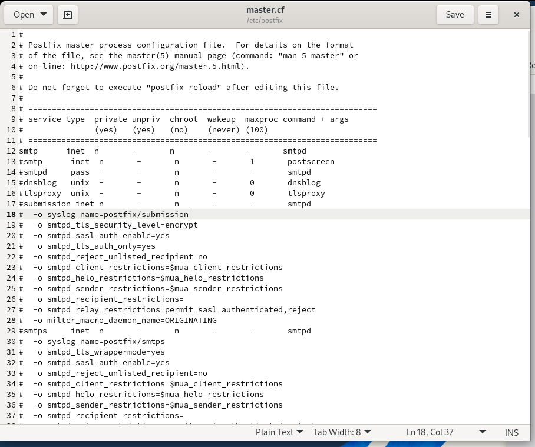
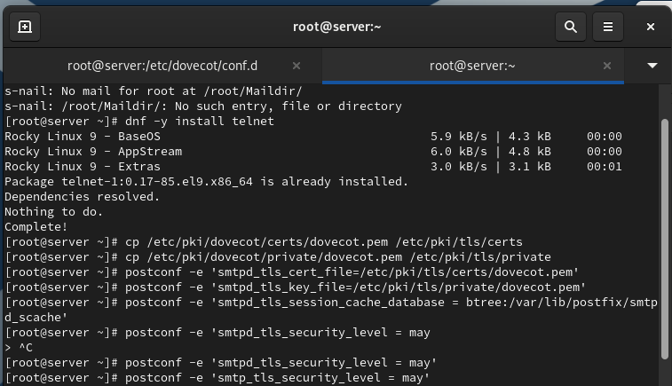
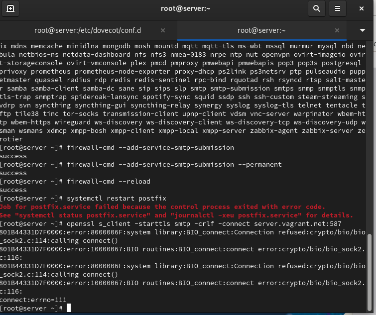
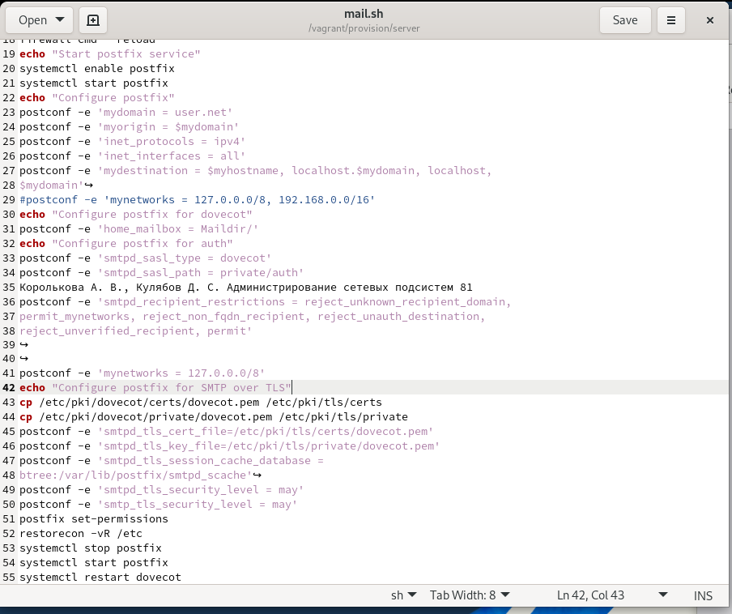

# Лабораторная работа №10

## Лабораторная работа №10

---

# Цель работы

Приобретение практических навыков администрирования сетевых подсистем

---

## На виртуальной машине server войдём под нашим пользователем и откроем терминал. Перейдём в режим суперпользователя (рис. @fig-1):

{ width=90% height=70% }

---

## В дополнительном терминале запустим мониторинг работы почтовой службы (рис. @fig-2):

{ width=90% height=70% }

---

## Добавим в список протоколов, с которыми может работать Dovecot, протокол LMTP (рис. @fig-3):

{ width=90% height=70% }

---

## Настроим в Dovecot сервис lmtp для связи с Postfix, определив расположение unix-сокета и права доступа (рис. @fig-4):

{ width=90% height=70% }

---

## Переопределим в Postfix передачу сообщений через заданный unix-сокет (рис. @fig-5):

{ width=90% height=70% }

---

## В файле /etc/dovecot/conf.d/10-auth.conf зададим формат имени пользователя для аутентификации в форме логина без указания домена (рис. @fig-6):

{ width=90% height=70% }

---

## Перезапустим Postfix и Dovecot для применения изменений (рис. @fig-7):

{ width=90% height=70% }

---

## Из-под учётной записи своего пользователя отправим письмо с клиента (рис. @fig-8):

{ width=90% height=70% }

---

## Посмотрим содержание логов при мониторинге почтовой службы и проверим почтовый ящик пользователя на сервере (рис. @fig-9, @fig-10):

{ width=90% height=70% }

---

## Просмотр логов и почтового ящика

{ width=90% height=70% }

---

## Определим службу аутентификации пользователей в Dovecot и настроим Postfix для использования SASL-аутентификации (рис. @fig-11):

{ width=90% height=70% }

---

## Для проверки работы аутентификации временно запустим SMTP-сервер с возможностью аутентификации (рис. @fig-12):

{ width=90% height=70% }

---

## На клиенте установим telnet, получим строку для аутентификации и протестируем подключение к SMTP-серверу (рис. @fig-13):

{ width=90% height=70% }

---

## Настроим SMTP-сервер на 587-м порту, разрешим соответствующую службу в межсетевом экране и перезапустим Postfix (рис. @fig-14):

{ width=90% height=70% }

---

## Этап выполнения работы №15

{ width=90% height=70% }

---

## Этап выполнения работы №16

{ width=90% height=70% }

---

# Выводы

В ходе выполнения лабораторной работы были приобретены практические навыки

---

# Спасибо за внимание!

## Вопросы?
