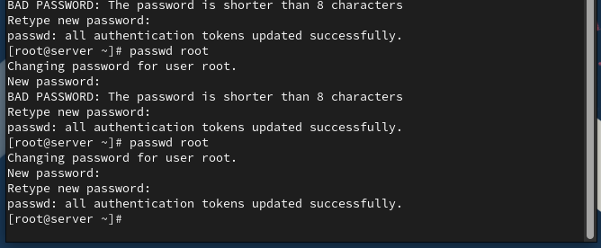
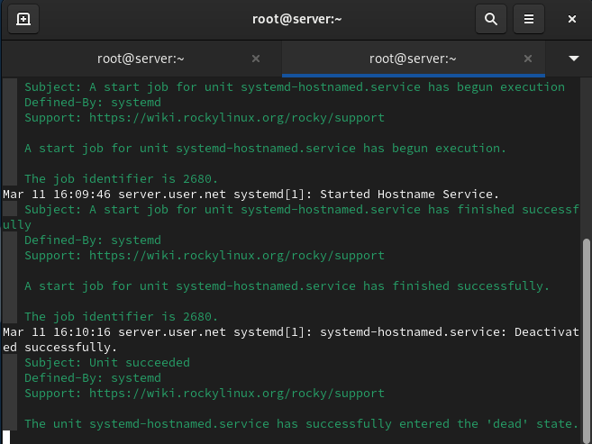
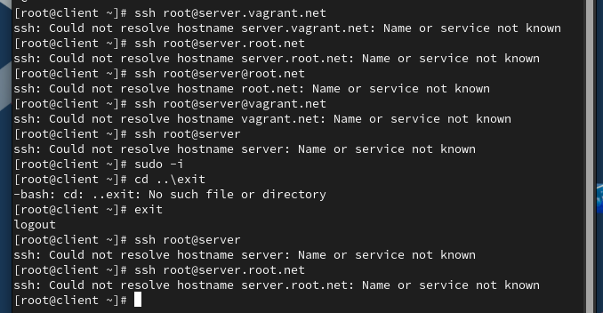
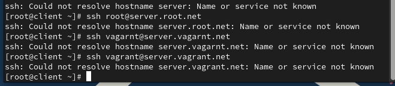
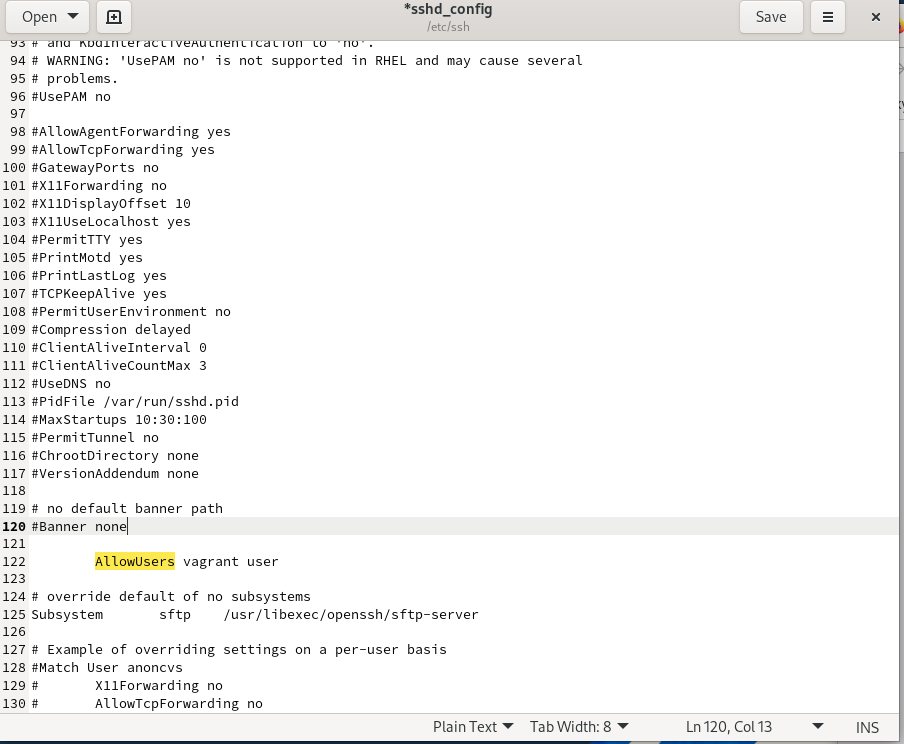
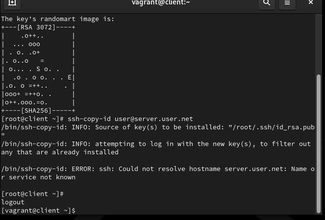

# Цели и задачи работы

## Цель лабораторной работы

Приобрести практические навыки настройки безопасного удалённого доступа к серверу  
с помощью SSH и средств контроля (sshd_config, firewall, SELinux, ключевая аутентификация, туннели).

# Выполнение лабораторной работы

## Мониторинг событий e попытка входа root

{ #fig:001 width=80% }

## Ошибки аутентификации root em журнале

{ #fig:002 width=80% }

## Запрет удалённого входа para root

{ #fig:003 width=80% }

## Результат после запрета root

{ #fig:004 width=80% }

## Успешное подключение пользователя akabrikosov

{ #fig:005 width=80% }

## Ограничение списка пользователей AllowUsers

{ #fig:006 width=80% }

## Отказ em доступе пользователю вне AllowUsers

{ #fig:007 width=80% }

## Разрешение доступа двум пользователям

{ #fig:008 width=80% }

## Настройка двух портов para SSH

{ #fig:009 width=80% }

## Ошибка bind no порт 2022

{ #fig:010 width=80% }

## Исправление SELinux e firewall para 2022

{ #fig:011 width=80% }

## Подключение por SSH через порт 2022

{ #fig:012 width=80% }

## Разрешение аутентификации por ключу

{ #fig:013 width=80% }

## Подключение por ключу sem senha

{ #fig:014 width=80% }

## SSH-туннель e перенаправление портов

{ #fig:015 width=80% }

## Проверка доступа к веб-странице через туннель

{ #fig:016 width=80% }

## Запуск консольных команд через SSH

{ #fig:017 width=80% }

## Просмотр почты no сервере через SSH

{ #fig:018 width=80% }

## Разрешение X11 Forwarding

{ #fig:019 width=80% }

## Попытка запуска графического приложения por SSH

{ #fig:020 width=80% }

# Выводы по проделанной работе

## Вывод

В ходе работы настроены механизмы безопасного удалённого доступа por SSH:  
запрет входа para root, ограничение пользователей через AllowUsers, работа через два порта с настройкой SELinux e firewall,  
аутентификация por ключу, организация SSH-туннелей e удалённый запуск приложений.  
Проверки подтвердили корректность конфигурации e соблюдение принципов безопасного доступа.
