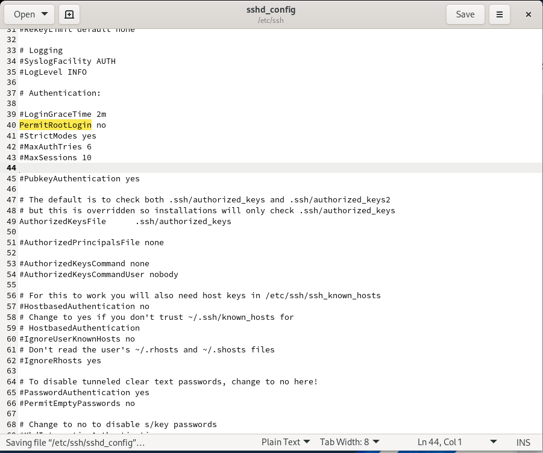
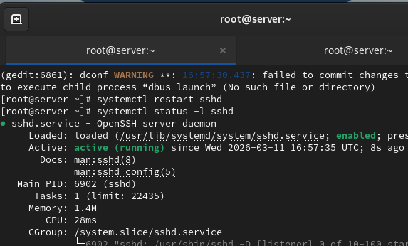
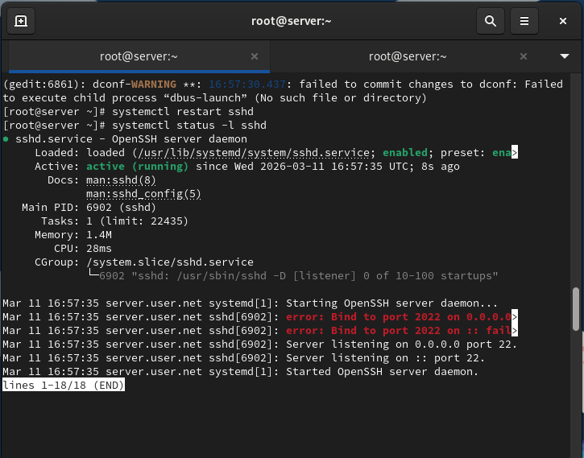
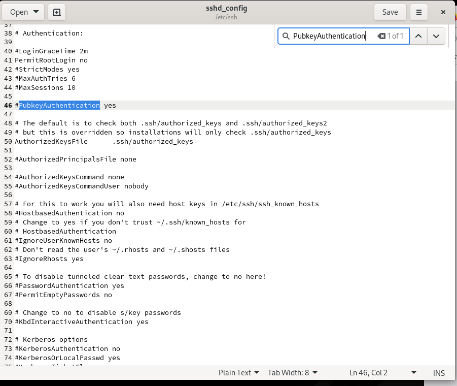
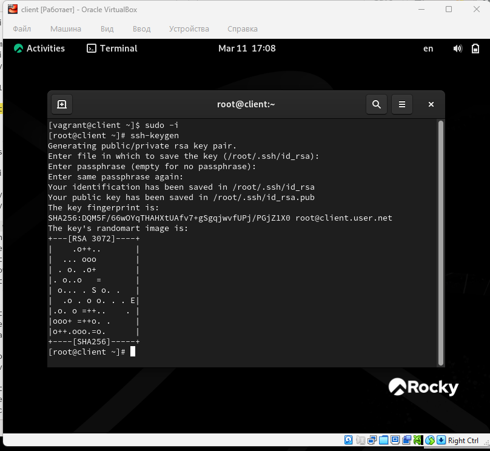
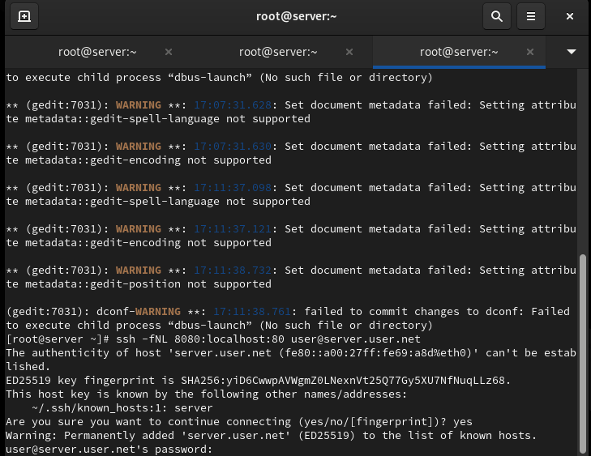
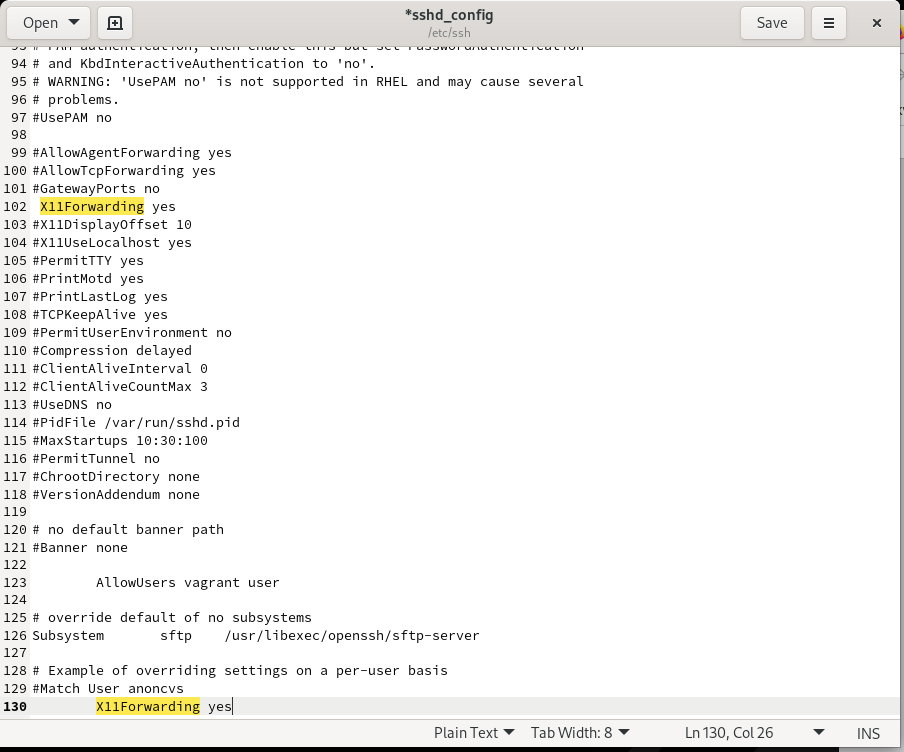
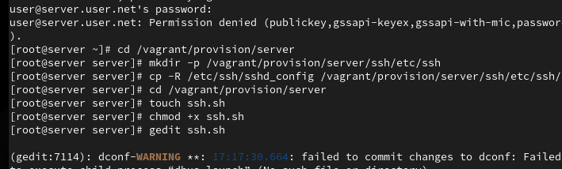
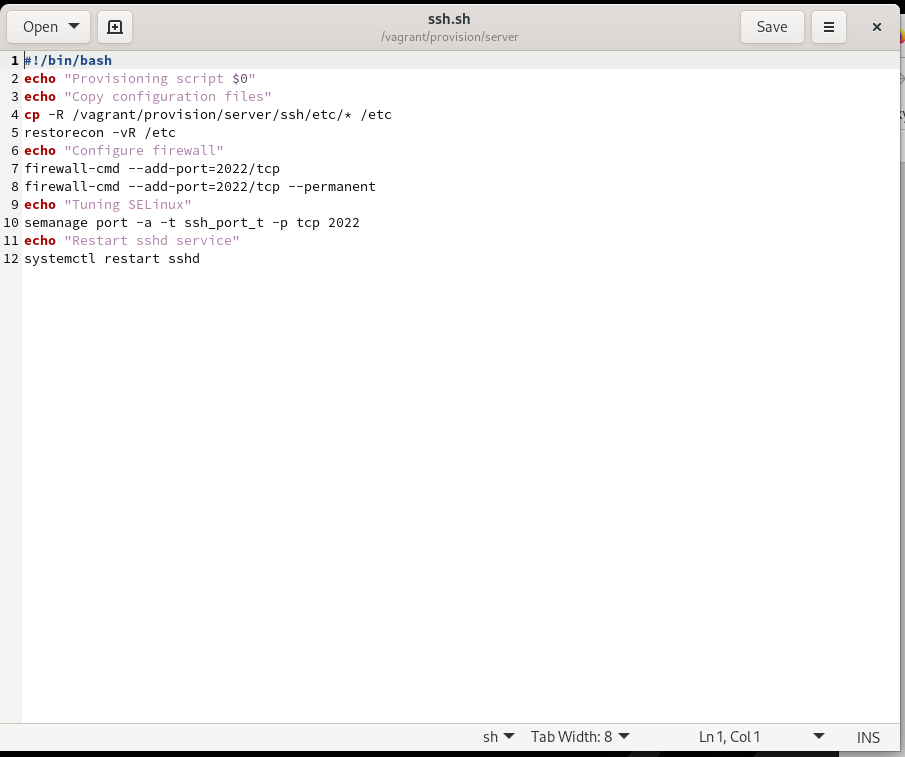

# Лабораторная работа №11

## Лабораторная работа №11

---

# Цель работы

Приобретение практических навыков администрирования сетевых подсистем

---

## На сервере зададим пароль для пользователя root (рис. @fig-1):

{ width=90% height=70% }

---

## На сервере в дополнительном терминале запустим мониторинг системных событий (рис. @fig-2):

{ width=90% height=70% }

---

## С клиента попытаемся получить доступ к серверу посредством SSH-соединения через пользователя root (рис. @fig-3):

{ width=90% height=70% }

---

## На сервере откроем файл /etc/ssh/sshd_config для редактирования и запретим вход на сервер пользователю root (рис. @fig-4):

{ width=90% height=70% }

---

## После сохранения изменений перезапустим sshd (рис. @fig-5):

{ width=90% height=70% }

---

## На сервере откроем файл /etc/ssh/sshd_config и добавим строку AllowUsers vagrant, затем перезапустим sshd (рис. @fig-6, @fig-7):

{ width=90% height=70% }

---

## Настройка AllowUsers

{ width=90% height=70% }

---

## Внесём изменение в файл /etc/ssh/sshd_config, добавив пользователя user в AllowUsers, и перезапустим sshd (рис. @fig-8, @fig-9):

{ width=90% height=70% }

---

## Добавление пользователя в AllowUsers

{ width=90% height=70% }

---

## В файле /etc/ssh/sshd_config добавим второй порт 2022, перезапустим sshd и проверим статус (рис. @fig-10, @fig-11):

{ width=90% height=70% }

---

## Настройка нескольких портов

{ width=90% height=70% }

---

## Исправим метки SELinux для порта 2022 и откроем порт в межсетевом экране, затем перезапустим sshd (рис. @fig-12):

{ width=90% height=70% }

---

## С клиента подключимся к серверу через порт 2022 и получим доступ root (рис. @fig-13):

{ width=90% height=70% }

---

## На сервере разрешим аутентификацию по ключу и перезапустим sshd (рис. @fig-14):

{ width=90% height=70% }

---

## На клиенте сформируем SSH-ключ и скопируем его на сервер (рис. @fig-15):

{ width=90% height=70% }

---

# Выводы

В ходе выполнения лабораторной работы были приобретены практические навыки

---

# Спасибо за внимание!

## Вопросы?
