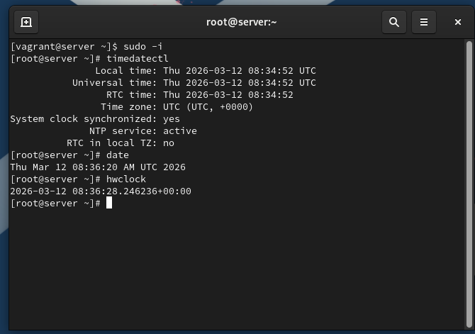
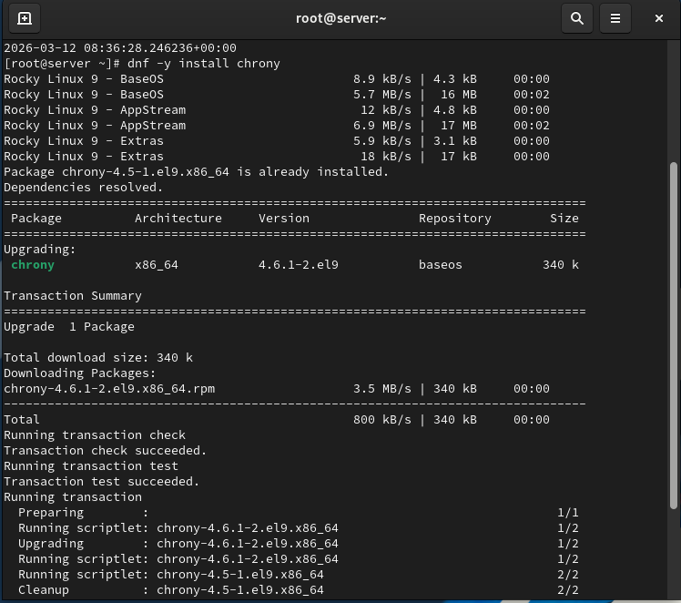
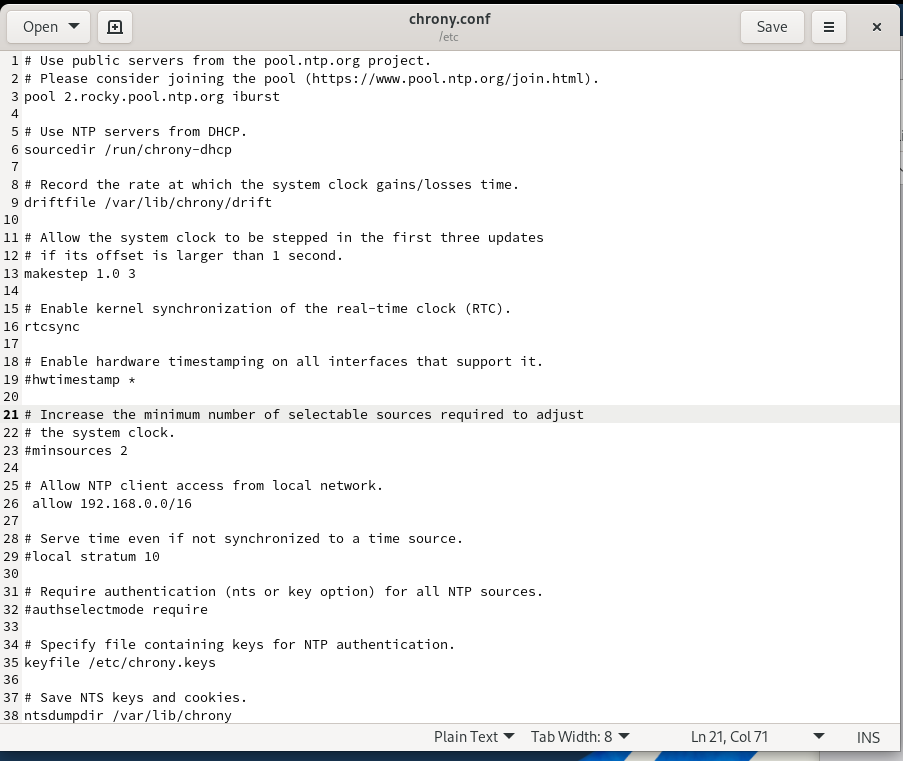
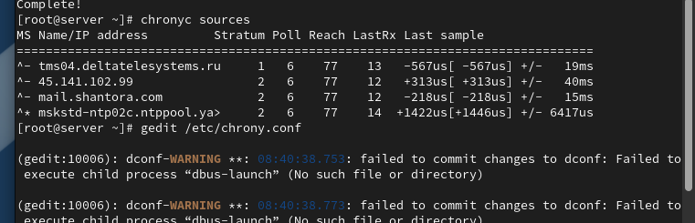

# Цели и задачи работы

## Цель лабораторной работы

Получение практических навыков управления системным временем  
и настройки синхронизации времени в Linux с использованием службы chrony.

# Выполнение лабораторной работы

## Проверка параметров времени

- Проверены параметры даты и времени на сервере и клиенте  
- Определена временная зона — UTC  
- Проверено состояние сетевой синхронизации времени  

{ width=80% }

## Проверка системного и аппаратного времени

- Проверено текущее системное время  
- Проверено аппаратное время (RTC)  
- Подтверждена синхронизация системных и аппаратных часов  

## Проверка источников синхронизации времени

- Проверены источники времени на сервере и клиенте  
- Проанализированы параметры stratum, задержки и смещения  
- Определён текущий активный источник времени  

{ width=80% }

## Настройка сервера времени

- В конфигурацию chrony на сервере добавлено разрешение для локальной сети  
- Выполнен перезапуск службы синхронизации времени  
- Настроен межсетевой экран для работы NTP  

{ width=80% }

## Настройка клиента времени

- В конфигурации chrony клиента указан сервер времени  
- Удалены остальные источники синхронизации  
- Выполнен перезапуск службы chronyd  

{ width=80% }

## Проверка синхронизации клиента с сервером

- Выполнена повторная проверка источников времени  
- Подтверждена синхронизация клиента с сервером  

{ width=80% }

# Выводы по проделанной работе

## Вывод

В ходе лабораторной работы выполнена настройка системного и аппаратного времени  
на виртуальных машинах server и client.  
Настроена централизованная синхронизация времени с использованием службы chrony.  
Реализована автоматизация настройки времени при загрузке виртуальных машин  
с использованием механизма provision в Vagrant.
