# Лабораторная работа №12

## Лабораторная работа №12

---

# Цель работы

Приобретение практических навыков администрирования сетевых подсистем

---

## На сервере посмотрим параметры настройки даты и времени, текущего системного времени и аппаратного времени (рис. @fig-1):

{ width=90% height=70% }

---

## На клиенте посмотрим параметры настройки даты и времени, текущего системного времени и аппаратного времени (рис. @fig-2):

{ width=90% height=70% }

---

## Установим на сервере необходимое программное обеспечение chrony (рис. @fig-3):

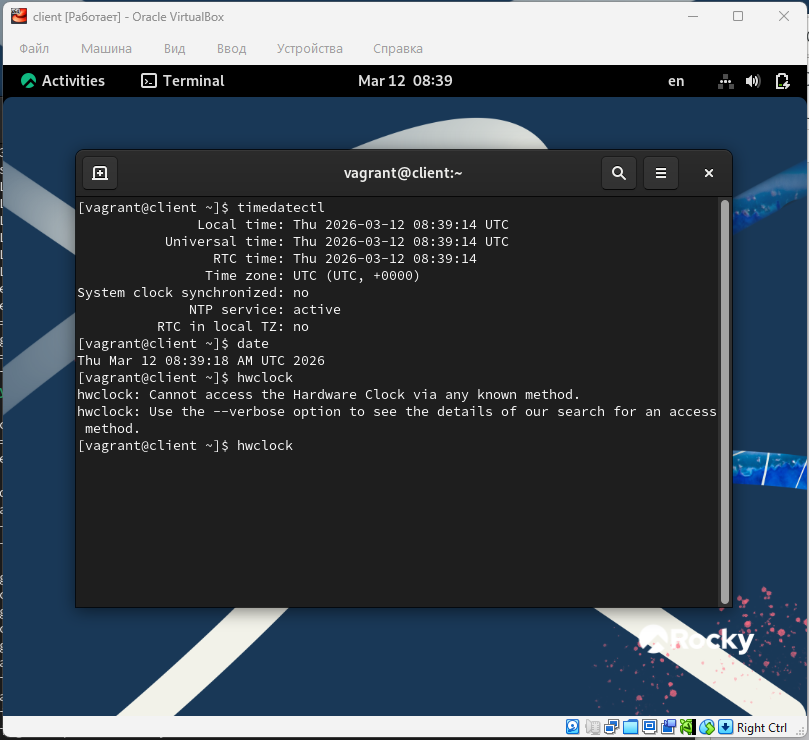{ width=90% height=70% }

---

## Проверим источники времени на клиенте до настройки (рис. @fig-4):

{ width=90% height=70% }

---

## Проверим источники времени на сервере до настройки (рис. @fig-5):

{ width=90% height=70% }

---

## На сервере откроем на редактирование файл /etc/chrony.conf и добавим строку allow 192.168.0.0/16 (рис. @fig-6):

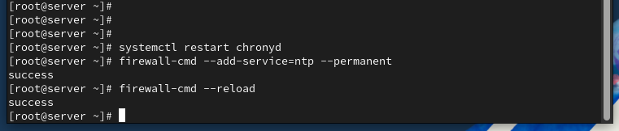{ width=90% height=70% }

---

## На сервере перезапустим службу chronyd и настроим межсетевой экран (рис. @fig-7):

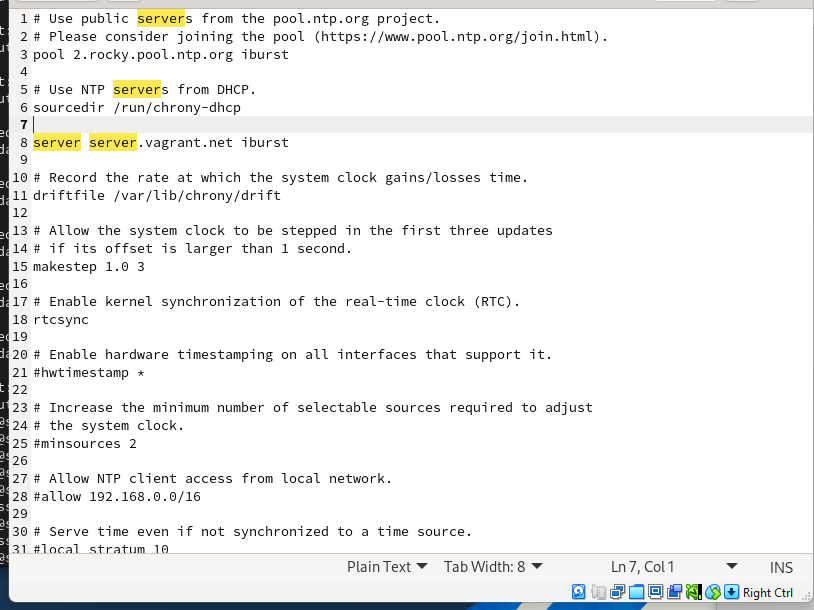{ width=90% height=70% }

---

## На клиенте откроем файл /etc/chrony.conf и добавим строку server server.user.net iburst, удалив все остальные строки с директивой server (рис. @fig-8):

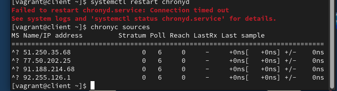{ width=90% height=70% }

---

## На клиенте перезапустим службу chronyd (рис. @fig-9):

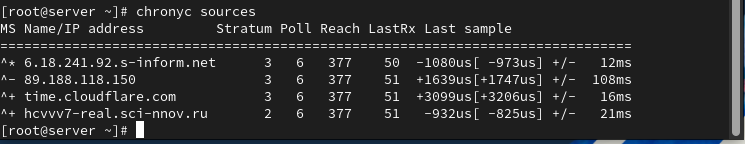{ width=90% height=70% }

---

## Проверим источники времени на клиенте после настройки (рис. @fig-10):

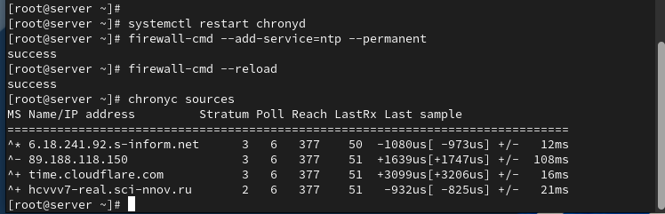{ width=90% height=70% }

---

## Проверим источники времени на сервере после настройки (рис. @fig-11):

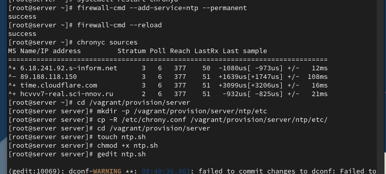{ width=90% height=70% }

---

## На виртуальной машине server перейдём в каталог для внесения изменений в настройки внутреннего окружения, создадим каталог ntp и исполняемый файл ntp.sh (рис. @fig-12):

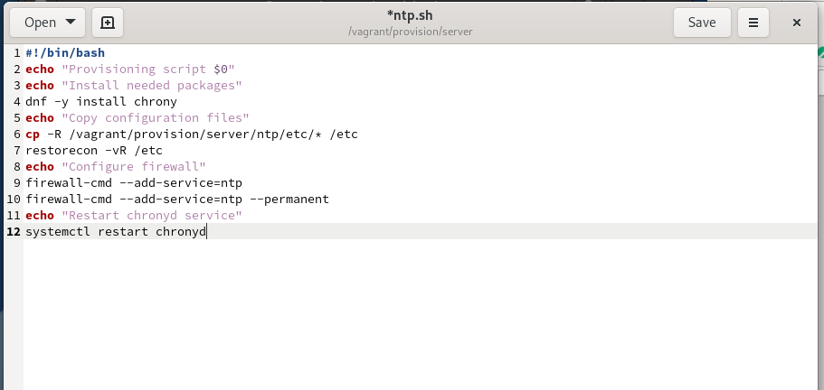{ width=90% height=70% }

---

## Откроем файл ntp.sh на редактирование и пропишем скрипт из лабораторной работы (рис. @fig-13):

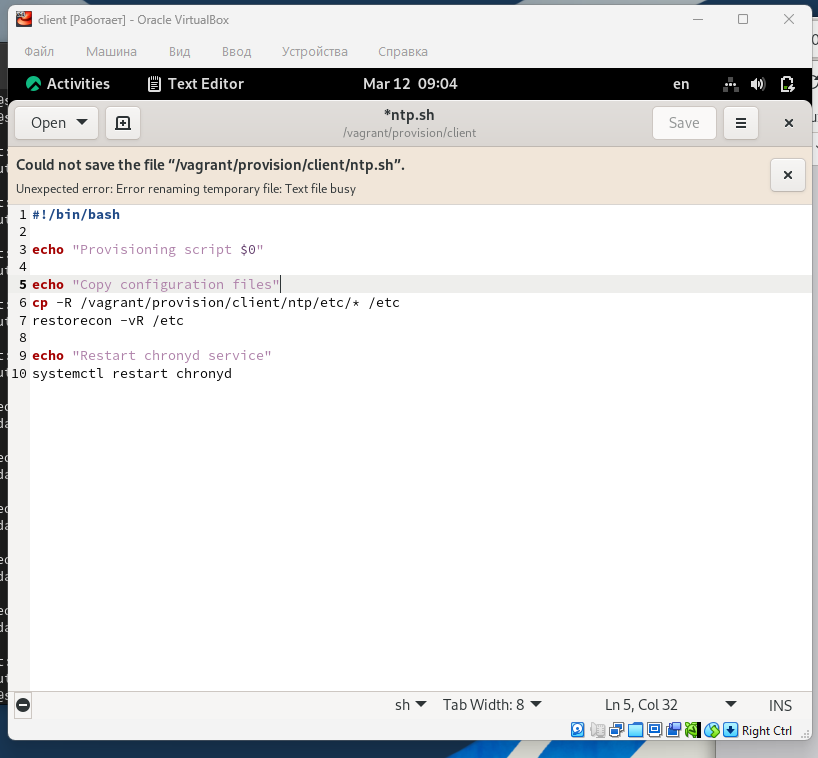{ width=90% height=70% }

---

## На виртуальной машине client перейдём в каталог для внесения изменений в настройки внутреннего окружения, создадим каталог ntp и исполняемый файл ntp.sh (рис. @fig-14):

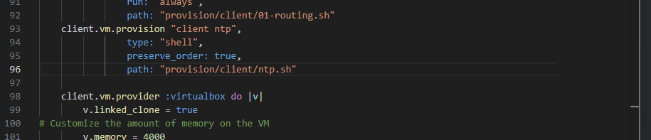{ width=90% height=70% }

---

## Откроем файл ntp.sh на редактирование и пропишем скрипт из лабораторной работы (рис. @fig-15):

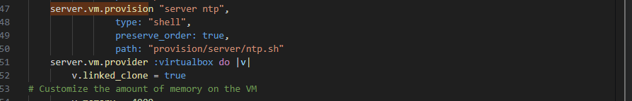{ width=90% height=70% }

---

# Выводы

В ходе выполнения лабораторной работы были приобретены практические навыки

---

# Спасибо за внимание!

## Вопросы?
