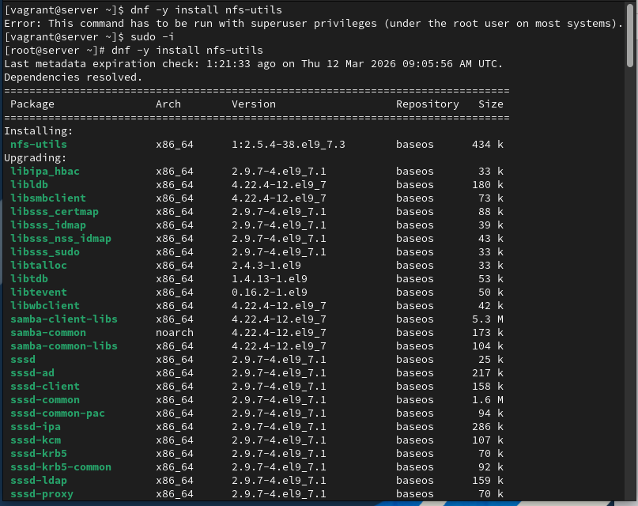
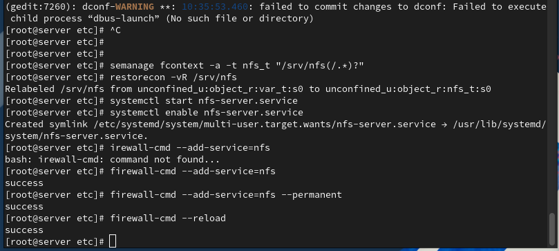
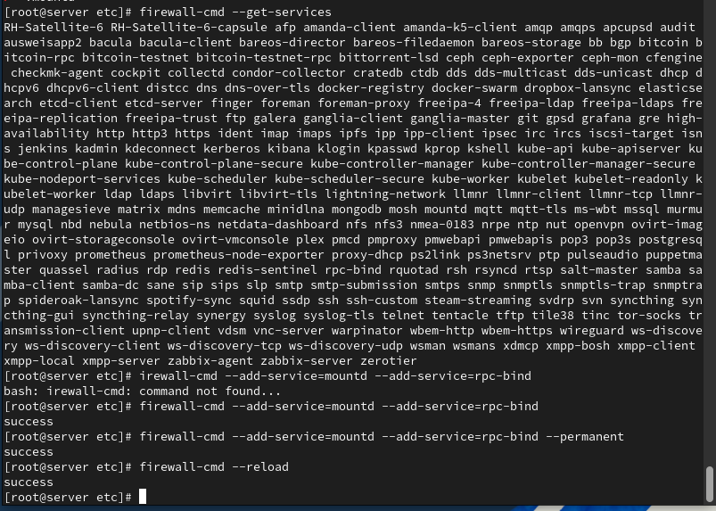
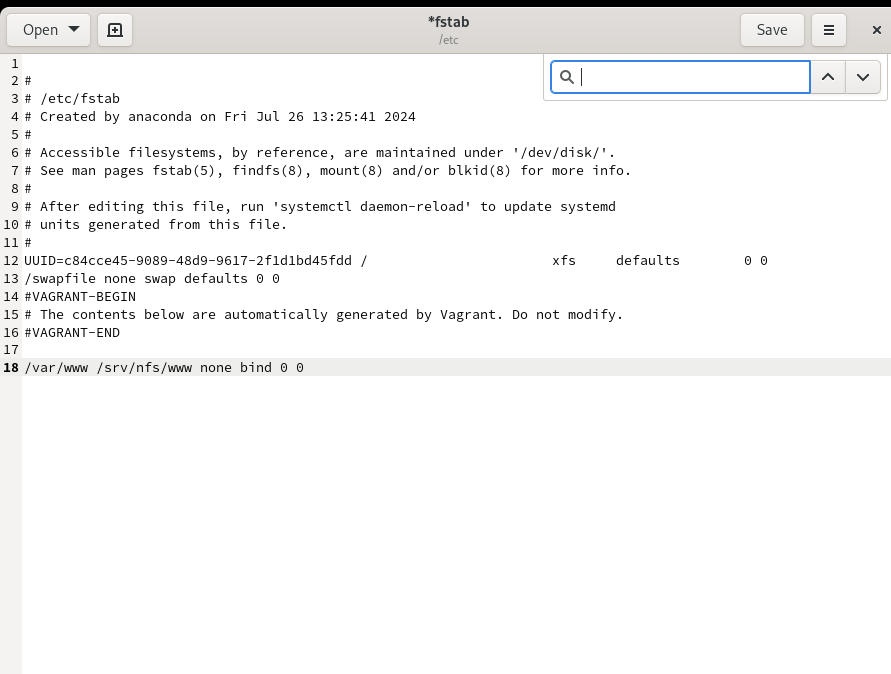
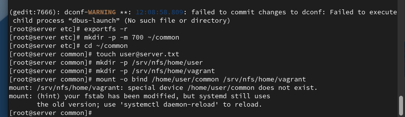
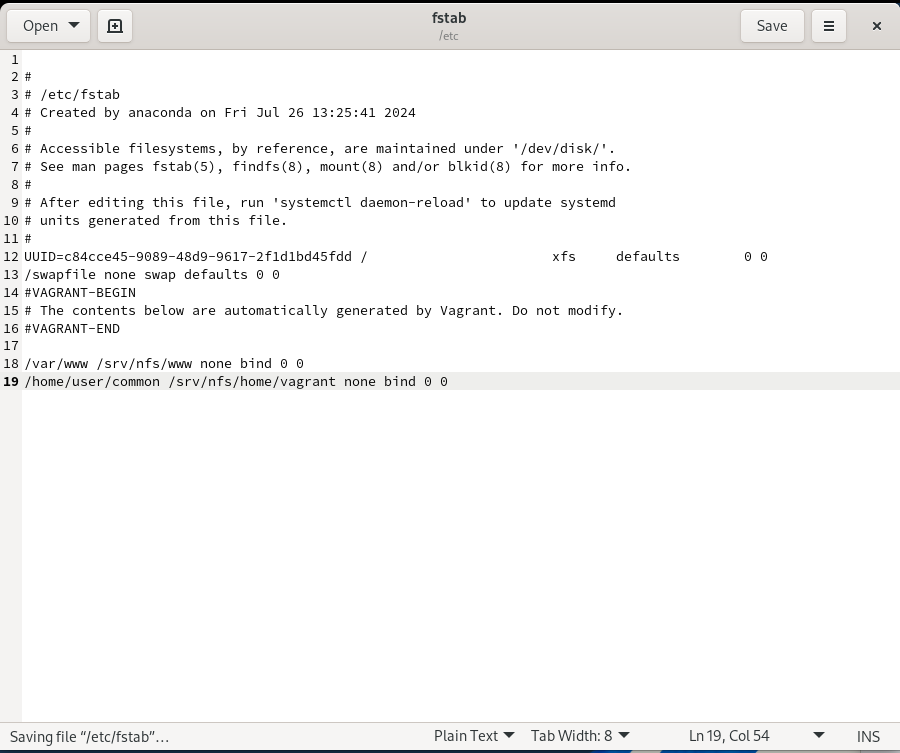
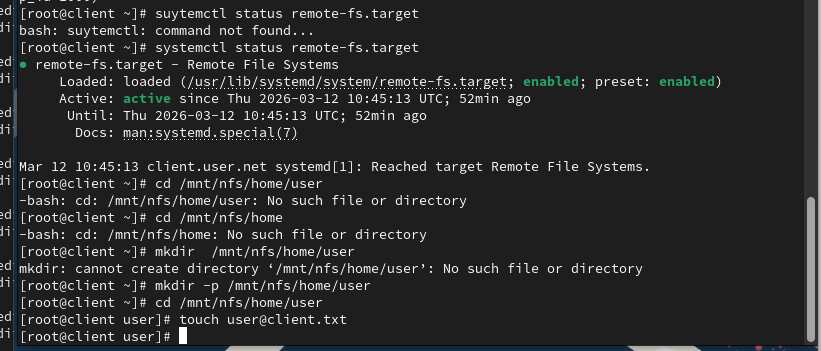

# Цели и задачи работы

## Цель лабораторной работы

Приобрести практические навыки настройки сервера NFSv4  
для удалённого доступа к ресурсам и организации общего сетевого хранилища.

## Задачи

- Настроить экспорт каталогов на сервере NFS
- Обеспечить корректную работу SELinux-контекстов
- Настроить firewalld для работы NFS и RPC-служб
- Подключить ресурсы на клиенте и настроить автомонтирование
- Включить в дерево NFS каталог веб-сервера и пользовательские каталоги
- Автоматизировать настройку через provision-скрипты Vagrant

# Выполнение лабораторной работы

## Экспорт корня дерева NFS

{ #fig:001 width=80% }

## SELinux и запуск NFS-службы

{ #fig:002 width=80% }

## Настройка firewalld для RPC-служб

{ #fig:003 width=80% }

## Проверка экспортов с клиента

{ #fig:004 width=80% }

## Монтирование NFS на клиенте

{ #fig:005 width=80% }

## Автомонтирование через fstab на клиенте

{ #fig:006 width=80% }

## Проверка remote-fs.target

{ #fig:007 width=80% }

## Экспорт каталога веб-сервера

{ #fig:008 width=80% }

## Bind-монтирование веб-каталога через fstab

{ #fig:009 width=80% }

## Проверка структуры дерева NFS на сервере

{ #fig:010 width=80% }

## Проверка структуры дерева NFS на клиенте

{ #fig:011 width=80% }

## Подготовка пользовательского каталога

{ #fig:012 width=80% }

## Экспорт пользовательского каталога

{ #fig:013 width=80% }

## Автоматизация bind-монтирования пользовательского каталога

{ #fig:014 width=80% }

## Проверка монтирования на сервере

{ #fig:015 width=80% }

## Проверка прав доступа на клиенте

{ #fig:016 width=80% }

## Проверка синхронизации данных на сервере

{ #fig:017 width=80% }

# Выводы по проделанной работе

## Вывод

В ходе лабораторной работы настроены сервер и клиент NFSv4.  
Реализовано экспортирование каталогов с различными уровнями доступа: общий каталог, каталог веб-сервера и пользовательский каталог.  
Проверена корректность bind-монтирования, ограничений прав доступа и автоматического подключения сетевых ресурсов при загрузке системы.  
Настройка окружения автоматизирована с помощью provision-скриптов Vagrant, что обеспечивает воспроизводимость развертывания.
