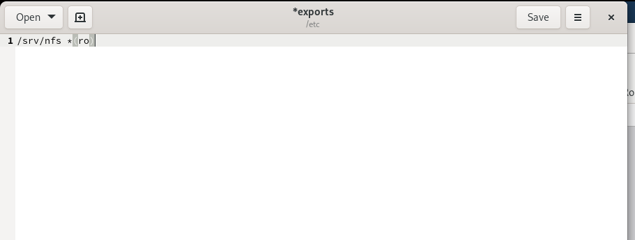
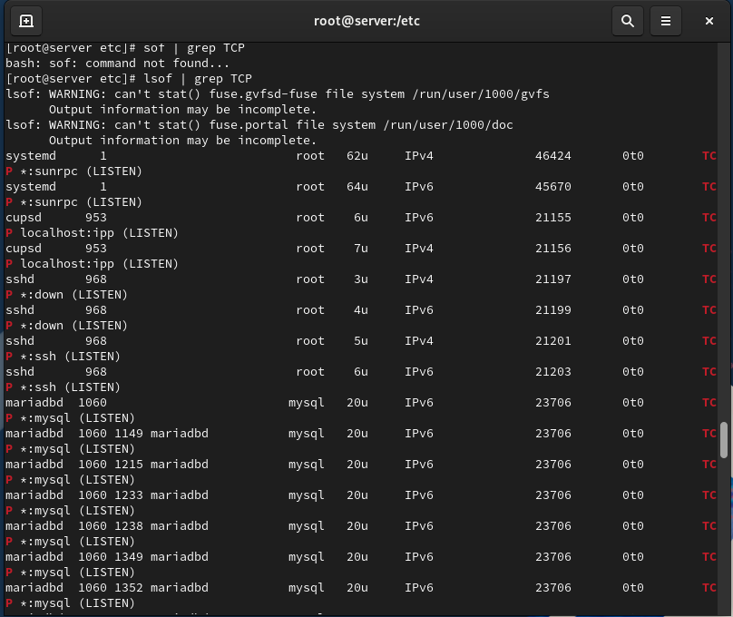
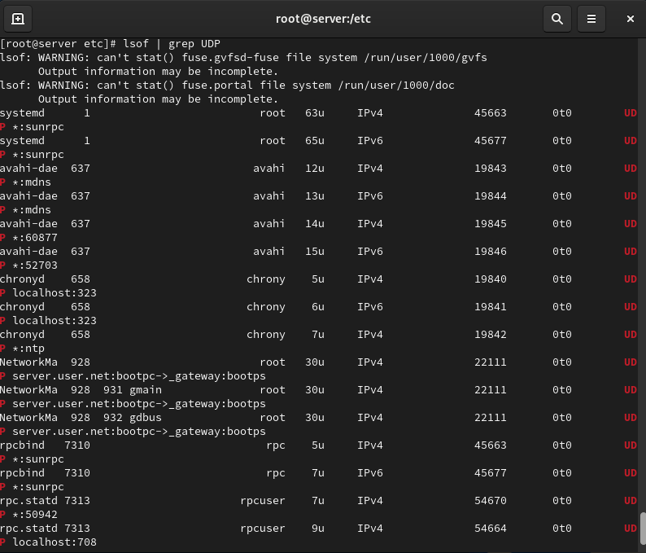
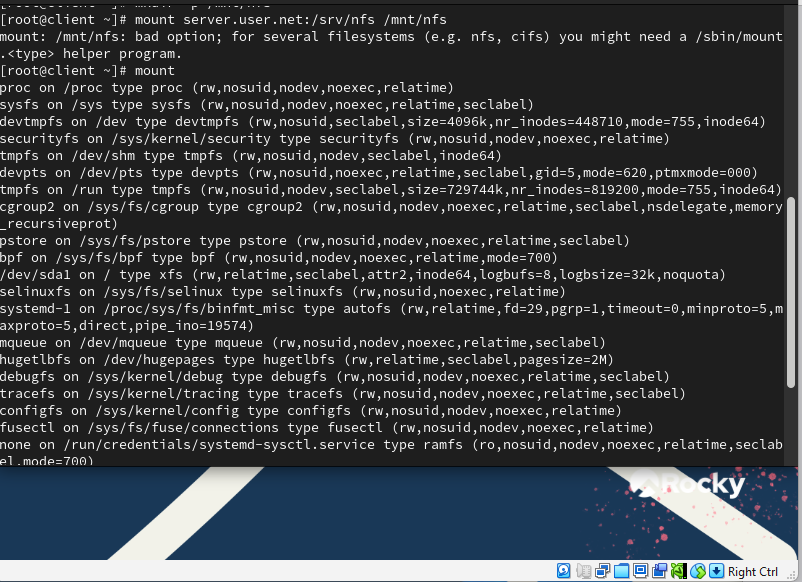
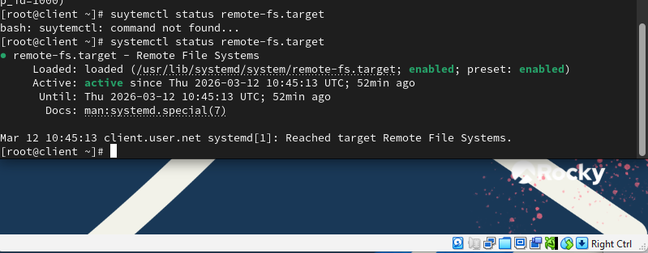
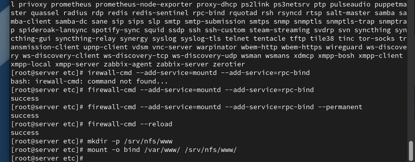
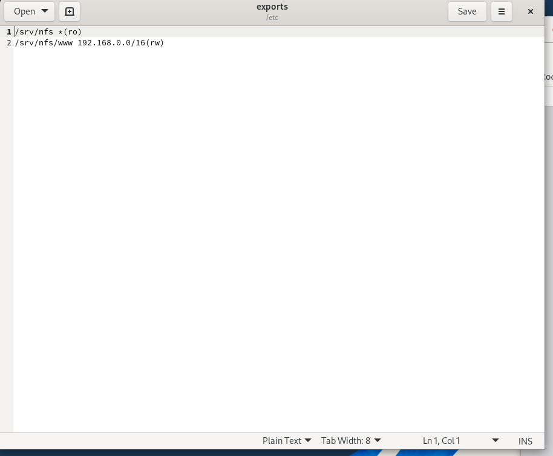
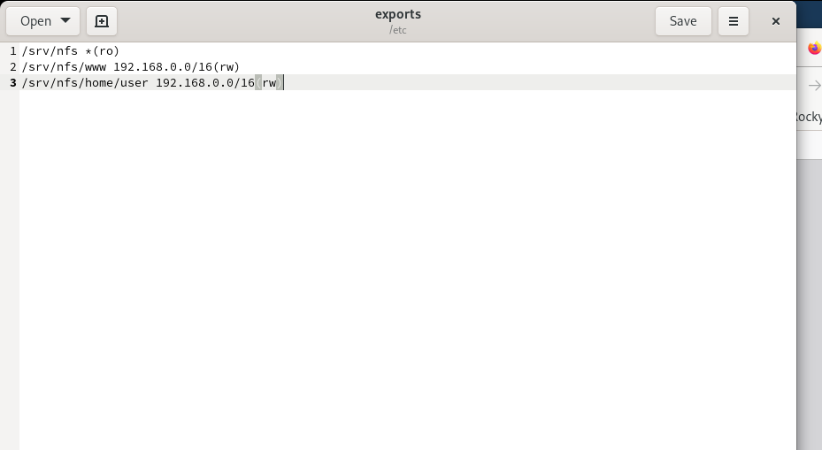
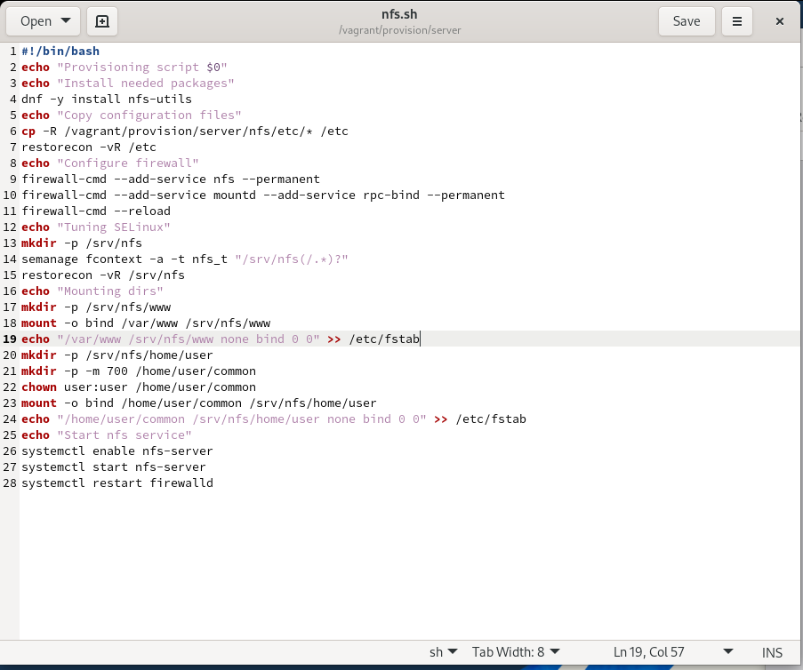
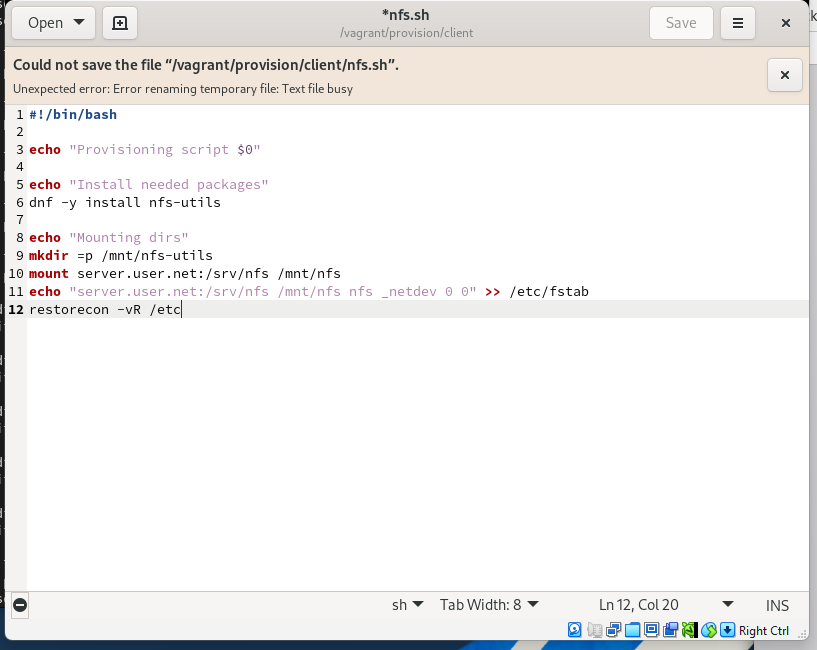

# Лабораторная работа №13

## Лабораторная работа №13

---

# Цель работы

Приобретение практических навыков администрирования сетевых подсистем

---

## На сервере установим необходимое программное обеспечение nfs-utils (рис. @fig-1):

{ width=90% height=70% }

---

## На сервере создадим каталог, который предполагается сделать доступным всем пользователям сети (корень дерева NFS) (рис. @fig-2):

{ width=90% height=70% }

---

## В файле /etc/exports пропишем подключаемый через NFS общий каталог с доступом только на чтение (рис. @fig-3):

{ width=90% height=70% }

---

## Для общего каталога зададим контекст безопасности NFS, применим изменённую настройку SELinux, запустим сервер NFS и настроим межсетевой экран (рис. @fig-4):

{ width=90% height=70% }

---

## На клиенте установим необходимое для работы NFS программное обеспечение (рис. @fig-5):

{ width=90% height=70% }

---

## На клиенте попробуем посмотреть имеющиеся подмонтированные удалённые ресурсы (рис. @fig-6):

{ width=90% height=70% }

---

## Попробуем на сервере остановить сервис межсетевого экрана (рис. @fig-7):

{ width=90% height=70% }

---

## На сервере запустим сервис межсетевого экрана (рис. @fig-8):

{ width=90% height=70% }

---

## На сервере посмотрим, какие службы задействованы при удалённом монтировании (TCP и UDP) (рис. @fig-9, @fig-10):

{ width=90% height=70% }

---

## Просмотр служб NFS

{ width=90% height=70% }

---

## Добавим службы rpc-bind и mountd в настройки межсетевого экрана на сервере (рис. @fig-11):

{ width=90% height=70% }

---

## На клиенте создадим каталог для монтирования удалённого ресурса и подмонтируем дерево NFS. Проверим, что общий ресурс подключён правильно (рис. @fig-12):

{ width=90% height=70% }

---

## На клиенте в конце файла /etc/fstab добавим запись для автоматического монтирования NFS при загрузке (рис. @fig-13):

{ width=90% height=70% }

---

## На клиенте проверим наличие автоматического монтирования удалённых ресурсов при запуске системы (рис. @fig-14):

{ width=90% height=70% }

---

## На сервере создадим общий каталог, в который затем будет подмонтирован каталог с контентом веб-сервера (рис. @fig-15):

{ width=90% height=70% }

---

## Подмонтируем каталог веб-сервера и проверим содержимое каталога /srv/nfs (рис. @fig-16):

{ width=90% height=70% }

---

## На сервере в файле /etc/exports добавим экспорт каталога веб-сервера с удалённого ресурса (рис. @fig-17):

{ width=90% height=70% }

---

# Выводы

В ходе выполнения лабораторной работы были приобретены практические навыки

---

# Спасибо за внимание!

## Вопросы?
