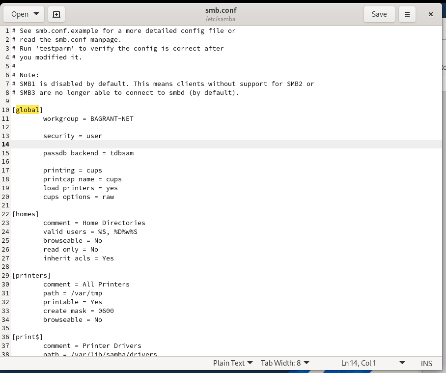
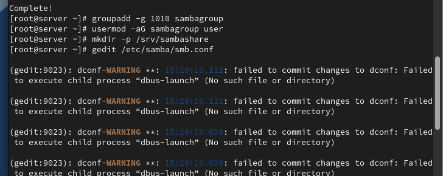
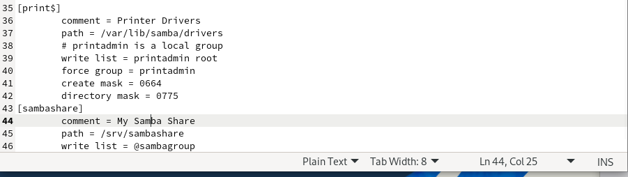
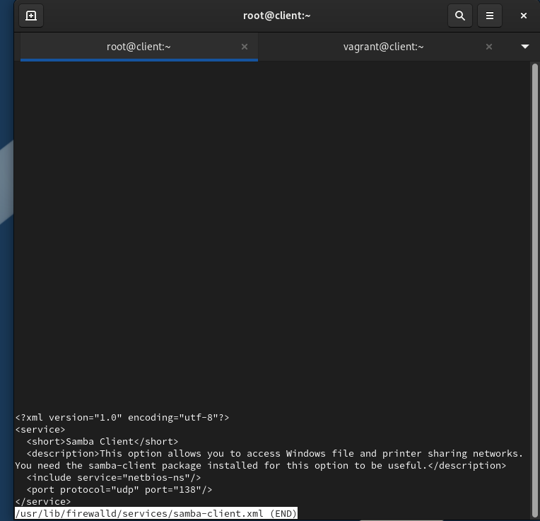
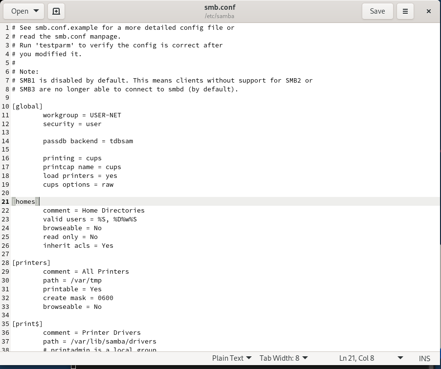
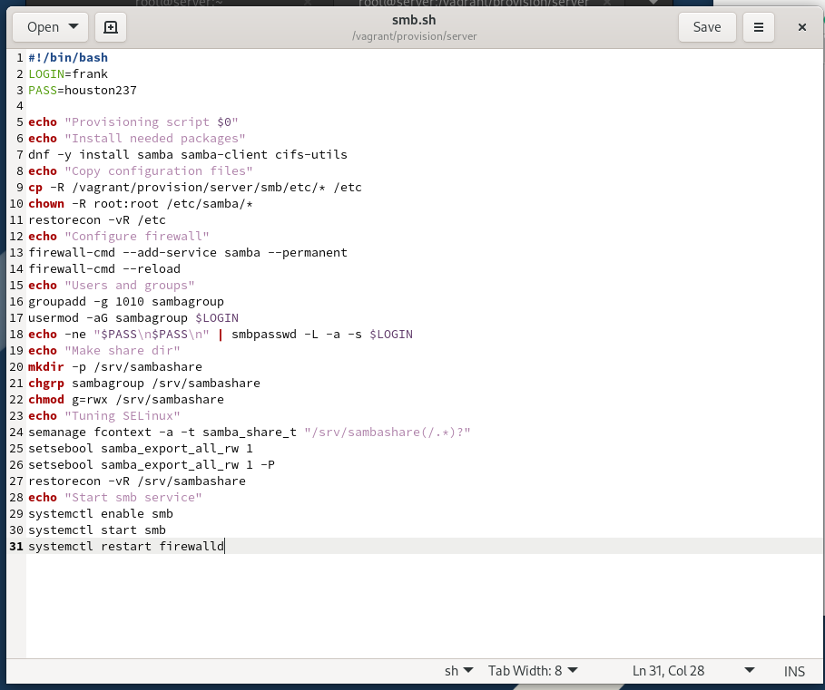
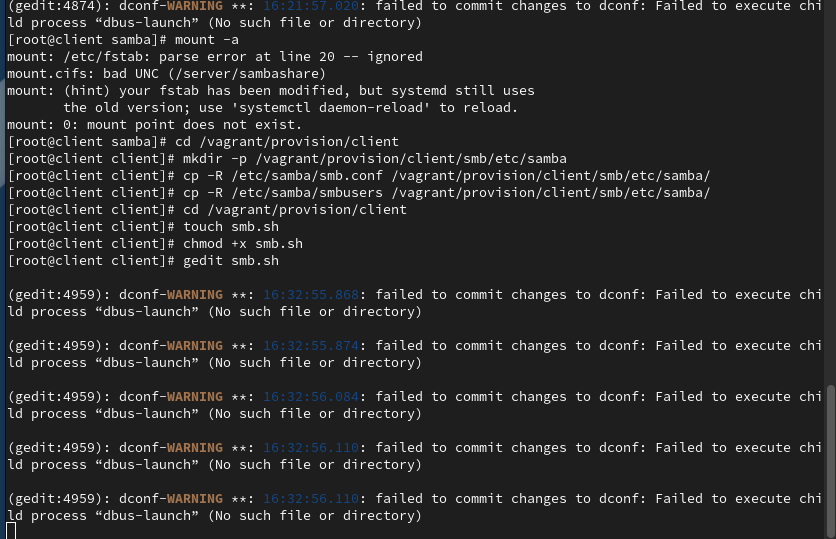

# Цели и задачи работы

## Цель лабораторной работы

Приобретение практических навыков настройки  
доступа групп пользователей к общим ресурсам  
по протоколу SMB (Samba).

# Выполнение лабораторной работы

## Настройка сервера Samba

{ width=80% }

## Настройка конфигурации Samba

{ width=80% }

## Запуск и проверка службы Samba

{ width=80% }

## Настройка межсетевого экрана

{ width=80% }

## Настройка прав доступа e SELinux

{ width=80% }

## Проверка контекста SELinux

{ width=80% }

## Проверка групп пользователя

{ width=80% }

## Проверка записи em общий каталог

{ width=80% }

## Просмотр ресурсов сервера с клиента

{ width=80% }

## Монтирование общего ресурса

{ width=80% }

## Проверка записи no клиенте

{ width=80% }

## Файл учётных данных Samba

{ width=80% }

## Автоматическое монтирование

{ width=80% }

## Проверка автоматического монтирования

{ width=80% }

## Проверка доступа после монтирования

{ width=80% }

# Выводы по проделанной работе

## Вывод

В ходе лабораторной работы выполнена настройка сервера  
e клиента Samba em виртуальной среде.  
Реализован общий ресурс с разграничением прав доступа  
на основе групп Linux e механизмов SELinux.  
Проверена работа аутентифицированного доступа e  
автоматического монтирования ресурсов.  
Настройка автоматизирована с использованием Vagrant.
