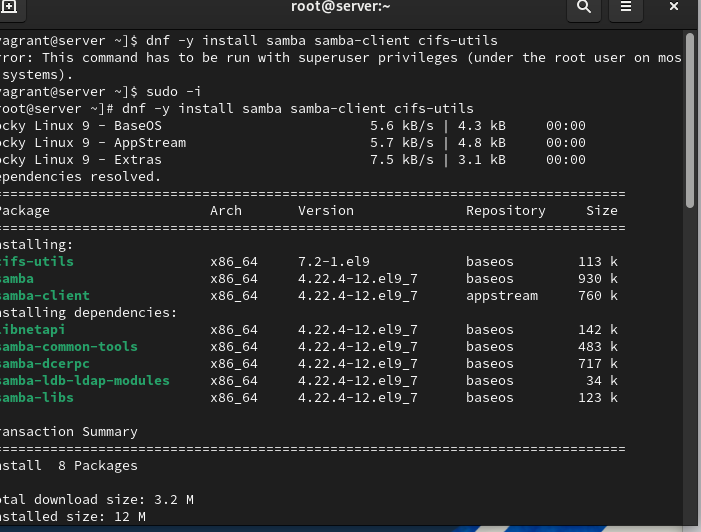
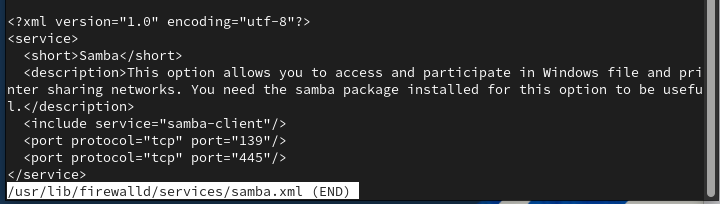
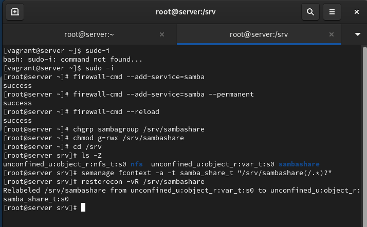
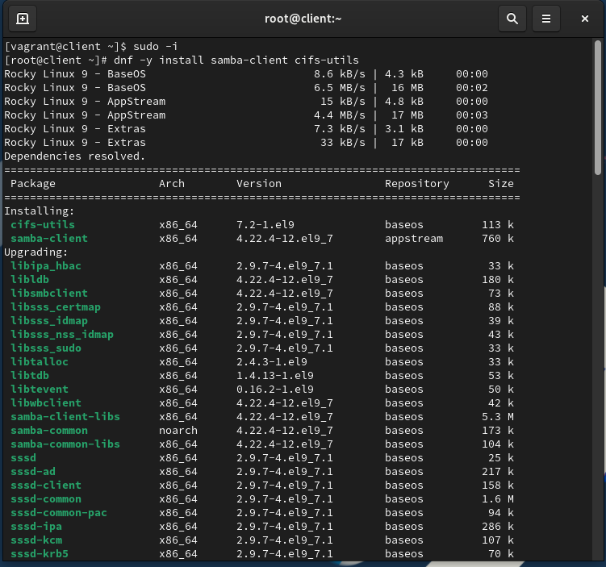
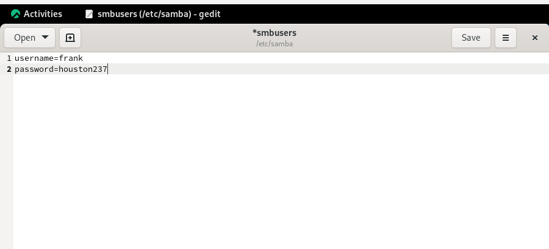
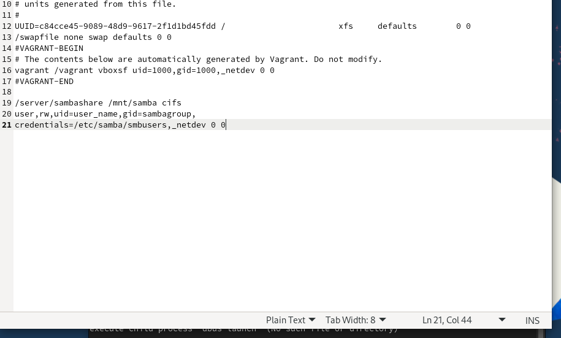
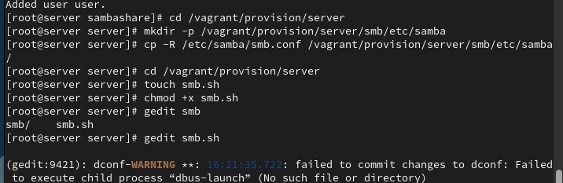
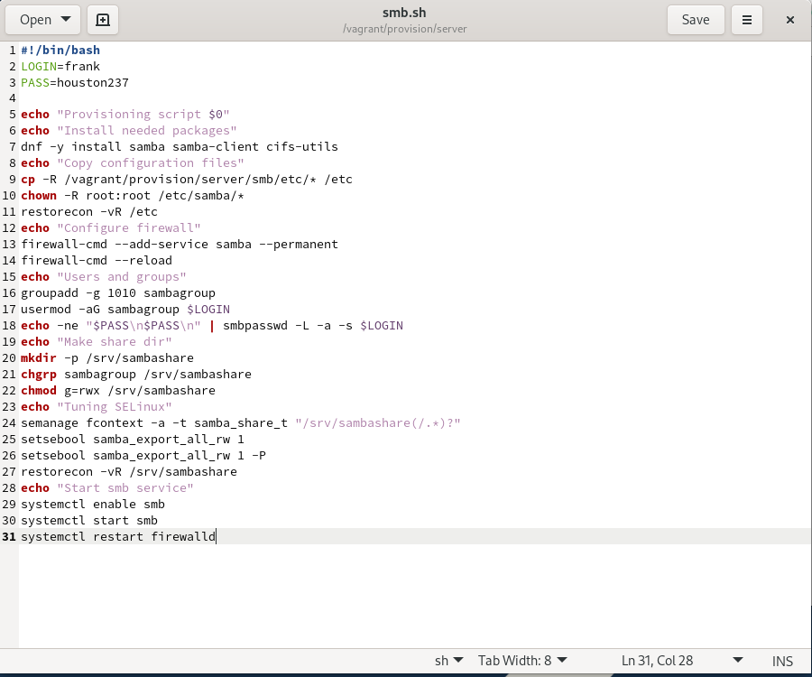
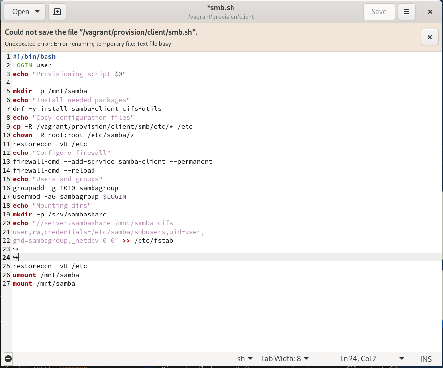
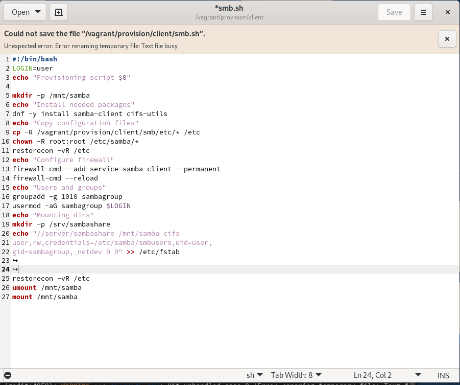

# Лабораторная работа №14

## Лабораторная работа №14

---

# Цель работы

Приобретение практических навыков администрирования сетевых подсистем

---

## На сервере установим необходимые пакеты samba, samba-client и cifs-utils (рис. @fig-1):

{ width=90% height=70% }

---

## Создадим группу sambagroup для пользователей, добавлем пользователя и создадим общий каталог (рис. @fig-2):

{ width=90% height=70% }

---

## В файле конфигурации /etc/samba/smb.conf изменим параметр рабочей группы (рис. @fig-3):

{ width=90% height=70% }

---

## В конце файла добавим раздел с описанием общего доступа к разделяемому ресурсу (рис. @fig-4):

{ width=90% height=70% }

---

## Убедимся, что мы не сделали синтаксических ошибок в файле smb.conf, используя команду testparm (рис. @fig-5):

{ width=90% height=70% }

---

## Запустим демон Samba и посмотрим его статус (рис. @fig-6):

{ width=90% height=70% }

---

## Для проверки наличия общего доступа попробуем подключиться к серверу с помощью smbclient (рис. @fig-7):

{ width=90% height=70% }

---

## Посмотрим файл конфигурации межсетевого экрана для Samba и настроим его (рис. @fig-8):

{ width=90% height=70% }

---

## Настроим права доступа для каталога с разделяемым ресурсом, контекст безопасности SELinux и добавим пользователя в базу Samba (рис. @fig-9):

{ width=90% height=70% }

---

## На клиенте установим необходимые пакеты samba-client и cifs-utils (рис. @fig-10):

{ width=90% height=70% }

---

## На клиенте настроим межсетевой экран, создадим группу и изменим рабочую группу (рис. @fig-11):

{ width=90% height=70% }

---

## Создадим файл smbusers в каталоге /etc/samba/ для настройки работы с Samba с помощью файла учётных данных (рис. @fig-12):

{ width=90% height=70% }

---

## Добавим строку в /etc/fstab и подмонтируем общий ресурс (рис. @fig-13):

{ width=90% height=70% }

---

## Этап выполнения работы №14

{ width=90% height=70% }

---

## Этап выполнения работы №15

{ width=90% height=70% }

---

## Этап выполнения работы №16

{ width=90% height=70% }

---

## Этап выполнения работы №17

{ width=90% height=70% }

---

# Выводы

В ходе выполнения лабораторной работы были приобретены практические навыки

---

# Спасибо за внимание!

## Вопросы?
