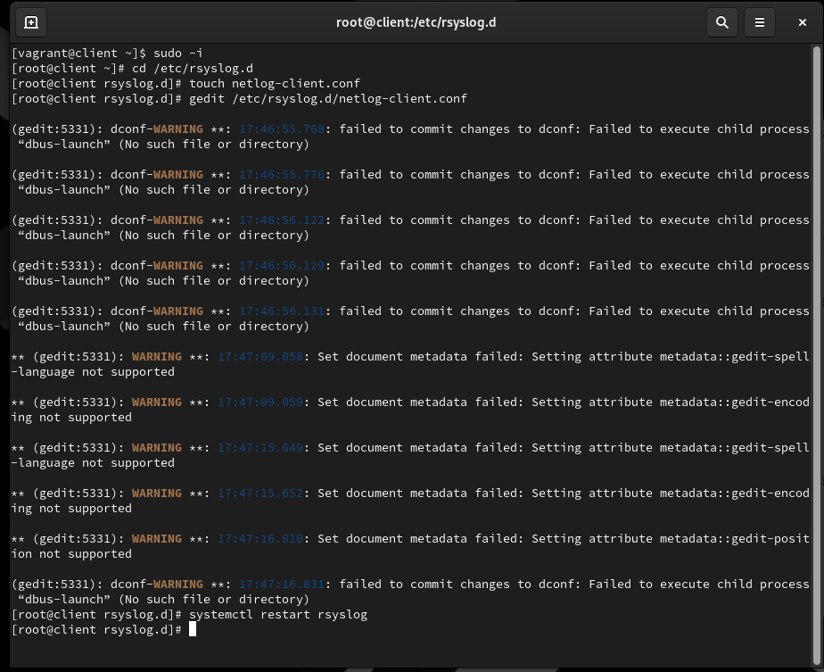
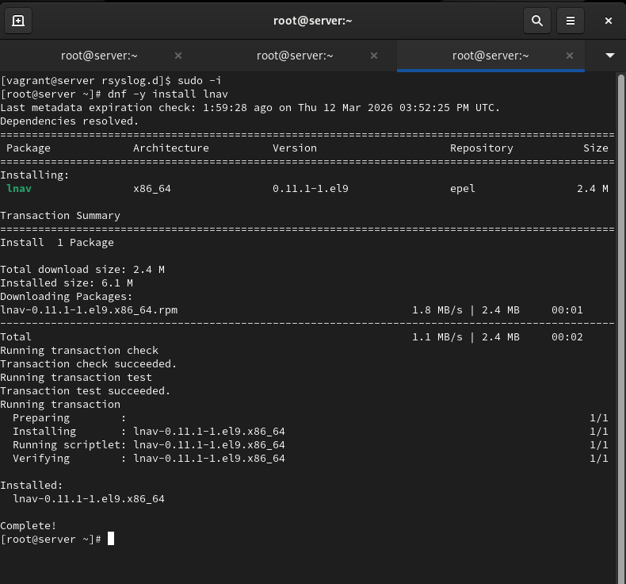

# Цели и задачи работы

## Цель лабораторной работы

Получение практических навыков работы с журналами системных событий и настройка централизованного сетевого журналирования  
на базе rsyslog с передачей сообщений от клиента к серверу по TCP.

# Выполнение лабораторной работы

## Настройка сервера сетевого журнала

{ #fig:001 width=80% }

## Настройка межсетевого экрана и проверка порта

{ #fig:002 width=80% }

## Настройка клиента сетевого журнала

{ #fig:003 width=80% }

## Проверка приёма и отображения журналов на сервере

{ #fig:004 width=80% }

## Контроль состояния системы

{ #fig:005 width=80% }

## Попытка установки просмотрщика журналов

{ #fig:006 width=80% }

# Выводы по проделанной работе

## Вывод

Настроена система централизованного сетевого журналирования на базе rsyslog.  
На сервере реализован приём сообщений по TCP, на клиенте настроена пересылка системных сообщений на сервер.  
Корректность работы проверена анализом записей системных журналов.  
Дополнительно выполнена автоматизация конфигурации через provisioning-скрипты Vagrant для воспроизводимого развёртывания.
