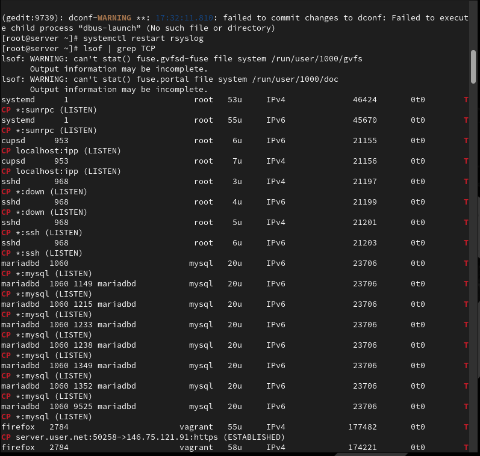
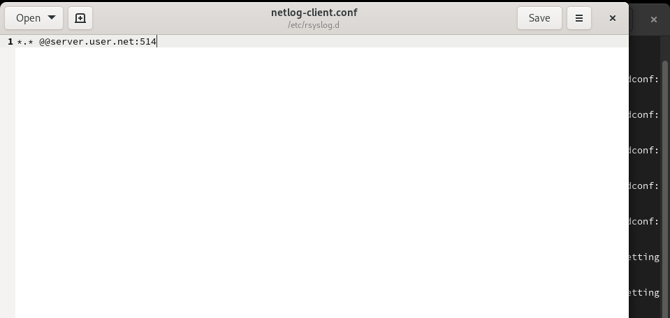
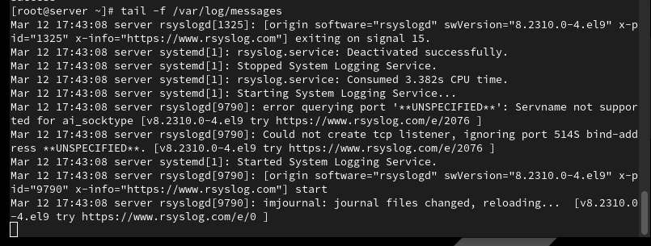
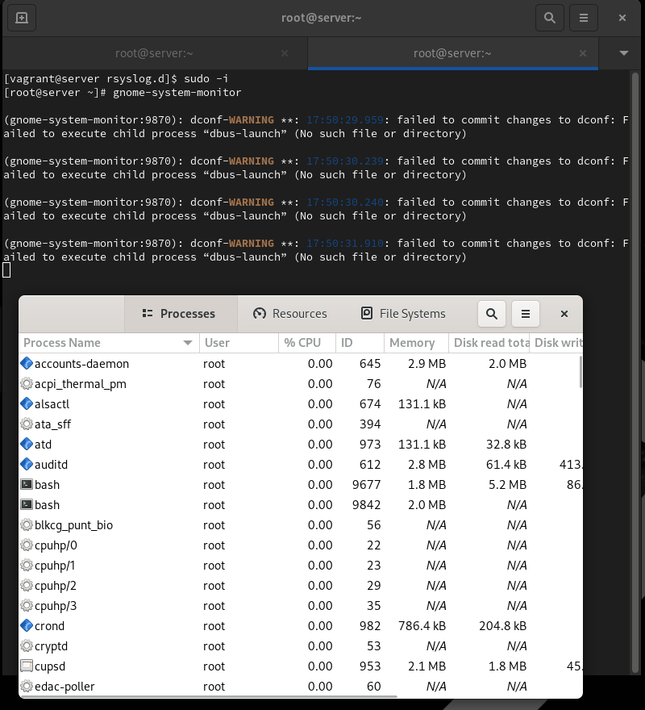
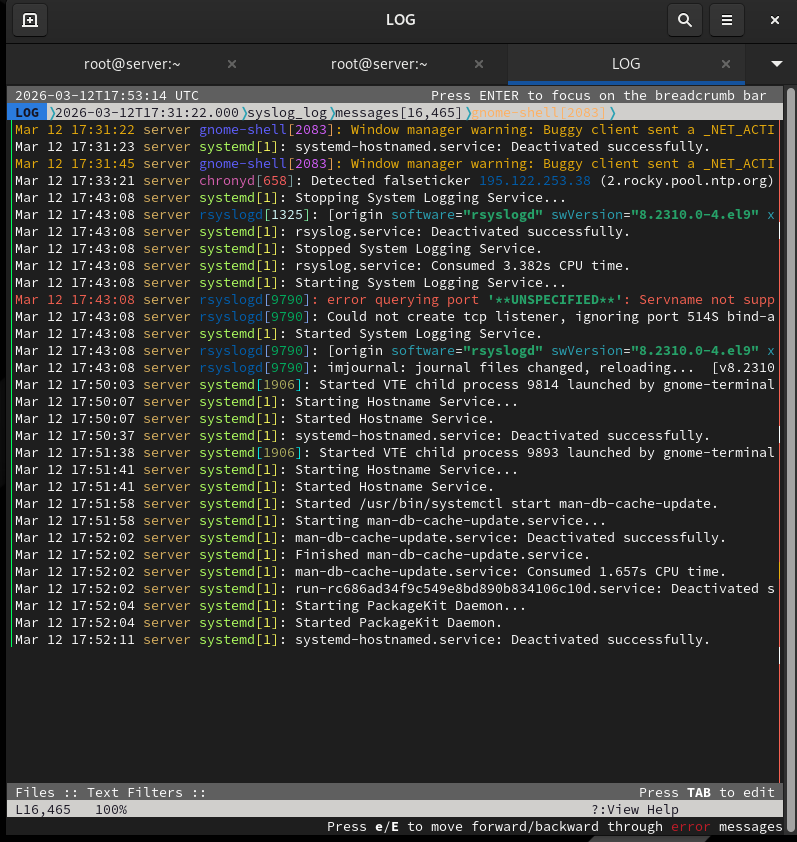
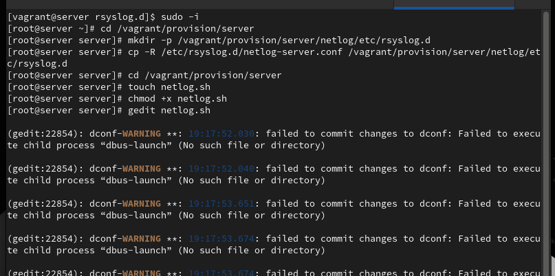
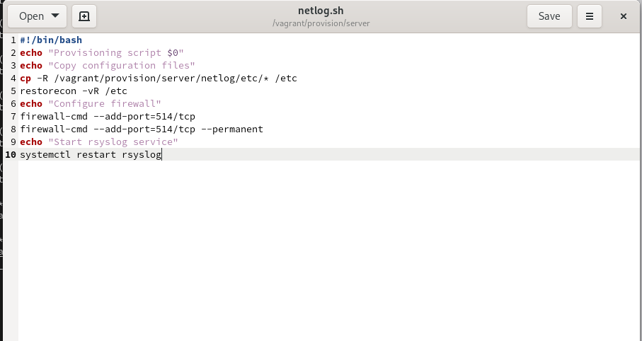
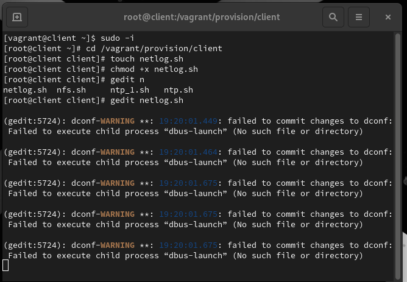
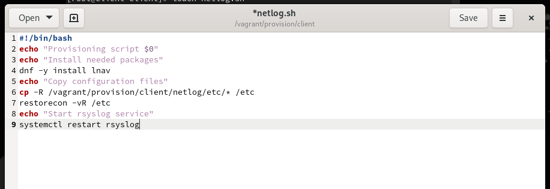

# Лабораторная работа №15

## Лабораторная работа №15

---

# Цель работы

Приобретение практических навыков администрирования сетевых подсистем

---

## На сервере создадим файл конфигурации сетевого хранения журналов в каталоге /etc/rsyslog.d (рис. @fig-1):

{ width=90% height=70% }

---

## В файле конфигурации /etc/rsyslog.d/netlog-server.conf включим приём записей журнала по TCP-порту 514 (рис. @fig-2):

{ width=90% height=70% }

---

## Перезапустим службу rsyslog и посмотрим, какие порты, связанные с rsyslog, прослушиваются (рис. @fig-3):

{ width=90% height=70% }

---

## На сервере настроим межсетевой экран для приёма сообщений по TCP-порту 514 (рис. @fig-4):

{ width=90% height=70% }

---

## На клиенте создадим файл конфигурации сетевого хранения журналов (рис. @fig-5):

{ width=90% height=70% }

---

## В файле конфигурации /etc/rsyslog.d/netlog-client.conf включим перенаправление сообщений журнала на 514 TCP-порт сервера (рис. @fig-6):

{ width=90% height=70% }

---

## Перезапустим службу rsyslog на клиенте для применения изменений (рис. @fig-7):

{ width=90% height=70% }

---

## На сервере просмотрим один из файлов журнала для проверки сбора сообщений (рис. @fig-8):

{ width=90% height=70% }

---

## На сервере под пользователем запустим графическую программу для просмотра журналов gnome-system-monitor (рис. @fig-9):

{ width=90% height=70% }

---

## На сервере установим просмотрщик журналов системных сообщений lnav (рис. @fig-10):

{ width=90% height=70% }

---

## Просмотрим логи с помощью lnav для удобного анализа системных сообщений (рис. @fig-11):

{ width=90% height=70% }

---

# Выводы

В ходе выполнения лабораторной работы были приобретены практические навыки

---

# Спасибо за внимание!

## Вопросы?
