# Цели и задачи работы

## Цель лабораторной работы

Получить практические навыки настройки и использования Fail2ban  
для базовой защиты сервера от атак типа «brute force»  
на примере служб SSH, HTTP и почтовых сервисов.

# Выполнение лабораторной работы

## Установка и запуск Fail2ban

{ #fig:001 width=80% }

## Настройка защиты SSH

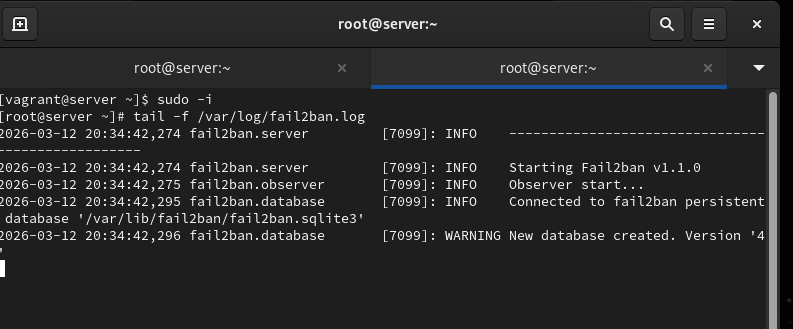{ #fig:002 width=80% }

## Проверка запуска jail SSH

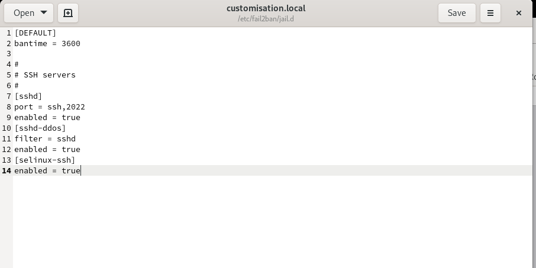{ #fig:003 width=80% }

## Настройка защиты веб-служб (Apache)

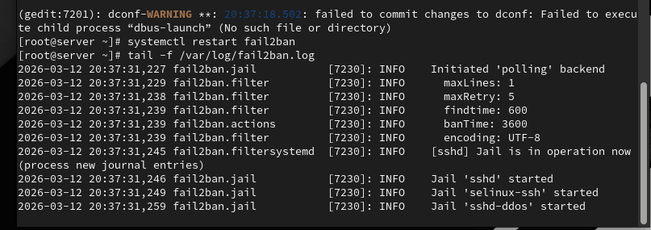{ #fig:004 width=80% }

## Проверка защиты HTTP

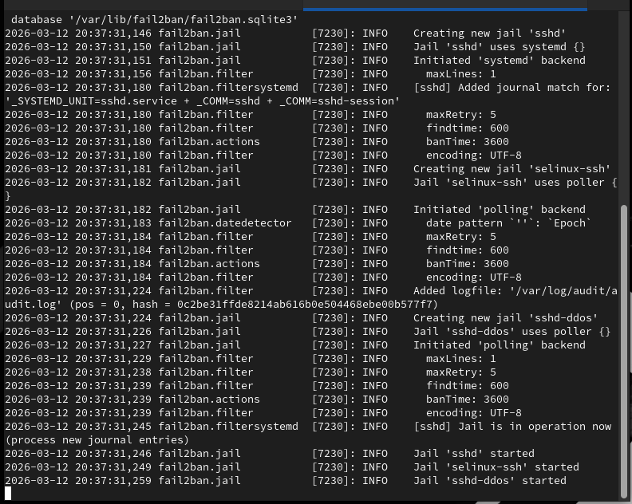{ #fig:005 width=80% }

## Настройка защиты почтовых сервисов

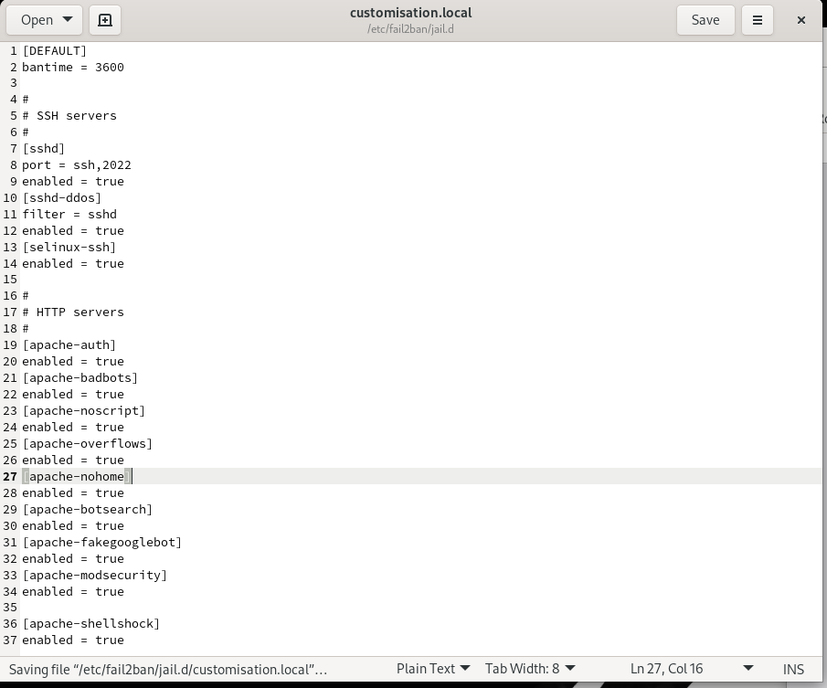{ #fig:006 width=80% }

## Проверка защиты почты

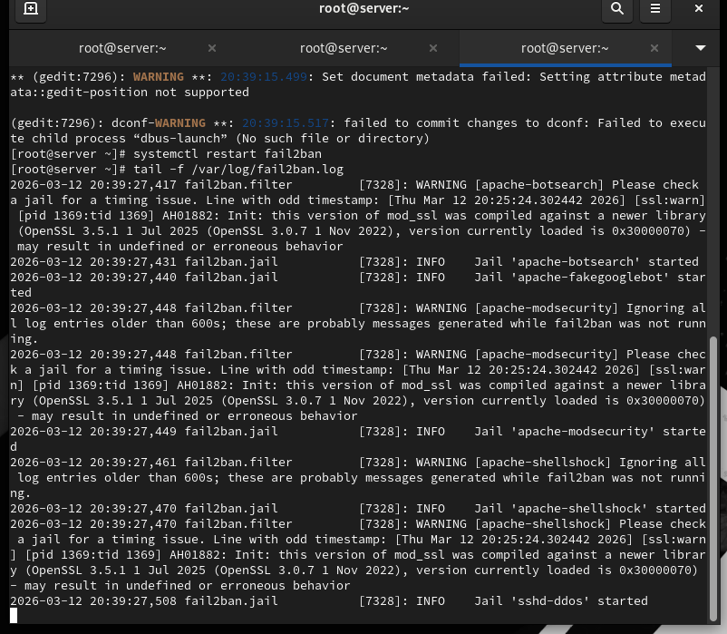{ #fig:007 width=80% }

## Проверка статуса Fail2ban

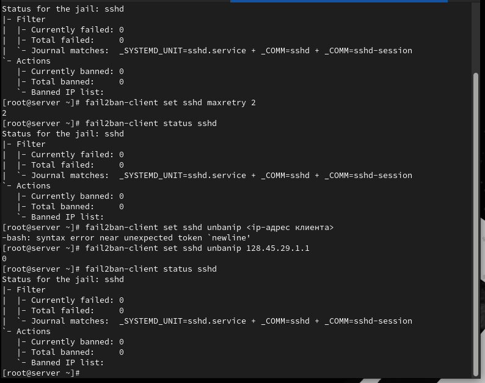{ #fig:008 width=80% }

## Блокировка IP-адреса клиента

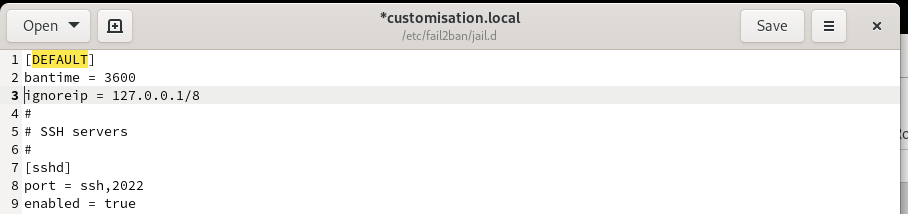{ #fig:009 width=80% }

## Разблокировка и исключение IP-адреса

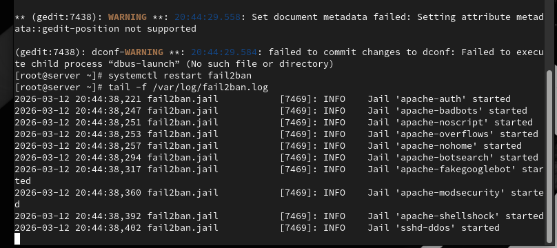{ #fig:010 width=80% }

## Проверка ignoreip

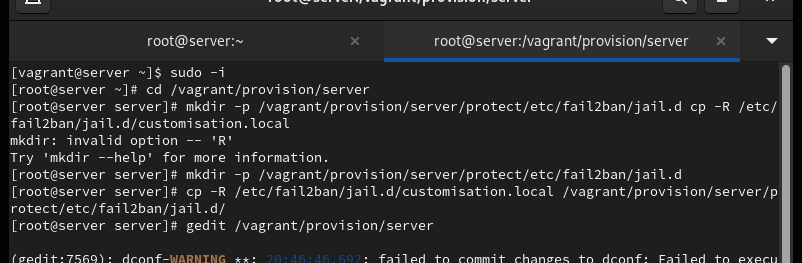{ #fig:011 width=80% }

## Подготовка provisioning-конфигурации

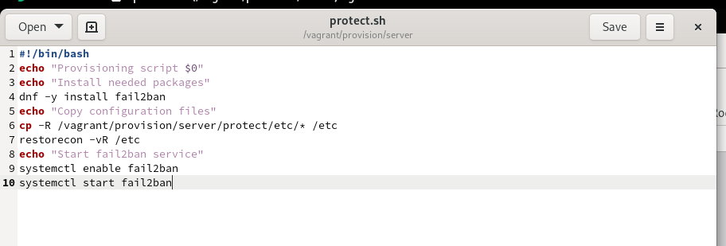{ #fig:012 width=80% }

# Выводы по проделанной работе

## Вывод

В ходе лабораторной работы была реализована базовая защита сервера  
от атак типа «brute force» с использованием Fail2ban.  
Настроена защита SSH, веб-служб и почтовых сервисов,  
проверены механизмы блокировки, разблокировки и исключений IP-адресов.  
Дополнительно выполнена автоматизация настройки Fail2ban  
в процессе развертывания виртуальной машины с помощью Vagrant.
