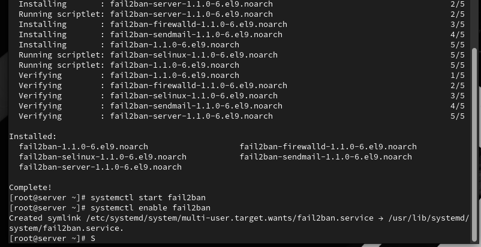

# Лабораторная работа №16

## Лабораторная работа №16

---

# Цель работы

Приобретение практических навыков администрирования сетевых подсистем

---

## На сервере установим fail2ban (рис. @fig-1):

{ width=90% height=70% }

---

## Запустим сервер fail2ban и добавим его в автозагрузку (рис. @fig-2):

{ width=90% height=70% }

---

## В дополнительном терминале запустим просмотр журнала событий fail2ban (рис. @fig-3):

{ width=90% height=70% }

---

## Создадим файл с локальной конфигурацией fail2ban (рис. @fig-4):

{ width=90% height=70% }

---

## В файле /etc/fail2ban/jail.d/customisation.local зададим время блокирования на 1 час и включим защиту SSH (рис. @fig-5):

{ width=90% height=70% }

---

## Перезапустим fail2ban для применения изменений (рис. @fig-6):

{ width=90% height=70% }

---

## Посмотрим журнал событий после перезапуска (рис. @fig-7):

{ width=90% height=70% }

---

## В файле /etc/fail2ban/jail.d/customisation.local включим защиту HTTP (рис. @fig-8):

{ width=90% height=70% }

---

## Перезапустим fail2ban и проверим журнал событий (рис. @fig-9, @fig-10):

{ width=90% height=70% }

---

## Перезапуск и проверка

{ width=90% height=70% }

---

## В файле /etc/fail2ban/jail.d/customisation.local включим защиту почты (рис. @fig-11):

{ width=90% height=70% }

---

## Перезапустим fail2ban и посмотрим журнал событий (рис. @fig-12, @fig-13):

{ width=90% height=70% }

---

# Выводы

В ходе выполнения лабораторной работы были приобретены практические навыки

---

# Спасибо за внимание!

## Вопросы?
